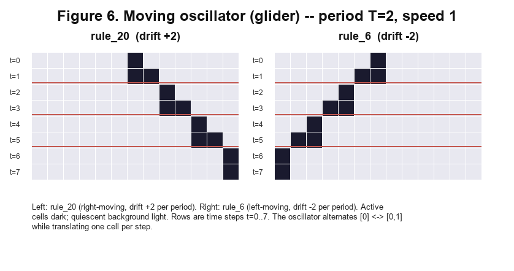

# ZUSE Automat Agent: Empirical Law Discovery in Elementary Cellular Automata

## Abstract

We present ZUSE Automat Agent (ZUSE), a deterministic, policy-driven discovery
loop for elementary cellular automata (ECA) that builds an empirical atlas of
cycle laws, world families, and basin fragility without a language model in the
discovery loop. The pipeline combines a fixed seven-law evaluator, a
dedup-gated observer stack, and persistent multi-seed world records, and is
applied to a 20-world sample spanning ECA rules, Conway's Game of Life
patterns, and synthetic controls.

The seven laws — *velocidad_constante*, *periodicidad*, *densidad_estable*,
*tipo_unico*, *complejidad_alta*, *frontera_temporal*, and
*temporal_scale_stability* — are calibrated empirically (*frontera_temporal*
upper bound 0.4352; *temporal_scale_stability* threshold 19.03, decision-tree
accuracy 0.908). Laws are separated into two groups: structure-observer laws
that depend on the full observer stack, and frame-metric laws that depend only
on aggregate frame statistics.

Key results: (1) *frontera_temporal* is not intrinsically rare — it activates
in 38 of 256 ECA rules under at least two of three seeds, and in 17 of 256
under all three; (2) the 20-world atlas reveals seven dynamic categories
(*frontera-rich-estable*, *periodicidad-global*, *oscilador-local*,
*multiregimen-productivo*, *multiregimen-escala-dependiente*, *noise-bounded*,
*sin-evidencia-multiregimen*), finer than Wolfram's four-class taxonomy; (3)
one-bit IC fragility spans from perfectly stable basins (`rule_208/209`,
`f_total = 0.000`) to exact fixture disruption (`life_blinker`, `f_total =
1.000`), with `rule_108` as the ECA outlier (`f_total = 0.992`, `f_gap =
0.945`). These cases separate three mechanistically distinct regimes:
productive basin switching, noise-boundary crossing, and quiescent-background
activation;
(4) an exhaustive protocol over 128 quiescent ECA rules and 502 non-zero IC words per
rule confirms `rule_108` as the unique ECA rule producing stationary local
period-2 oscillators; (5) designed periodic ICs activate production
`periodicidad` in 207 of 256 ECA rules, showing that the law is IC-family
sensitive rather than inaccessible; and (6) a controlled single-bit experiment
demonstrates that ECA frames are translation-invariant while the observer/dedup
pipeline is not, separating physical law from measurement artifact; and (7)
three progressive background-oscillator sweeps reveal that the local
oscillator landscape is strongly background-conditioned. Under quiescent zero
background, only `rule_108` (stationary, T=2) and eight rules (moving, T=2,
speed 1 cell/step) produce local oscillators. Under non-zero periodic
backgrounds of template length 1, 2, and 4 (1,927,680 runs), the landscape
expands to 30 stationary and 36 moving rules, introducing period-4 oscillators
and speed-0.5 gliders. Under 30 primitive length-8 binary backgrounds
(3,855,360 runs), 23 further rule/type pairs appear, the observed period
extends to T=15, and speed 2/3 cell/step is observed for the first time. Phase
sensitivity is detected in all 10 sampled rules from the length-8 sweep; a
strict IC/background co-translation test confirms exact physical equivariance
in 80/80 runs after correcting a cyclic-boundary artifact in `linear_shape`.
The `T=15` family is confined to the reflection-symmetric, black/white-conjugate
pair `rule_73/rule_109`, locks at five times the background temporal period,
and persists through step 900 in all 20 minimal rule/background representatives.

Every result is reproducible from deterministic scripts with no stochastic
components in the discovery loop.

## 1. Introduction

Elementary cellular automata are among the simplest systems known to exhibit
complex behavior. A radius-1, binary, one-dimensional CA is fully specified by
a single integer from 0 to 255, yet even within this minimal space, Wolfram's
empirical taxonomy finds four qualitatively distinct dynamic classes: uniform,
periodic, locally chaotic, and complex. Cook's proof that Rule 110 supports
universal computation establishes that complexity in ECA is not merely visual:
it has computational consequences.

Two questions remain largely open after Wolfram's program. First, the taxonomy
is qualitative and coarse: all complex rules fall into Class 4 regardless of
their intra-class differences in structure type, periodicity, fragility, or
scale behavior. Second, the boundary between the dynamics of the rule and the
properties of the measurement instrument is rarely made explicit. When an
observer reports that a run contains gliders, it conflates the CA physics with
the heuristic that defined the glider label.

ZUSE Automat Agent addresses both questions through a deterministic,
policy-driven discovery loop. The agent runs ECA worlds, applies a fixed stack
of heuristic observers, evaluates seven binary cycle laws, and stores
multi-seed evidence in persistent world records. No language model participates
in the discovery loop: law proposals, world selection, and evidence evaluation
are all deterministic. Language-model assistance is restricted to post-run
interpretation and documentation.

The result is an empirical atlas of 20 worlds with seven operational categories,
measured fragility along two axes (`f_total` and `f_core`), and explicit
characterization of two observer artifacts. The atlas is not a new taxonomy of
Wolfram's classes; it is a finer-grained, evidence-based map of a 20-world
sample that separates cycle-level laws, world-level regimes, and pipeline
behavior.

### 1.1 Contributions

We make the following contributions:

1. **ZUSE Automat Agent** — A deterministic, policy-driven discovery loop for
   ECA that accumulates multi-seed law evidence across worlds without symbolic
   regression or LLM guidance in the loop. The agent combines persistent
   world-record history, a dedup-gated observer stack, and a seven-law evaluator
   into a single reproducible pipeline.

2. **A seven-category empirical atlas of 20 worlds** — We classify 20 worlds
   spanning ECA rules, Conway's Game of Life patterns, and synthetic controls
   into seven operational categories (*frontera-rich-estable*,
   *periodicidad-global*, *oscilador-local*, *multiregimen-productivo*,
   *multiregimen-escala-dependiente*, *noise-bounded*,
   *sin-evidencia-multiregimen*) using law coverage, signature diversity, and
   fragility. The atlas extends Wolfram's four-class taxonomy by capturing
   intra-class structure, scale-dependent silencing, and negative-control
   regimes.

3. **A two-dimensional fragility framework** — We measure `f_total` and
   `f_core` separately, defining `f_gap = f_total - f_core` as a quantitative
   measure of secondary-law churn. Four distinct mechanisms are identified:
   stable basin (`rule_208/209`, `f_total = 0.000`), productive basin switching
   (`rule_137`, `f_gap = 0.318`), noise-boundary fragility (`rule_54`,
   `f_core = 0.677`), and quiescent-background activation (`rule_108`,
   `f_gap = 0.945`).

4. **`rule_108` as the unique stationary local-period-2 ECA oscillator** —
   Under an exhaustive protocol (128 quiescent ECA rules, 502 non-zero IC words per
   rule, span <= 32, period <= 16), `rule_108` is the only ECA rule that
   produces stationary local period-2 oscillators. The motif `#.# <-> ###`
   follows algebraically from `f(0,1,0) = f(1,0,1) = 1` and
   `f(1,1,1) = 0`, and the rule's left-right symmetry
   (`f(l,c,r) = f(r,c,l)`) explains why the oscillator does not drift.

5. **A measured separation between ECA dynamics and observer artifacts** —
   `rule_54` single-bit-IC frames are provably translation-invariant
   (confirmed by frame identity after shift normalization), while observer
   dedup counts range from 15 to 24 across IC positions. This non-equivariance
   is characterized as a pipeline property: absolute structure counts depend
   on IC context, but law signatures remain stable.

## 2. Related Work

ZUSE sits at the intersection of three bodies of prior work: empirical ECA
taxonomy, automated law discovery, and LLM-based scientific agents. It is
related to each tradition but positioned differently from all three: it extends
ECA taxonomy inward (intra-class rather than inter-class), it inverts the
discovery framing of symbolic regression systems (fixed evaluators rather than
generative hypotheses), and it excludes the LLM from the loop rather than
centering it.

### 2.1 ECA taxonomy and complexity

Wolfram's systematic study of elementary cellular automata established the
canonical four-class taxonomy: Class 1 (uniform), Class 2 (periodic), Class 3
(chaotic), and Class 4 (complex) [Wolfram2002]. This taxonomy is qualitative
and based on visual inspection of space-time diagrams. ZUSE extends it by
measuring intra-class structure: two Class-4 rules (`rule_137` and `rule_54`)
differ not only in fragility magnitude but in fragility mechanism, a distinction
the four-class taxonomy does not capture.

Cook's proof that Rule 110 supports universal computation [Cook2004]
established that ECA complexity has computational consequences beyond visual
appearance. But computational class is a coarse lens: `rule_110` and
`rule_54` are both Class 4, yet ZUSE finds that their fragility mechanisms are
qualitatively different — productive basin switching versus noise-boundary
crossing. `rule_110` appears in the ZUSE atlas as a
`multiregimen-productivo` world with `f_total = 0.323` and a stable frontera
signature. The computational proof characterizes what `rule_110` *can*
compute; ZUSE characterizes what it *typically does* under random
initialization.

### 2.2 Automated scientific discovery

AI Feynman [Udrescu2020] demonstrated symbolic regression over
physical datasets, recovering known equations from data with interpretable
structure. The contrast with ZUSE is deliberate: AI Feynman uses neural
networks to propose candidate laws from continuous-variable data, while ZUSE
applies fixed binary evaluators to discrete CA dynamics and accumulates
evidence without a generative component. ZUSE is not a symbolic regression
system; it is a policy-driven measurement pipeline whose outputs are law
signatures, not formulas.

More broadly, systems such as Eureqa [Schmidt2009] and recent
LLM-based discovery agents frame discovery as hypothesis generation followed
by verification. ZUSE inverts this framing: laws are fixed a priori, and the
discovery consists of finding which worlds satisfy them and under what
conditions. This makes every accepted law signature verifiable from
deterministic scripts, at the cost of not proposing new laws automatically.

### 2.3 ZUSE as evidence engine, not LLM scientist

Recent work on LLM-based scientific agents (e.g., The AI Scientist [Lu2024])
demonstrates that language models can propose hypotheses, design
experiments, and write papers with minimal human intervention. ZUSE occupies a
different position in this space: the language model is explicitly excluded
from the discovery loop and restricted to post-run interpretation and
documentation.

This separation is a design choice, not a limitation. It means that the atlas
findings are fully reproducible from the deterministic loop code, and that
language-model involvement can be audited at the documentation layer without
contaminating the empirical results. The cost is that ZUSE cannot propose new
laws; the benefit is that every accepted law has a transparent, non-generative
provenance.

## 3. System: ZUSE Automat Agent

ZUSE Automat Agent is a deterministic discovery loop over cellular automaton
worlds. A world is a simulator plus an initial-condition protocol and a time
window. For ECA worlds, the simulator is the standard binary radius-1 update
rule with periodic boundary conditions. The agent runs a world, computes frame
metrics, extracts candidate structures, evaluates a fixed set of laws, updates
world-level history, and chooses the next action through a transparent policy.

### 3.1 Inputs and outputs

A single agent cycle takes as input:

- **World identifier**: the ECA rule number (`0..255`) or a named synthetic
  world.
- **IC protocol**: either a random seed for standard runs or a designed IC
  vector for controlled experiments.
- **Width and steps**: fixed integers, typically `width = 64` and
  `steps = 24..200`, depending on the world's scale protocol.

The outputs of a single cycle are:

- **Frame metrics**: density mean, entropy mean, temporal transition rate, gzip
  ratio, and mutual information mean.
- **Analysis status**: `ok` or `ruido_no_analizable` after the noise gate.
- **Structure records**: raw `Estructura` outputs with type labels and span
  information, plus `dedup_structure_count`.
- **Law signature**: frozenset of accepted law names, or the empty set if the
  run is noise-gated.

### 3.2 Loop structure

The loop has five layers:

1. **Simulation.** ECA frames are generated from explicit initial conditions
   with fixed `width`, `steps`, and `seed` or with designed ICs for controlled
   experiments. The simulator itself is not learned.

2. **Frame metrics.** Each run is summarized by density, entropy, temporal
   transition rate, gzip compressibility, and temporal mutual information.
   These features support both individual laws (`complejidad_alta`,
   `frontera_temporal`, `temporal_scale_stability`) and later meta-analysis.

3. **Observers and deduplication.** A stack of heuristic observers converts
   frame histories into `Estructura` records with type labels such as `glider`,
   `bloque`, and `oscilador`. The raw observer outputs are intentionally kept
   for audit, while `deduplicate_structures` estimates the number of physical
   structures. The production noise gate uses `dedup_structure_count > 40`.

4. **Cycle-law evaluation.** Seven laws are evaluated on each analyzable run.
   The result is a law signature: the set of accepted laws for that cycle.
   Noise-gated runs skip law evaluation rather than forcing a low-confidence
   signature.

5. **Policy and memory.** The agent stores a persistent `WorldRecord` per
   world and chooses the next action after each cycle.

### 3.3 State: WorldRecord

Each world maintains a `WorldRecord` with the following fields relevant to
atlas construction:

| field | description |
| --- | --- |
| `visit_count` | total cycles run on this world |
| `scores` | per-cycle scores used by the policy |
| `noise_count` / `noise_fraction` | count and fraction of noise-gated cycles |
| `law_signatures` | list of accepted law signatures as frozensets |
| `unique_law_signature_count` | count of distinct non-empty signatures |
| `non_empty_signature_visit_count` | visits where at least one law was accepted |
| `law_signature_diversity` | unique non-empty signatures divided by non-empty visits, reported after at least five non-empty visits |
| `peak_signature_diversity` | maximum clean diversity observed so far |
| `has_multiregime_evidence` | monotone boolean, set once peak diversity exceeds `0.5` under low noise |
| `params_tried` | tested `(steps, width, law_signature)` tuples |
| `max_ok_steps` / `first_noise_steps` | scale boundary diagnostics |

The important design choice is that empty signatures are retained for audit but
excluded from diversity. A world is not multi-regime merely because it
alternates between laws and silence; multi-regime evidence requires multiple
non-empty law signatures.

### 3.4 Journal

Every cycle result is appended to a JSONL journal
(`outputs/experiments_*/journal_*.jsonl`). Each line is a self-contained JSON
record with cycle identifier, world identifier, steps, width, frame metrics,
analysis status, structure counts, law signature, action taken, and the
previous WorldRecord state visible to the policy at decision time. The journal
is the primary reproducibility artifact: the atlas in Section 5, the fragility
measurements in Section 6, and the case studies in Section 7 are all derived
from journal queries and controlled follow-up scripts.

### 3.5 Policy

The policy selects the next action from four options:

- **Vary seed** (`repeat_vary_seed`): run the same world with a new IC. Used
  when the world has a new law signature or confirmed multi-regime evidence
  and the current cycle is productive.
- **Increase scale** (`increase_steps`): raise `steps` to test scale-dependent
  behavior. Used when the current world produces analyzable signal and has not
  reached a known noise boundary.
- **Change world** (`change_world`): move to the next world. Used when the
  current world is noise-bounded, reaches a known noise boundary, has exhausted
  repeats, or converges to unproductive silence at maximum scale.
- **Stop by exhaustion**: after the requested cycle budget, persist state and
  journal artifacts.

The policy has no learned parameters. Its thresholds are fixed constants or
explicit guards in code: `dedup_structure_count > 40` for the noise gate,
signature diversity `> 0.5` for multi-regime evidence, `noise_fraction < 0.20`
for clean diversity, and at least five non-empty visits before diversity is
reported.

### 3.6 Non-generative design

The agent is deliberately non-generative inside the loop. No LLM proposes laws,
selects worlds, or evaluates a cycle. Symbolic regression was used only outside
the loop for calibration and analysis; it is not part of the online discovery
policy. The LLM-assisted work reported here occurs after runs are complete: it
helps design follow-up experiments, interpret artifacts, and write
documentation. This separation is important because every accepted law
signature in the atlas can be reproduced from deterministic scripts.

## 4. Seven Cycle Laws

The seven laws are the primary evidence units linking raw ECA frames to the
world categories, fragility scores, and observer artifacts reported in Sections
5-8. Each law is evaluated per run — one world, one initial condition, one step
count — once the observer and dedup pipeline reports `analysis_status = ok`.
The output is binary: accepted or rejected. Law signatures are frozensets of
accepted law names.

### 4.1 Design rationale

The seven laws were chosen to span distinct aspects of CA behavior using
measurements available from a single fixed-length run. They divide into two
groups by input type:

- **Structure-observer laws** (`velocidad_constante`, `periodicidad`,
  `densidad_estable`, `tipo_unico`): depend on the output of the heuristic
  observer stack. They can only fire if the run is analyzable
  (`analysis_status = ok`) and the observers detect at least one structure.

- **Frame-metric laws** (`complejidad_alta`, `frontera_temporal`,
  `temporal_scale_stability`): depend only on summary statistics computed
  directly from the frame array, without reference to individual structures.

This split is intentional. Frame-metric laws are symmetry-agnostic: they fire
regardless of where structures are in the lattice, how many there are, or
whether the observers identify them correctly. Structure-observer laws are
richer but carry the observer's heuristic assumptions. Section 8 reports two
cases where structure-observer laws produce artifacts that frame-metric laws
do not.

All laws produce binary output (accepted / rejected). The choice of binary
rather than continuous output is also intentional: it makes signatures
comparable across runs and worlds without requiring score normalization, and it
forces explicit calibration of each threshold.

### 4.2 Formal criteria

| # | Law | Inputs | Criterion | Constants |
| --- | --- | --- | --- | --- |
| 1 | `velocidad_constante` | Position tracks of moving structures | At least 50% of moving tracks (`velocity > 0.05` cells/step) have linear `x(t)` with normalized residual `< 0.15` | - |
| 2 | `periodicidad` | Structure type list | At least one structure classified as `oscilador` | - |
| 3 | `densidad_estable` | Frame density time series | Coefficient of variation `CV = sigma(rho) / mu(rho) < 0.15` | - |
| 4 | `tipo_unico` | Structure type set | Exactly one structure type present | - |
| 5 | `complejidad_alta` | Frame metrics | `entropy_mean > 0.80` and `transition_rate > 0.25` | - |
| 6 | `frontera_temporal` | Frame metrics | `entropy_mean > 0.80` and `0.28 < transition_rate < 0.4352` | upper threshold calibrated 2026-05-24 |
| 7 | `temporal_scale_stability` | Frame metrics + steps | `temporal_load = steps * gzip_ratio / transition_rate < 19.03` | threshold calibrated 2026-05-24 |

`temporal_scale_stability` rejects any run with `transition_rate = 0`
(quiescent or static configurations), since temporal load is undefined
(`infinity`).

### 4.3 Calibrated constants

Neither threshold can be derived analytically: the boundary between organized
frontier dynamics and pure chaos has no closed form in ECA. Both constants
were set empirically on real ECA runs and are valid within the atlas protocol
(`width = 64`, `steps` roughly `24..200`).

The `frontera_temporal` upper threshold `0.4352` is the midpoint between the
maximum `transition_rate` observed for `rule_110` (`0.4147`) and the minimum
for `rule_30` (`0.4557`) across six canonical seeds at `steps = 24`,
`width = 64`.

The `temporal_scale_stability` threshold `19.03` was fit on
`datasets/fase2c_v3.csv` (120 ECA scale samples). A decision tree at
`max_depth = 4` achieved accuracy `0.908`, precision `0.886`, and recall
`0.954` on the `analysis_ok` label.

### 4.4 Caveats

`tipo_unico` is an observer-dependent exploratory signal, not a mirror-invariant
physical property. Fase 6b showed that `rule_110` and `rule_124` are left-right
mirrors of each other with identical dynamics, yet `tipo_unico` can fire
asymmetrically depending on orientation. `tipo_unico` is retained in the atlas
for its exploratory value but should not be used as evidence of physical
asymmetry.

`frontera_temporal` and `temporal_scale_stability` both depend on
`transition_rate`. Fase 4a and later tree analyses identify transition rate as
the main discriminator separating organized frontier dynamics from pure chaos
or static order. Other metrics (`density_mean`, `gzip_ratio`,
`mutual_info_mean`) are useful context features but should not be treated as
independent causal evidence without ablation.

These caveats do not weaken the atlas: they clarify which signals reflect
physical ECA dynamics and which reflect the current observer design. Section 8
returns to both artifacts with controlled experiments.

### 4.5 Law signatures and the atlas

A law signature is a frozenset of accepted law names for one run. The empty
frozenset is valid and indicates a run that passed the noise gate but accepted
no law. Law signatures are the unit of evidence in the atlas: the world
categories in Section 5 are defined by how signatures distribute across seeds
and scales, and the fragility measurements in Section 6 count how often
signatures change under perturbation.

`frontera_temporal` is a proper subset of `complejidad_alta` by construction
(it adds the upper bound on transition rate). Any run that accepts
`frontera_temporal` also accepts `complejidad_alta`; the converse is not
required. This containment is visible in the law coverage matrix: every `✓` in
the `frontera_temporal` column co-occurs with a `✓` in the
`complejidad_alta` column.

## 5. World Atlas: 20 Worlds and Dynamic Categories

The atlas is derived from `outputs/world_taxonomy/law_map.md`. It contains 20
worlds: ECA rules, designed synthetic controls, and Life-like controls. Each
world is summarized by law coverage, non-empty visit ratio, noise ratio,
signature diversity, mean law count, dominant signature, and measured
fragility where available.

The atlas is not a score table. A high `mean_laws` value, high signature
diversity, and low fragility mean different things. The taxonomy therefore
separates five positive dynamic families from two bookkeeping categories:
`noise-bounded` for worlds stopped by the dedup gate, and
`sin-evidencia-multiregimen` for controls or worlds without sufficient evidence
for one of the positive families.

### 5.1 Category definitions

| category | operational signal | representative worlds |
| --- | --- | --- |
| `frontera-rich-estable` | low signature diversity, high stable law richness (`mean_laws >= 4.0`) | `rule_46`, `rule_208`, `rule_209` |
| `periodicidad-global` | global period-2 behavior; `periodicidad` in nearly all non-empty visits | `rule_51` |
| `oscilador-local` | bounded local period-2 structure on a quiescent background | `rule_108` |
| `multiregimen-productivo` | multiple non-empty law signatures with productive visits | `rule_18`, `rule_54`, `rule_109`, `rule_110`, `rule_124`, `rule_137` |
| `multiregimen-escala-dependiente` | real signature diversity but most high-scale visits become analyzable silence | `rule_90` |
| `noise-bounded` | pre-law failure under the deduplicated structure gate | `rule_30`, `rule_150` |
| `sin-evidencia-multiregimen` | no sufficient evidence of multi-regime or stable-rich behavior in the current protocol | `life_blinker`, `life_block`, `life_glider`, `synthetic_bloque`, `synthetic_glider`, `synthetic_oscilador` |

| world | category | mean_laws | peak_diversity | f_total | f_core |
| --- | --- | ---: | ---: | ---: | ---: |
| `rule_208` | `frontera-rich-estable` | 6.000 | 0.167 | 0.000 | 0.000 |
| `rule_209` | `frontera-rich-estable` | 6.000 | 0.167 | 0.000 | 0.000 |
| `rule_46` | `frontera-rich-estable` | 5.833 | 0.333 | 0.031 | 0.031 |
| `rule_51` | `periodicidad-global` | 4.500 | 0.333 | 0.193 | 0.000 |
| `rule_108` | `oscilador-local` | 2.000 | 0.167 | 0.992 | 0.047 |
| `rule_90` | `multiregimen-escala-dependiente` | 0.500 | 0.600 | 0.172 | 0.000 |
| `rule_110` | `multiregimen-productivo` | 2.727 | 0.600 | 0.323 | 0.198 |
| `rule_124` | `multiregimen-productivo` | 2.167 | 0.600 | 0.224 | 0.083 |
| `rule_109` | `multiregimen-productivo` | 2.000 | 0.667 | 0.307 | 0.307 |
| `rule_18` | `multiregimen-productivo` | 2.308 | 0.800 | 0.349 | 0.135 |
| `rule_137` | `multiregimen-productivo` | 2.867 | 0.833 | 0.630 | 0.312 |
| `rule_54` | `multiregimen-productivo` | 1.917 | 0.800 | 0.714 | 0.677 |
| `rule_30` | `noise-bounded` | 1.100 | 0.000 | 0.021 | 0.021 |
| `rule_150` | `noise-bounded` | 0.750 | 0.000 | 0.023 | 0.023 |
| `life_blinker` | `sin-evidencia-multiregimen` | 3.000 | 0.200 | 1.000 | 1.000 |
| `life_block` | `sin-evidencia-multiregimen` | 2.000 | 0.200 | 0.016 | 0.016 |
| `life_glider` | `sin-evidencia-multiregimen` | 2.357 | 0.333 | 0.032 | 0.032 |
| `synthetic_bloque` | `sin-evidencia-multiregimen` | 2.000 | 0.200 | n/a | n/a |
| `synthetic_glider` | `sin-evidencia-multiregimen` | 3.167 | 0.400 | n/a | n/a |
| `synthetic_oscilador` | `sin-evidencia-multiregimen` | 2.286 | 0.400 | n/a | n/a |

This classification is intentionally operational. A world can be reclassified
if a wider protocol produces different evidence; the atlas records what the
current deterministic protocol has measured.

The same principle applies to `frontera_temporal` candidates. Fase 20a found
many additional ECA rules that are rich in `frontera_temporal` at the fixed
sweep scale (`steps = 24`), but Fase 20b showed that the strongest four new
candidates do not remain `frontera-rich-estable` under long-journal policy
scaling. Fase 20c therefore treats `frontera-short-scale` as a candidate tier,
not as an atlas-grade category. The atlas promotes worlds only when short-scale
richness survives the broader validation protocol.

### 5.2 Law coverage

The law coverage matrix uses seven columns:

```text
velocidad_constante
periodicidad
densidad_estable
tipo_unico
complejidad_alta
frontera_temporal
temporal_scale_stability
```

Each cell has one of four states: accepted in the dominant signature or in at
least half of non-empty visits (`✓`), observed but below half (`·`), never
observed in non-empty visits (`-`), or unknown because no non-empty visits
exist (`?`).

Cell states:

- `✓`: law appears in the dominant signature or in at least 50% of non-empty visits.
- `·`: law appears in at least one non-empty visit but in less than 50%.
- `-`: non-empty visits exist and the law never appears.
- `?`: no non-empty visits.

| world | vel | per | den | tipo | compl | front | tss |
| --- | --- | --- | --- | --- | --- | --- | --- |
| `life_blinker` | - | ✓ | ✓ | ✓ | - | - | - |
| `life_block` | - | - | ✓ | ✓ | - | - | - |
| `life_glider` | · | - | ✓ | ✓ | - | - | - |
| `rule_108` | - | ✓ | - | ✓ | - | - | - |
| `rule_109` | - | - | ✓ | · | ✓ | ✓ | ✓ |
| `rule_110` | ✓ | - | ✓ | - | ✓ | ✓ | · |
| `rule_124` | · | - | ✓ | - | ✓ | ✓ | ✓ |
| `rule_137` | · | - | ✓ | · | ✓ | ✓ | ✓ |
| `rule_150` | - | - | ✓ | - | ✓ | - | ✓ |
| `rule_18` | ✓ | - | - | ✓ | ✓ | - | ✓ |
| `rule_208` | ✓ | - | ✓ | ✓ | ✓ | ✓ | ✓ |
| `rule_209` | ✓ | - | ✓ | ✓ | ✓ | ✓ | ✓ |
| `rule_30` | - | - | ✓ | - | ✓ | - | ✓ |
| `rule_46` | ✓ | - | ✓ | ✓ | ✓ | ✓ | ✓ |
| `rule_51` | - | ✓ | ✓ | ✓ | ✓ | - | ✓ |
| `rule_54` | ✓ | - | · | · | ✓ | - | ✓ |
| `rule_90` | · | - | · | - | · | - | ✓ |
| `synthetic_bloque` | - | - | ✓ | ✓ | - | - | - |
| `synthetic_glider` | ✓ | - | ✓ | ✓ | - | - | · |
| `synthetic_oscilador` | - | ✓ | - | ✓ | - | - | · |

The matrix reveals three broad patterns:

1. **Synthetic and Life-like controls validate observer semantics.**
   `life_blinker` and `synthetic_oscilador` activate `periodicidad`; block-like
   worlds activate `densidad_estable` and `tipo_unico`; synthetic gliders
   activate `velocidad_constante`.

2. **Class-4 and frontier worlds separate into distinct families.**
   `rule_137`, `rule_110`, `rule_124`, `rule_109`, and `rule_54` are
   multi-regime worlds with two or three dominant laws. By contrast,
   `rule_46`, `rule_208`, and `rule_209` activate six of seven laws with low
   diversity.

3. **`periodicidad` is IC-family sensitive.**
   Under random ICs it appears in designed controls, in the global complement
   rule (`rule_51`), and in the local oscillator (`rule_108`), but not in the
   complex frontier worlds. Under explicitly periodic ICs, however, Fase 21a
   finds production `periodicidad` in `207/256` ECA rules. The law is therefore
   not dead or ECA-inaccessible; it is controlled by the IC family. This is why
   Section 7 treats `rule_108` separately rather than folding it into ordinary
   stable-rich behavior.

### 5.3 Key atlas rows

The following rows anchor the category structure:

| world | category | mean_laws | peak_diversity | dominant signature |
| --- | --- | ---: | ---: | --- |
| `rule_208` | `frontera-rich-estable` | `6.000` | `0.167` | `velocidad_constante + densidad_estable + tipo_unico + complejidad_alta + frontera_temporal + temporal_scale_stability` |
| `rule_209` | `frontera-rich-estable` | `6.000` | `0.167` | `velocidad_constante + densidad_estable + tipo_unico + complejidad_alta + frontera_temporal + temporal_scale_stability` |
| `rule_46` | `frontera-rich-estable` | `5.833` | `0.333` | `velocidad_constante + densidad_estable + tipo_unico + complejidad_alta + frontera_temporal + temporal_scale_stability` |
| `rule_137` | `multiregimen-productivo` | `2.867` | `0.833` | `densidad_estable + complejidad_alta + frontera_temporal` |
| `rule_54` | `multiregimen-productivo` | `1.917` | `0.800` | `complejidad_alta + temporal_scale_stability` |
| `rule_51` | `periodicidad-global` | `4.500` | `0.333` | `periodicidad + densidad_estable + tipo_unico + complejidad_alta + temporal_scale_stability` |
| `rule_108` | `oscilador-local` | `2.000` | `0.167` | `periodicidad + tipo_unico` |
| `rule_90` | `multiregimen-escala-dependiente` | `0.500` | `0.600` | `temporal_scale_stability` |

These rows show why the taxonomy cannot be reduced to a single richness score.
`rule_208` and `rule_209` are maximally rich and stable; `rule_137` is less
rich but highly diverse; `rule_108` is law-sparse but category-defining because
it is the only local oscillator; `rule_90` has high diversity evidence but low
non-empty yield because its high-scale visits become silent.

### 5.4 Scientific role of the atlas

The atlas is the bridge between cycle-level laws and world-level claims. A law
signature describes one run. A world category describes how signatures behave
across seeds, scales, and perturbations. This distinction is what makes later
fragility measurements interpretable: `f_total = 0.630` in `rule_137` means
something different from `f_total = 0.992` in `rule_108` because the atlas
identifies different category-defining cores.

## 6. Fragility: `f_total`, `f_core`, `f_gap`

### 6.1 Protocol

Fragility is measured by exhaustive one-bit IC perturbation. For each measured
world and canonical seed, every bit in the IC is flipped individually, and the
resulting run is evaluated through the full pipeline (simulation, frame
metrics, observers, dedup, law evaluation). The reference is the law signature
of the unperturbed run.

Protocol parameters:

- **IC width**: `64` for most fragility measurements; `128` for the designed
  `rule_108` local-oscillator IC.
- **Perturbations per seed**: one per bit position (`64` or `128`, depending on
  IC width).
- **Seeds per world**: usually `3` canonical seeds, giving `192` perturbations
  for width-64 worlds. Designed-IC worlds such as `rule_108` use a canonical
  IC rather than random seeds.
- **Steps**: world-specific canonical steps (e.g., `24` for `rule_46`, `48`
  for `rule_137`, `96` for `rule_54`).

### 6.2 Metrics

Three primary fragility metrics are defined:

- **`f_total`**: fraction of perturbations that produce a different law
  signature from the reference (including noise-gated runs and silence).
- **`f_core`**: fraction that changes the category-defining core laws. Noise
  and silence count as core changes because the defining regime is lost.
- **`f_gap = f_total - f_core`**: secondary-law churn. Perturbations that
  change the signature without affecting the core-defining laws.

A fourth component is tracked separately:

- **`f_noise`**: fraction of perturbations that produce
  `analysis_status = ruido_no_analizable` (noise-gate crossing).

`f_noise` is a component of `f_total` and `f_core`; it is reported separately
because it identifies a specific observer-boundary mechanism.

### 6.3 Core-law convention

Core laws are defined per category:

| category | core laws |
| --- | --- |
| `frontera-rich-estable` | the full six-law frontier signature |
| `periodicidad-global` | `periodicidad` |
| `oscilador-local` | `periodicidad` and `tipo_unico` |
| `multiregimen-productivo` | the reference signature of that specific seed |
| `multiregimen-escala-dependiente` | `temporal_scale_stability` |

For `multiregimen-productivo` worlds, the reference signature varies by seed.
`f_core` is therefore computed per seed against that seed's reference and then
averaged.

### 6.4 Fragility spectrum

Fase 22 completes the physical fragility spectrum for all measured non-synthetic
worlds in the atlas. Synthetic controls are excluded from `f_total` and
`f_core` because they are frame generators rather than evolved systems with a
perturbable initial condition. The completed spectrum includes ECA worlds,
Life fixtures, stable-rich frontier worlds, noise-bounded productive pockets,
and the designed `rule_108` local-oscillator IC.

| world | category | `f_total` | `f_core` | `f_gap` | `f_noise` | mechanism |
| --- | --- | ---: | ---: | ---: | ---: | --- |
| `rule_208` | `frontera-rich-estable` | 0.000 | 0.000 | 0.000 | 0.000 | stable basin |
| `rule_209` | `frontera-rich-estable` | 0.000 | 0.000 | 0.000 | 0.000 | stable basin |
| `life_block` | `sin-evidencia-multiregimen` | 0.016 | 0.016 | 0.000 | 0.000 | stable Life fixture |
| `rule_30` | `noise-bounded` | 0.021 | 0.021 | 0.000 | 0.000 | productive pocket |
| `rule_150` | `noise-bounded` | 0.023 | 0.023 | 0.000 | 0.000 | productive pocket |
| `rule_46` | `frontera-rich-estable` | 0.031 | 0.031 | 0.000 | 0.000 | stable basin |
| `life_glider` | `sin-evidencia-multiregimen` | 0.032 | 0.032 | 0.000 | 0.000 | stable Life fixture |
| `rule_90` | `multiregimen-escala-dependiente` | 0.172 | 0.000 | 0.172 | 0.000 | secondary churn |
| `rule_51` | `periodicidad-global` | 0.193 | 0.000 | 0.193 | 0.000 | secondary churn |
| `rule_124` | `multiregimen-productivo` | 0.224 | 0.083 | 0.141 | 0.000 | productive switching |
| `rule_109` | `multiregimen-productivo` | 0.307 | 0.307 | 0.000 | 0.000 | productive switching |
| `rule_110` | `multiregimen-productivo` | 0.323 | 0.198 | 0.125 | 0.000 | productive switching |
| `rule_18` | `multiregimen-productivo` | 0.349 | 0.135 | 0.214 | 0.000 | productive switching |
| `rule_137` | `multiregimen-productivo` | 0.630 | 0.312 | 0.318 | 0.000 | productive switching |
| `rule_54` | `multiregimen-productivo` | 0.714 | 0.677 | 0.037 | 0.375 | noise-boundary |
| `rule_108` | `oscilador-local` | 0.992 | 0.047 | 0.945 | 0.000 | quiescent-background activation |
| `life_blinker` | `sin-evidencia-multiregimen` | 1.000 | 1.000 | 0.000 | 0.000 | periodic fixture disruption |

The spectrum is category-aligned at the extremes: `frontera-rich-estable`
occupies the low end, while `multiregimen-productivo` occupies the upper ECA
range. The `life_blinker` control reaches `f_total = 1.000` because any
single-cell perturbation breaks the exact Life oscillator fixture. `rule_108`
remains the main ECA structural outlier: `f_total = 0.992` with only
`f_core = 0.047`.

### 6.5 Fragility mechanisms

The atlas identifies several distinct mechanisms by which one-bit IC
perturbations change law signatures:

**Stable basin** (`rule_208`, `rule_209`): `f_total = 0.000`. All perturbations
preserve the reference signature. The basin for the six-law frontier signature
is wide enough that no measured single-bit perturbation escapes it. `rule_46`
is nearly identical (`f_total = 0.031`).

**Stable Life fixture** (`life_block`, `life_glider`): perturbations rarely
change the reference signature (`f_total <= 0.032`) because the fixture remains
structurally recognizable after most one-cell flips. This is fixture-level
robustness, not evidence of a broad ECA basin.

**Productive pocket** (`rule_30`, `rule_150`): the worlds are noise-bounded in
the long journal, but the non-empty pockets that survive the gate are stable
under one-bit perturbation (`f_total ~= 0.02`). Their category is defined by
frequent pre-law noise at scale, not by fragility of the productive signatures.

**Productive basin switching** (`rule_137`, and the non-noise-boundary
`multiregimen-productivo` worlds): perturbations move the IC among productive
law-signature regimes. The world never falls into silence or noise;
`f_noise = 0.000` throughout. `rule_137` is the strongest clean case
(`f_total = 0.630`), with more than 80% of perturbations switching regime in
the two most fragile measured seeds.

**Noise-boundary fragility** (`rule_54`): perturbations cross the observer
noise gate rather than moving between productive regimes. The mechanism
requires complex ICs near the dedup threshold; single-bit ICs from bare
backgrounds do not approach the gate (Section 8). `f_noise = 0.375` makes
`rule_54` the only measured world where noise-gate crossings dominate
fragility.

**Periodic fixture disruption** (`life_blinker`): any one-cell perturbation
breaks the exact Life period-2 reference signature (`f_total = 1.000`). This
is not basin switching or noise-boundary crossing; it is the brittleness of a
minimal periodic fixture under full-grid perturbation.

**Quiescent-background activation** (`rule_108`): the canonical IC has only two
active bits on a zero background. Nearly any background perturbation ignites
new dynamics and changes secondary laws, producing `f_total = 0.992`. The core
oscillator survives unless the perturbation lands near the motif
(`f_core = 0.047`). The result is the largest `f_gap` in the atlas (`0.945`):
nearly all fragility is secondary, not core.

### 6.6 The `f_core` / `f_gap` separation

The main result of the fragility analysis is the separation between core and
secondary law changes:

- `rule_51` (`periodicidad-global`): `f_total = 0.193`, `f_core = 0.000`.
  Global periodicity survives all measured perturbations; only secondary laws
  (`densidad_estable`) toggle.
- `rule_108` (`oscilador-local`): `f_total = 0.992`, `f_core = 0.047`. The
  local oscillator survives nearly all perturbations; secondary laws are
  maximally sensitive.
- `rule_54` (`multiregimen-productivo`): `f_total = 0.714`,
  `f_core = 0.677`. The core productive signature changes frequently;
  `f_gap = 0.037` is near zero.
- `rule_137` (`multiregimen-productivo`): `f_total = 0.630`,
  `f_core = 0.312`. Both core and secondary transitions are common;
  `f_gap` is approximately equal to `f_core`.

These four cases span the space of possible (`f_core`, `f_gap`) combinations.
Together they demonstrate that `f_total` alone is insufficient: two worlds can
have similar total fragility with opposite core/secondary decompositions.

## 7. Case Studies

### 7.1 `rule_108` — Unique Local Oscillator

#### Discovery and formal profile

`rule_108` was identified during a targeted local-oscillator search (Fase 16)
using minimal ICs on a quiescent background (`f(0,0,0) = 0`). The canonical IC
is a pair of active cells separated by one gap (`#.#`, word `101` in binary).
Under `rule_108`, this IC produces an exact period-2 local oscillator
(Figure 4): the gap fills in each step (`#.# -> ###`) and then empties again,
repeating indefinitely with zero drift.

**Figure 4. `rule_108` period-2 oscillator motif.**

```text
Step t:   . . . # . # . . .
Step t+1: . . . # # # . . .
Step t+2: . . . # . # . . .   (repeats)
```

*Space-time diagram to be rendered as bitmap figure. Active cells shown as `#`,
quiescent background as `.`. Span <= 3, period `T = 2`.*

The oscillator is stationary (center of mass fixed), bounded (`span <= 3`),
and stable over 200 steps with zero drift on a uniform-zero background.

Formal profile (6 canonical seed labels, `width = 128`, `steps = 200`,
IC = `pair_gap1`): `periodicidad` and `tipo_unico` are accepted in `6/6`
runs. Mean `dedup_structure_count = 1.000`. The oscillator is deterministic
given the canonical IC; the seed labels are retained only to keep the profile
format consistent with other atlas worlds.

#### Algebraic derivation

The oscillator follows from three entries in the `rule_108` table:

| Neighborhood | Output | Role |
| --- | --- | --- |
| `010` | `1` | isolated active center stays active |
| `101` | `1` | gap fills in: `#.# -> ###` |
| `111` | `0` | center empties: `### -> #.#` |

`rule_108` is left-right symmetric (`f(l,c,r) = f(r,c,l)`), which explains why
the oscillator does not drift: the two flanking cells exert equal influence on
the center.

#### Fragility: quiescent-background activation

`rule_108` has the largest fragility gap in the atlas:

| Metric | Value |
| --- | --- |
| `f_total` | `0.992` |
| `f_core` | `0.047` |
| `f_gap` | `0.945` |
| Core positions | `61, 62, 63, 65, 66, 67` |
| Pattern | `clustered` |

The mechanism is geometric. The canonical IC (`pair_gap1`, 2 active bits in
`width = 128`) leaves more than 120 cells at zero. A one-bit perturbation at
any of those background positions activates the quiescent background: because
`f(0,1,0) = 1`, an isolated `1` on a zero background immediately grows,
producing new detectable structures. This changes secondary laws while leaving
`periodicidad` and `tipo_unico` intact as long as the oscillator core is
undisturbed. A perturbation within the core neighborhood (positions `61..63`,
`65..67`) displaces or destroys the oscillator, accounting for
`f_core = 0.047`.

This constitutes a third fragility mechanism, distinct from productive basin
switching (`rule_137`, Section 7.3) and noise-boundary fragility (`rule_54`,
Section 7.2): quiescent-background activation. The core behavior is robust,
but the minimal IC makes secondary laws highly sensitive to background
activation.

#### Uniqueness

Fase 18 ran an exhaustive search over all 128 ECA rules with quiescent
backgrounds (`f(0,0,0) = 0`), testing 502 non-zero IC words per rule (all
non-empty binary words of length 1..8), with `width = 128`, `steps = 200`,
burn-in of 80 steps, and requiring zero drift (stationary oscillators only).
Only `rule_108` produced stationary local period-2 oscillators; no other rule
produced a stationary local oscillator for periods `2..16` and span `<= 32`.

A companion sweep with the stationarity requirement relaxed found a distinct
family of moving local oscillators -- see Section 7.5.

The longer-IC extension strengthens the same conclusion. Extending the
stationary sweep to all 7,676 non-zero IC words of length 9..12
(`982,528` rule/IC runs) produced 3,802 detections, all in `rule_108`. No new
stationary oscillator rule appears beyond the length-1..8 baseline; the
minimum witness is still the embedded `101` motif (`000000101` at length 9).

The family is internal to `rule_108`: 132 out of 179 candidate IC words are
accepted by the production observer as `periodicidad`, with oscillator spans
3, 5, 6, 7, and 8. All confirmed oscillators have period exactly 2; no longer
period was found.

### 7.2 `rule_54` — Noise Gate Anatomy

`rule_54` is the clearest example of noise-boundary fragility: perturbations do
not merely move the run to another productive signature, but can push the
observer output across the deduplicated structure gate. The production gate is:

```text
dedup_structure_count > 40 -> ruido_no_analizable
```

#### Fase 13: anatomy of the gate

Fase 13 measured three productive `rule_54` ICs at `steps = 96` and perturbed
each by all 64 one-bit flips. The reference deduplicated counts were close to
the gate:

| seed | reference dedup | noisy flips / 64 |
| --- | --- | --- |
| `20260638` | `32` | `14` |
| `20260640` | `33` | `18` |
| `20260642` | `39` | `40` |

Across the three seeds, `72/192` flips crossed into `ruido_no_analizable`
(`f_noise = 0.375`). Every noisy flip crossed for the same reason:
`dedup_structure_count > 40`. No alternative noise mechanism was observed.

The sensitive positions formed a clustered, multi-hot pattern rather than a
single contiguous block. Bins near the periodic boundary (`0..7` and `56..63`)
were repeatedly implicated, and bit 5 was the only bit whose flip crossed the
gate in all three measured seeds.

#### Fase 19: controlled single-bit negative case

Fase 19 tested whether bit 5 was a special absolute coordinate of `rule_54`.
It replaced the complex ICs with controlled single-bit ICs: for each
`k = 0..63`, the initial state contained only one active bit at position `k`.

The result separates CA physics from the observer pipeline:

- The ECA frames are translation-invariant after shift normalization.
- The observer/dedup counts are not translation-equivariant for this
  wide-spreading pattern: `dedup_structure_count` ranges from `15` to `24`
  across positions.
- The law signature is identical for all 64 positions:
  `temporal_scale_stability`.
- Every single-bit IC remains far below the gate (`dedup <= 24 < 40`).

Therefore, bit 5 is not a privileged coordinate of `rule_54`. The Fase 13
signal arises from the interaction between complex IC geometry and the
observer/gate pipeline. Complex ICs close to the threshold can be pushed across
it by local flips; a single active cell cannot.

#### Mechanism

`rule_54` has high total and core fragility (`f_total = 0.714`,
`f_core = 0.677`), but its mechanism differs from `rule_137`. In `rule_137`,
perturbations tend to move between productive regimes. In `rule_54`, a large
fraction of perturbations cross an analysis boundary: the run becomes too
fragmented for the current observer/dedup gate.

This makes `rule_54` a methodological case study as much as a dynamical one.
It shows that the atlas can identify worlds whose measured fragility is
dominated by proximity to an observer threshold. It also motivates the caveat that
absolute structure counts should not be treated as symmetry-invariant physical
observables without equivariance checks.

### 7.3 `rule_137` — Productive Basin Switching

`rule_137` is the primary example of productive basin switching: one-bit IC
perturbations change the law signature without ever crossing the noise gate or
reaching silence. All fragility is productive (`f_noise = 0.000`,
`f_silence = 0.000`), making it the cleanest case in the atlas for
inter-basin transitions.

#### Fragility profile

Three canonical seeds at `steps = 48`, `width = 64`:

| seed | reference signature | f_total |
| --- | --- | --- |
| `20260633` | `complejidad_alta + frontera_temporal` | `0.812` |
| `20260635` | `complejidad_alta + densidad_estable + frontera_temporal` | `0.219` |
| `20260673` | `complejidad_alta + densidad_estable + frontera_temporal + temporal_scale_stability + tipo_unico + velocidad_constante` | `0.859` |

Aggregate: `f_total = 0.630`, `f_core = 0.312`, `f_gap = 0.318`.

The per-seed range (`0.219..0.859`) is the widest in the atlas. Even the least
fragile measured seed has `f_total > 0.2`. The most fragile seeds (20260633 and
20260673) flip on more than 80% of one-bit perturbations.

#### Mechanism

`f_noise = 0.000`: no perturbed IC crosses the deduplicated structure gate. The
world remains analyzable throughout. The fragility is a property of productive
basin geography, not proximity to an observer threshold.

The pattern is `dispersed`: sensitive positions are distributed across the IC
width rather than concentrated near a motif. This is consistent with a world
that has many narrow productive basins whose boundaries intersect throughout
the IC space.

`peak_diversity = 0.833` — the highest in the atlas. The canonical seeds
themselves already visit multiple distinct productive regimes. The fragility
measurement extends this: not just that the world can reach different signatures
under different seeds, but that a single-bit perturbation to any one canonical
IC is enough to move between regimes.

#### f_core and f_gap interpretation

`f_core = 0.312` reflects genuine regime switching: flips that remove or
change laws defining the canonical signature. `f_gap = 0.318` reflects
secondary-law churn: the core productive signature survives, but laws on the
signature boundary (such as `densidad_estable` or `tipo_unico`) toggle.

The two components are roughly equal (0.312 vs 0.318), meaning `rule_137` sits
in a region where both core-regime transitions and secondary-law transitions are
common. This is structurally different from `rule_108` (`f_gap = 0.945`, where
the core oscillator is robust and secondary laws dominate) and from `rule_54`
(`f_gap = 0.037`, where the core productive signature changes but almost no
fragility is secondary).

#### Contrast with `rule_54` and `rule_108`

`rule_54` and `rule_137` both have high `f_total` (0.714 vs 0.630), but the
mechanisms are opposite: `rule_54` fragility is dominated by noise-gate
crossings (`f_noise = 0.375`), while `rule_137` fragility is entirely
productive. A perturbed `rule_137` IC stays analyzable and law-rich; it is
simply in a different productive regime.

`rule_108` contrasts from the opposite direction: its `f_core = 0.047` shows
that the defining behavior (the local oscillator) is nearly indestructible,
while `rule_137`'s `f_core = 0.312` shows that its defining signatures change
under nearly a third of all one-bit flips.

### 7.4 `rule_46`, `rule_208`, `rule_209` — Stable-Rich Frontier

These three worlds define the `frontera-rich-estable` category: low signature
diversity, near-maximal law richness, and very low fragility. They are the
counterexample that revised the early atlas interpretation of
`frontera_temporal`.

The first 15-world atlas made `frontera_temporal` look rare: it appeared only
as a minority law in class-4 multi-regime worlds such as `rule_137`,
`rule_110`, and `rule_54`. Fase 11 showed that this was a sampling artifact.
A sweep over all 256 ECA rules (`seeds = 20260523..20260525`, `W = 64`,
`T = 24`) found 38 rules where `frontera_temporal` activates in at least two
of three seeds, and 17 rules where it activates in all three.

The top rules by law richness were `rule_46`, `rule_208`, and `rule_209`.
Formal six-seed profiles (`20260523..20260528`, `W = 64`, `T = 24`) placed all
three in a new category:

| world | mean laws | peak diversity | category |
| --- | ---: | ---: | --- |
| `rule_46` | `5.833` | `0.333` | `frontera-rich-estable` |
| `rule_208` | `6.000` | `0.167` | `frontera-rich-estable` |
| `rule_209` | `6.000` | `0.167` | `frontera-rich-estable` |

The dominant signature is the same six-law set:

```text
velocidad_constante
densidad_estable
tipo_unico
complejidad_alta
frontera_temporal
temporal_scale_stability
```

Only `periodicidad` is absent. This makes the family nearly maximal under the
current seven-law system without relying on multi-regime exploration.

#### Stable richness rather than multi-regime diversity

The category is defined by the conjunction of high richness and low diversity.
`rule_137` is rich because it moves among several productive law signatures.
The frontier-rich worlds are rich because the same high-law signature appears
reliably across seeds.

This distinction matters operationally. A policy that only looks for signature
diversity would miss these worlds, even though they produce more accepted laws
per visit than any multi-regime world in the atlas. The Fase 11 taxonomy update
therefore adds:

```text
frontera-rich-estable := mean_laws >= 4.0 and peak_diversity <= 0.5
```

evaluated after noise-bounded and multi-regime cases.

#### Complement symmetry and independent convergence

`rule_46` and `rule_209` are a complement pair (`46 = 255 - 209`): exchanging
zeros and ones maps one into the other. Their shared profile is therefore one
physical phenomenon seen through global bit inversion.

`rule_208` is more surprising. Its complement is `rule_47`, not `rule_46` or
`rule_209`, yet it reaches the same maximum-richness profile. This suggests
that the `frontera-rich-estable` regime is not a single isolated symmetry
orbit; at least two distinct ECA regions converge to the same six-law
frontier.

#### Fragility

Fase 12 measured one-bit fragility for the three worlds using the same protocol
as `rule_137` and `rule_54`:

| world | f_total | f_core | f_noise |
| --- | ---: | ---: | ---: |
| `rule_46` | `0.031` | `0.031` | `0.000` |
| `rule_208` | `0.000` | `0.000` | `0.000` |
| `rule_209` | `0.000` | `0.000` | `0.000` |

The result is the opposite end of the fragility spectrum from `rule_137`.
Where `rule_137` has many narrow productive basins (`f_total = 0.630`),
`rule_208` and `rule_209` have measured basins so wide that no single-bit flip
changes the law signature. `rule_46` is only slightly fragile: two of 192
single-bit perturbations change signature across the three measured seeds.

This confirms that high law richness does not imply high fragility. Richness
can arise either from many neighboring productive regimes (`rule_137`) or from
a single broad, stable regime (`rule_46/208/209`).

#### Scientific revision

The correct conclusion is not that `frontera_temporal` is intrinsically rare.
It is rare in the original discovery atlas because the original world sequence
under-sampled stable high-richness boundary worlds. In the full ECA sweep,
`frontera_temporal` is a robust marker of the `frontera-rich-estable` family.

### 7.5 Moving Oscillator Family -- Minimal Period-2 Gliders

A companion sweep to Fase 18 searched all 128 quiescent ECA rules
(`f(0,0,0) = 0`) for oscillators that translate at constant velocity. The
detection protocol matched Fase 18 except: the zero-drift requirement was
replaced by a requirement of constant non-zero drift confirmed over three
consecutive periods; `width` was extended to `256` and `steps` to `300` to
give moving patterns room to travel. The 502 non-zero IC words of length 1..8
were tested per rule (64,256 total runs, 312 s).

Eight rules produce moving oscillators: `rule_6`, `rule_20`, `rule_38`,
`rule_52`, `rule_134`, `rule_148`, `rule_166`, `rule_180`. All share the same
minimal glider pattern:

| Step | Active shape (normalized offsets) |
| --- | --- |
| `t` | `[0]` -- single active cell |
| `t+1` | `[0, 1]` -- two adjacent active cells |
| `t+2` | `[0]` displaced by `+/-2` |

The oscillator alternates between one and two active cells while traveling at
speed 1 cell per step -- the maximum velocity for a radius-1 ECA. Mean active
span per period is 0.5 (alternating span 0 and span 1). All eight rules are
confirmed `edge_touch = False` within `width = 256`.

**Figure 6. Moving oscillator (glider) -- period T=2, speed 1.**

```text
rule_20 (drift +2)          rule_6 (drift -2)

t=0:  . . . 1 . . . . .    . . . . . 1 . . .
t=1:  . . . 1 1 . . . .    . . . . 1 1 . . .
t=2:  . . . . . 1 . . .    . . . 1 . . . . .   <- period boundary
t=3:  . . . . . 1 1 . .    . . 1 1 . . . . .
t=4:  . . . . . . . 1 .    . 1 . . . . . . .   <- period boundary
```

Active cells shown as `1`, quiescent background as `.`. Each period advances
the pattern two positions in the travel direction.



#### Structure: four mirror pairs

The eight rules form four left-right symmetric pairs:

| Left-moving | Right-moving | `b5` | `b7` |
| --- | --- | --- | --- |
| `rule_6` | `rule_20` | 0 | 0 |
| `rule_38` | `rule_52` | 1 | 0 |
| `rule_134` | `rule_148` | 0 | 1 |
| `rule_166` | `rule_180` | 1 | 1 |

Bits `b5` (neighborhood `101`) and `b7` (neighborhood `111`) vary across the
family but do not participate in the glider cycle: neither neighborhood occurs
during quiescent travel with a two-cell active pattern. The eight rules are
therefore a single physical family parametrized by two inactive bit choices
and the left-right direction.

#### Contrast with `rule_108`

| Property | `rule_108` | Moving family |
| --- | --- | --- |
| Drift per period | 0 | +/-2 |
| Period `T` | 2 | 2 |
| Mean active span | ~2 | 0.5 |
| Speed | 0 (stationary) | 1 (maximum) |
| Rules in scope | 1 | 8 (4 mirror pairs) |

The two families do not overlap. `rule_108` does not appear among the eight
moving rules, and none of the eight moving rules produce stationary local
oscillators under Fase 18. Together, the two sweeps partition the quiescent
local oscillator landscape into a unique stationary oscillator (`rule_108`) and
a unique minimal glider family (8 rules, 4 mirror pairs).

#### Uniqueness within the protocol

No IC word of length 1..8 produced a moving oscillator with `T > 2` or
`|drift| != 2` in any quiescent rule. The minimal glider `[0] <-> [0, 1]` at
period 2 and maximum speed is the only moving local oscillator family under
this protocol.

The longer-IC extension reaches the same result. Testing all 7,676 non-zero IC
words of length 9..12 over all 128 quiescent rules (`982,528` rule/IC runs)
produced 2,059 moving detections, all within the same eight-rule family. No
new moving-oscillator rule appears. The minimal witnesses are still the old
glider seeds embedded in longer words (`000000001` for right movers,
`000000010` for left movers). The sweep also filtered 9,822 period-1 moving
particle aliases across 32 rules; these are moving particles, not internal
period-2 oscillators. Extensions to IC words longer than 12 remain open
(Section 10.2). The non-zero background extension is reported in Section 7.6.

### 7.6 Periodic-background oscillator sweep

The two sweeps above restrict the background to quiescent zero cells. A third
sweep tests whether replacing the background with a non-zero periodic tiling
changes the oscillator landscape.

**Protocol.** All 256 ECA rules are tested against 15 unique non-zero periodic
backgrounds with template lengths 1, 2, and 4. Each rule/background pair is
tested against 502 non-zero IC words of length 1..8 centered in a width-256
grid for 300 steps with 80 burn-in. The detector identifies exact recurrence
of the localized difference between the perturbed run and the unperturbed
background orbit; global background periodicity alone is not counted as a
local oscillator. Total: 1,927,680 rule/background/IC runs, 122,253 candidate
detections.

**Result.** Thirty rules produce stationary local oscillators under at least
one non-zero periodic background; 36 rules produce moving oscillators. Of
the 30 stationary rules, 29 are new relative to the zero-background baseline.
Of the 36 moving rules, 28 are new.

The following phenomena appear under non-zero backgrounds but not under the
quiescent zero background:

- **Period-4 stationary oscillators.** `rule_54` and `rule_147` produce
  stationary period-4 oscillators under `0001` background.
- **Period-4 moving oscillator.** `rule_180` produces a T=4 glider with
  drift +4 under `0001` background (shapes `[0] -> [0,1] -> [0,2,3] -> [0]`),
  distinct from its T=2 speed-1 glider under quiescent background.
- **Speed-0.5 gliders.** Multiple rules (including `rule_3`, `rule_17`,
  `rule_27`, `rule_35`, `rule_39`) produce T=2 gliders with drift +/-1 under
  non-zero backgrounds, corresponding to 0.5 cells per step. Under quiescent
  zero background the only observed glider speed was 1 cell/step.
- **`rule_108` under all-one background.** `rule_108` appears in the
  stationary list with background `1` and the same motif `### / #.#` as
  the quiescent result, confirming that the rule_108 oscillator is intrinsic
  to the rule table.

**Separation of regimes.** The zero-background uniqueness claims (Sections 7.1
and 7.5) are not contradicted: they describe the quiescent regime. Under zero
background, the quiescent local oscillator space is sparse (1 stationary rule,
8 moving rules); under non-zero periodic backgrounds, the landscape expands
substantially (30 stationary, 36 moving) and includes period and speed classes
absent from the quiescent regime. The two regimes should not be merged.

### 7.7 Period-8 background oscillator sweep (Fase 24)

A fourth oscillator sweep extended the periodic-background protocol to
length-8 primitive binary backgrounds, testing three questions: do longer
background periods introduce new oscillator rules, new period classes T>4, or
glider speeds outside {0, 0.5, 1}?

**Protocol.** All 256 ECA rules are tested against 30 primitive binary
necklaces of length 8. A length-8 binary string is primitive if its minimal
period is exactly 8; the necklace representative is the lexicographically
smallest member of its rotation class. The count of 30 follows from Mobius
inversion: `(2^8 - 2^4) / 8 = 30`. Each rule/background pair is tested against
502 non-zero IC words of length 1..8 in a width-256 grid, 300 steps, 80
burn-in. The differential detector and period search window (2..16, span <=
32) are unchanged from Section 7.6. Total: 3,855,360 runs.

**Result.** The sweep produces 323,872 candidate detections after filtering
95,121 period-1 aliases. New stationary rules beyond the length-1/2/4
baseline are `rule_62`, `rule_118`, `rule_131`, and `rule_145` (4 rules, all
T=3). New moving rules are `rule_7`, `rule_9`, `rule_21`, `rule_25`,
`rule_31`, `rule_45`, `rule_61`, `rule_65`, `rule_67`, `rule_75`, `rule_87`,
`rule_88`, `rule_89`, `rule_101`, `rule_103`, `rule_111`, `rule_125`,
`rule_173`, and `rule_229` (19 rules).

**New period classes.** Periods T=6, 8, 10, 12, and 15 appear for the first
time; under backgrounds of length 1, 2, and 4 the maximum observed period was
T=4. T=15 is a non-trivial period not divisible by the background length (8).
No mechanism is claimed from the current data; it is reported as an emergent
period requiring further investigation.

**New glider speed.** Speed 2/3 cell/step (drift +/-2, T=3) is observed for
the first time; the prior speed set was {0, 0.5, 1}. Representative cases are
`rule_9` (drift -2, T=3, background `00001001`) and `rule_65` (drift +2,
T=3, background `00000001`). Two further rules with the same speed signature,
`rule_111` and `rule_125`, appear in the candidate table. Direct rule-table
reflection confirms two exact left-right mirror pairs: `rule_9 <-> rule_65`
and `rule_111 <-> rule_125`. The paired rules carry opposite drift signs with
the same T=3 speed magnitude.

**Phase dependence.** A rotation sub-test applied all 8 rotations of the
canonical background to 10 sampled rules while holding the IC fixed. None of
the 10 samples is active in all eight rotations after circular-geometry
correction. `rule_62` and `rule_118` activate in 7 of 8 background rotations;
moving cases range from 6/8 (`rule_9`, `rule_65`) to 2/8 (`rule_111`,
`rule_45`). The IC therefore requires a particular alignment with the
background to nucleate the oscillator.

**Co-translation test (Fase 25).** A strict test co-translates both background
and IC through `k=0..7` for the same 10 cases. The background and XOR
perturbation orbits are exact translations in 80/80 runs. The original
`linear_shape` preprocessing recovers only 58/80 signatures: 22 moving runs
cross positions 255/0, causing a false linear span and rejection. Circular
shape canonicalization (largest-gap cut plus continuous position unwrapping)
recovers 80/80 signatures and all 10/10 cases. Thus the physics and recurrence
detector are co-translation equivariant once cyclic geometry is represented
correctly. The remaining fixed-IC phase dependence is physical, although the
linear observer overstated its severity for moving rules.

**Summary.** All three Fase-24 questions are answered affirmatively:
period-8 backgrounds introduce 4 new stationary rules and 19 new moving
rules, expand the period set to include T=6, 8, 10, 12, and 15, and introduce
speed 2/3 cell/step as a new rational class. The zero-background uniqueness
claims of Sections 7.1 and 7.5 are unaffected.

### 7.8 Anatomy of the T=15 family (Fase 26)

The longest period observed in Fase 24 was analyzed separately to determine
whether it represented a single accidental witness or a coherent family.
All 221 `T=15` detections are stationary and occur in only two rules:
`rule_73` (123 detections) and `rule_109` (98). Both rules are left-right
symmetric, and black/white conjugation maps each rule exactly to the other.
The detections cover 14 primitive length-8 backgrounds, 20 rule/background
pairs, and 25 temporal motifs up to cycle phase. The minimum witness is
`rule_109` on background `00011001` with the two-cell IC word `01`.

**Temporal locking.** Every participating unperturbed background enters a
temporal orbit of period `T_bg=3` (with transient length 0..2). The localized
perturbation has fundamental period `T_local=15`, giving the same locking ratio
`T_local/T_bg=5` in all 20 rule/background pairs. Thus `T=15` is not inherited
directly from the spatial background length 8. Long-horizon reruns of one
minimal witness per pair preserve exact recurrence through step 900 in 20/20
cases; the detector scans upward from period 1 and therefore excludes smaller
fundamental periods.

**Basin width.** Persistence in time does not imply robustness to initialization.
Holding the IC fixed while rotating the background preserves `T=15` in only
23/160 runs. One-bit mutations of the 20 minimal IC witnesses preserve it in
4/134 runs. Most failed perturbations settle into shorter localized periods
`T=3` or `T=6`; a small number produce `T=12` or no localized period in the
search window. The family is therefore temporally exact but basin-narrow.

These results establish a persistent background-locked family rather than a
single numerical coincidence. They do not yet derive the five-to-one locking
ratio from the `rule_73/rule_109` tables; that algebraic mechanism remains an
open question.

## 8. Observer Artifacts and Pipeline Equivariance

The ZUSE pipeline contains two classes of observer artifact that the atlas
identifies and characterizes. Framing these artifacts as results — not just
implementation limitations — is important: they define the boundary between
what the system measures reliably and what it does not.

### 8.1 Mirror asymmetry in `tipo_unico` (Fase 6b)

`rule_110` and `rule_124` are left-right mirrors of each other: the rule table
for `rule_124` is obtained by reflecting every neighborhood
`f(l,c,r) -> f(r,c,l)` in the `rule_110` table. Under periodic boundary
conditions, the two rules produce physically equivalent dynamics up to spatial
reflection.

Despite this equivalence, `tipo_unico` can fire asymmetrically: it may be
accepted for one orientation and rejected for the other, depending on which
structure types the heuristic observers label from the specific frame sequence.
Since `tipo_unico` counts whether exactly one structure type appears, its value
depends on the labeling convention of the observers, not only on the CA
dynamics.

`tipo_unico` is retained in the atlas for its exploratory value: it reliably
distinguishes runs with homogeneous structure populations from runs with mixed
populations. It should not be used as evidence of physical left-right
asymmetry.

### 8.2 Translation non-equivariance of the dedup pipeline (Fase 19)

ECA with periodic boundary conditions is translation-invariant: shifting the
initial condition by any number of cells produces the same dynamics up to a
spatial shift. A pipeline that correctly identifies physical structures should
therefore return the same structure count for all translations of the same IC.

Fase 19 tested this directly: 64 single-bit ICs for `rule_54`, one active bit
at each position `k = 0..63`, with `width = 64` and `steps = 96`. The ECA
frames were confirmed translation-invariant (frame identity after shift
normalization: `True`). The observer/dedup pipeline was not:

| metric | range across 64 positions |
| --- | --- |
| `dedup_structure_count` | `15..24` (29 distinct result classes) |
| `raw_structure_count` | `45..72` |
| law signature | `temporal_scale_stability` (all 64 identical) |
| `analysis_status` | `ok` (all 64) |

| metric | value |
| --- | --- |
| ICs tested | 64 single-bit positions (`k = 0..63`) |
| ECA translation-invariant | True |
| Unique result classes (observer) | 29 |
| dedup range observed | 15-24 |
| Noise gate threshold | > 40 |
| Closest single-bit IC to gate | `k = 55`, `dedup = 24` |
| Complex-IC reference (Fase 13) | `dedup = 32..39` |
| Law signature (all 64 positions) | `temporal_scale_stability` |
| Conclusion | noise-gate crossing requires complex IC geometry; single-bit ICs stay at least 16 below gate |

The mechanism is a boundary interaction: `rule_54` produces wide-spreading
patterns that cross the periodic frame boundary. The dedup algorithm's handling
of cyclic-span structures varies depending on the absolute IC position relative
to where structure boundaries fall on the lattice. The result is a
position-dependent count that is not a translation-equivariant physical
observable.

Fase 25 isolates a second instance of the same geometric failure mode in the
local-oscillator detector. Co-translated background and XOR perturbation orbits
are identical in 80/80 runs, but `linear_shape` loses 22 moving signatures when
the localized difference straddles positions 255 and 0. Circular
canonicalization restores 80/80 signatures. This directly attributes the
non-equivariance to linear treatment of a periodic lattice.

### 8.3 Implications for the atlas

Both artifacts are bounded in their effect:

- `tipo_unico` asymmetry is a labeling artifact, not a count artifact. It
  affects which laws are accepted, but only for runs where the structure
  population is near the one-type boundary. Runs with clearly homogeneous
  or clearly mixed populations are unaffected.

- Dedup non-equivariance affects absolute structure counts but not law
  signatures. In Fase 19, all 64 translated ICs produce identical law
  signatures despite varying dedup counts. The noise gate (`dedup > 40`) is
  never approached by single-bit ICs, and law evaluation depends on count
  magnitude only through the gate.

The atlas therefore relies on law signatures as the primary evidence unit.
Absolute dedup counts appear in world profiles as context and should be
interpreted with the translation-equivariance caveat. Future work on
symmetry-invariant observers would remove both artifacts.

## 9. Limitations

### 9.1 Fixed protocol parameters

The atlas is valid for the parameter regime used: `width = 64` (formal
profiles), `width = 128` (rule_108 oscillator), `steps` roughly `24..200`, and
the IC protocols defined per world. The two calibrated thresholds —
`frontera_temporal` upper bound `0.4352` and `temporal_scale_stability`
threshold `19.03` — were fit on data from this regime. Applying the atlas to
significantly different widths or step counts requires recalibration. This is
not a flaw in the methodology; it is the expected scope of an empirically
grounded atlas.

### 9.2 Heuristic observers

The observer stack uses geometric heuristics to label structures as `glider`,
`bloque`, or `oscilador`. These heuristics are not derived from first
principles and are not provably complete or sound for arbitrary ECA dynamics.
As shown in Section 8, they are not translation-equivariant for wide-spreading
patterns and are not mirror-invariant for `tipo_unico`. The atlas is built on
law signatures, which are more robust than absolute observer counts, but the
underlying observers remain heuristic. Replacing them with symmetry-invariant
observers would be a meaningful improvement.

### 9.3 Bounded local oscillator protocol

The uniqueness claim for `rule_108` holds under a specific protocol: quiescent
zero background, stationary exact periodicity (no drift), IC words of binary
length 1..12 (502 words of length 1..8 plus 7,676 words of length 9..12), and
period detection window 2..16 with local span <= 32. IC words longer than 12
or longer detection periods are outside the current stationary protocol. A
separate periodic-background sweep (Section 7.6) confirms that non-zero
backgrounds substantially change the oscillator landscape; those results define
a different regime and do not apply to the zero-background uniqueness claim.
Moving oscillators under quiescent zero background were
searched in a companion sweep -- Section 7.5 reports the result. The claim is
therefore: no other quiescent ECA rule produces a stationary local-period
oscillator under this protocol. It is not a claim about ECA oscillators in
general.

The period-8 background sweep (Section 7.7) is also bounded by background
phase. Fase 25 completed the strict co-translation test: the physical orbits
are exact translations in 80/80 runs, while the original linear observer
recovers 58/80 signatures because of cyclic boundary crossings. Circular
canonicalization recovers 80/80. Fixed-IC phase dependence remains in all 10
sampled cases after correction, so it is physical alignment sensitivity rather
than pure observer non-equivariance.

Fase 26 strengthens the longest-period result without converting it into a
general theorem. All 20 minimal `T=15` rule/background representatives persist
through step 900 and share a background temporal period of 3, but only 23/160
background phases and 4/134 one-bit IC mutations retain `T=15`. The result is
therefore robust in time and narrow in basin under the tested protocol.

### 9.4 Empirical atlas, not axiomatic classification

The world categories are induced from observed law signatures across a finite
number of seeds and step counts. A world classified as
`multiregimen-productivo` on 6..15 visits could exhibit different behavior at
larger scale, with different IC distributions, or under longer runs. The
categories are stable empirical summaries, not theorems. `rule_90` is a clear
example: it is classified as `multiregimen-escala-dependiente` because
high-scale visits become silent under the current protocol, but the underlying
XOR dynamics have algebraic structure that the current seven laws do not
capture.

Fase 20 gives the same warning for `frontera_temporal`: 24 additional rules
were rich in `frontera_temporal` at sweep scale, but the top four failed
long-journal validation. Category assignment is therefore protocol-scale
dependent; short-scale richness is candidate evidence, not atlas-grade
classification.

Fase 21 gives an analogous warning for `periodicidad`. With random ICs,
production `periodicidad` is rare in ECA; with explicitly periodic IC families,
it appears in `207/256` rules. The law is therefore not inaccessible to ECA,
but it is strongly conditioned by the IC family. Atlas rows should be read as
claims about a stated rule/IC/scale protocol, not as intrinsic properties of
the rule table alone.

### 9.5 PySR symbolic regression -- negative result

The decision-tree analyses (Section 4, temporal calibration) provide strong
empirical signal but not closed-form symbolic expressions. PySR was planned as
a follow-up to produce interpretable formulas for the calibrated thresholds and
fragility spectra. PySR 1.5.10 was subsequently unblocked. A full regression
over 15 atlas worlds (five features: `mean_laws`, `peak_diversity`,
`noise_ratio`, `non_empty_ratio`, `f_core`; target `f_total`; 40 iterations)
produced a best expression of complexity 9 with `MSE = 0.035`, above the
threshold for a paper-worthy finding. The dominant predictor is `f_core`; the
residual is driven by `rule_108` as a structural outlier (`f_gap = 0.945`) that
is not predictable from aggregate features without a mechanism feature. The
symbolic layer remains incomplete, and this negative result is consistent with
the `f_core`/`f_gap` separation documented in Section 6.

## 10. Next Work

### 10.1 Symmetry-invariant observers

The two observer artifacts identified in Section 8 — `tipo_unico` mirror
asymmetry and dedup translation non-equivariance — share a root cause: the
heuristic observers do not encode the symmetries of the underlying CA. A
natural next step is to build observers that canonicalize structure
representations under spatial reflection and translation before counting. This
would make `tipo_unico` a mirror-invariant physical property and dedup counts
stable across IC positions, strengthening the evidential basis for both the
atlas and the fragility measurements.

### 10.2 Extended local oscillator search

The `rule_108` uniqueness result holds under the current stationary protocol
(zero background, exact period, IC words of length <= 12, span <= 32).
Several controlled extensions have now been completed:

- **Moving oscillators**: completed. A companion sweep over all 128 quiescent
  rules found eight rules producing minimal period-2 speed-1 gliders (Section
  7.5). No longer-period or slower-speed moving oscillators were found under
  this protocol. The follow-up length-9..12 sweep found no additional
  stationary or moving oscillator rules.
- **Longer IC words beyond 12**: extend the IC sweep from length 12 to length
  16 or beyond to test whether substantially wider seed patterns produce
  oscillators in rules that failed the length-12 protocol.
- **Non-zero backgrounds**: completed. A sweep over 15 non-zero periodic
  backgrounds (template lengths 1, 2, 4) across all 256 rules and 502 IC
  words (1,927,680 runs) found that the periodic-background regime is
  substantially richer than the quiescent regime: 30 stationary rules,
  36 moving rules, including period-4 oscillators and speed-0.5 gliders not
  present under zero background. `rule_108` persists under all-one background
  with the same motif. Full results in Section 7.6.
- **Period-8 backgrounds**: completed. A sweep over 30 primitive length-8
  binary necklaces (3,855,360 runs) found 4 new stationary rules, 19 new
  moving rules, five new period classes (T=6, 8, 10, 12, 15), and a new glider
  speed (2/3 cell/step, T=3). All 10 sampled results were background-phase
  dependent after circular-geometry correction. Fase 25 confirms exact
  co-translation equivariance in 80/80 runs with circular shape
  canonicalization. Full results are in Section 7.7.
- **T=15 anatomy**: completed. All 221 detections belong to the
  reflection-symmetric, black/white-conjugate pair `rule_73/rule_109`. The 20
  minimal rule/background representatives remain exact through step 900 and
  lock at five times the background temporal period (`15/3`). The basin is
  narrow: 23/160 background phases and 4/134 one-bit IC mutations retain
  `T=15`. Full results are in Section 7.8.

Each extension is a controlled experiment with the same measurement protocol;
only the IC or background definition changes.

### 10.3 PySR symbolic regression

The decision-tree calibration for `frontera_temporal` and
`temporal_scale_stability` (Section 4) provides thresholds but not formulas.
PySR symbolic regression on the fragility spectrum (`f_total`, `f_core`,
`f_gap` as functions of rule properties and IC metrics) is now technically
available, but the first atlas-wide run did not produce a compact paper-worthy
formula. The next useful symbolic-regression target would require mechanism
features rather than aggregate atlas features alone.

### 10.4 Figures

The following six figures are planned for the preprint draft:

1. **World taxonomy table** — the full 20-world atlas with categories, law
   coverage symbols, and fragility columns, formatted as a paper-ready table.
2. **Law coverage matrix** — the `✓ / · / - / ?` matrix from
   `outputs/world_taxonomy/law_map.md`, rendered as a heatmap or binary grid.
3. **`f_total` / `f_core` spectrum** — a two-axis scatter or bar chart showing
   all measured worlds positioned by `f_total` and `f_core`, with the four
   fragility mechanisms labeled.
4. **`rule_108` oscillator motif** — a space-time diagram of the `#.# <-> ###`
   two-step cycle, showing several periods on a quiescent background.
5. **`rule_54` gate and observer non-equivariance** — a dual figure: the
   Fase 13 noise-gate crossing diagram (reference dedup vs perturbed dedup)
   alongside the Fase 19 per-position dedup variation (15..24 across k=0..63).

6. **Moving oscillator space-time diagram** -- dual panel showing `rule_20`
   (right-moving) and `rule_6` (left-moving) over 8 time steps, with active
   cells dark and quiescent background light. Illustrates the `[0] <-> [0,1]`
   glider cycle and the `+/-2` drift per period.

## References

[Wolfram2002] Stephen Wolfram. *A New Kind of Science*. Wolfram Media,
Champaign, IL, 2002. https://www.wolframscience.com/nks/

[Cook2004] Matthew Cook. "Universality in Elementary Cellular Automata."
*Complex Systems* 15(1): 1-40, 2004.
https://www.complex-systems.com/abstracts/v15_i01_a01/

[Udrescu2020] Silviu-Marian Udrescu and Max Tegmark. "AI Feynman: A
physics-inspired method for symbolic regression." *Science Advances* 6(16):
eaay2631, 2020. https://doi.org/10.1126/sciadv.aay2631

[Schmidt2009] Michael Schmidt and Hod Lipson. "Distilling Free-Form Natural
Laws from Experimental Data." *Science* 324(5923): 81-85, 2009.
https://doi.org/10.1126/science.1165893

[Lu2024] Chris Lu, Cong Lu, Robert Tjarko Lange, Jakob Foerster, Jeff Clune,
and David Ha. "The AI Scientist: Towards Fully Automated Open-Ended Scientific
Discovery." arXiv:2408.06292, 2024. https://arxiv.org/abs/2408.06292
