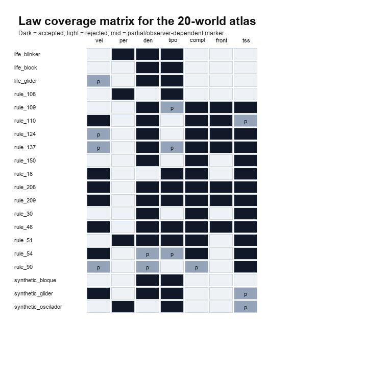
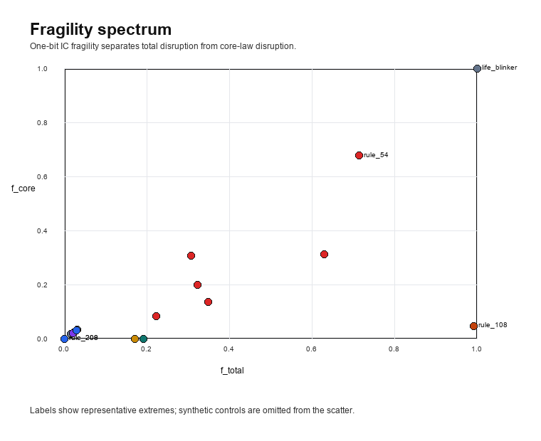
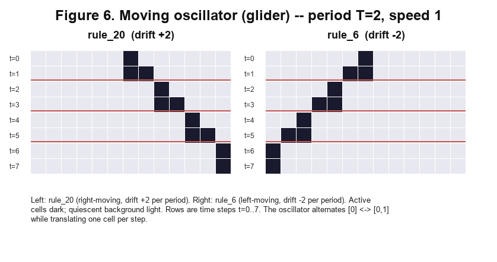
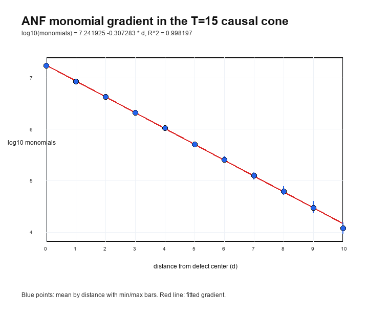

# ZUSE Automat Agent: Empirical Law Discovery in Elementary Cellular Automata

## Abstract

We present ZUSE, a deterministic discovery pipeline for elementary cellular automata (ECA). ZUSE runs fixed simulation protocols, evaluates seven operational cycle laws, stores multi-seed WorldRecords, and measures basin fragility without using a language model inside the discovery loop. Across a 20-world atlas, the system separates law coverage, observer artifacts, and fragility regimes that are collapsed by coarse visual taxonomy.

The strongest case study is a periodic-background oscillator family in `rule_73/rule_109`. A length-8 background sweep finds a `T=15` mechanism with a five-state locking cycle. A 25-cell, 12-step causal cone then reveals an algebraic normal form (ANF) gradient: active-output monomial counts decay with distance from the defect center with `R^2 = 0.998197`, and active-output degree follows `degree = 24 - d + epsilon`. The gradient generalizes to external length-9/10 `T=15` witnesses and concentrates, outside the original family, in catalogued `rule_109` cases. Subsequent causal audits show that center mediation is necessary but not sufficient; period/horizon and alignment descriptors are partial; and the remaining `rule_109/bg=1100/T=8` residual is not separated by scalar temporal summaries.

All scripts, reports, PDFs, and versioned releases are public. The claims are empirical and protocol-bounded: ZUSE provides a reproducible evidence engine for CA law discovery, not a universal autonomous scientist.
## 1. Introduction

Elementary cellular automata are among the simplest systems known to exhibit
complex behavior. A radius-1, binary, one-dimensional CA is fully specified by
a single integer from 0 to 255, yet even within this minimal space, Wolfram's
empirical taxonomy finds four qualitatively distinct dynamic classes: uniform,
periodic, locally chaotic, and complex. Cook's proof that Rule 110 supports
universal computation establishes that complexity in ECA is not merely visual:
it has computational consequences.

Two questions remain largely open after Wolfram's program. First, the taxonomy
is qualitative and coarse: all complex rules fall into Class 4 regardless of
their intra-class differences in structure type, periodicity, fragility, or
scale behavior. Second, the boundary between the dynamics of the rule and the
properties of the measurement instrument is rarely made explicit. When an
observer reports that a run contains gliders, it conflates the CA physics with
the heuristic that defined the glider label.

ZUSE Automat Agent addresses both questions through a deterministic,
policy-driven discovery loop. The agent runs ECA worlds, applies a fixed stack
of heuristic observers, evaluates seven binary cycle laws, and stores
multi-seed evidence in persistent world records. No language model participates
in the discovery loop: law proposals, world selection, and evidence evaluation
are all deterministic. Language-model assistance is restricted to post-run
interpretation and documentation.

The result is an empirical atlas of 20 worlds with seven operational categories,
measured fragility along two axes (`f_total` and `f_core`), and explicit
characterization of two observer artifacts. The atlas is not a new taxonomy of
Wolfram's classes; it is a finer-grained, evidence-based map of a 20-world
sample that separates cycle-level laws, world-level regimes, and pipeline
behavior.

### 1.1 Contributions

We make the following contributions:

1. **ZUSE Automat Agent** -- A deterministic, policy-driven discovery loop for
   ECA that accumulates multi-seed law evidence across worlds without symbolic
   regression or LLM guidance in the loop. The agent combines persistent
   world-record history, a dedup-gated observer stack, and a seven-law evaluator
   into a single reproducible pipeline.

2. **A seven-category empirical atlas of 20 worlds** -- We classify 20 worlds
   spanning ECA rules, Conway's Game of Life patterns, and synthetic controls
   into seven operational categories (*frontera-rich-estable*,
   *periodicidad-global*, *oscilador-local*, *multiregimen-productivo*,
   *multiregimen-escala-dependiente*, *noise-bounded*,
   *sin-evidencia-multiregimen*) using law coverage, signature diversity, and
   fragility. The atlas extends Wolfram's four-class taxonomy by capturing
   intra-class structure, scale-dependent silencing, and negative-control
   regimes.

3. **A two-dimensional fragility framework** -- We measure `f_total` and
   `f_core` separately, defining `f_gap = f_total - f_core` as a quantitative
   measure of secondary-law churn. Four distinct mechanisms are identified:
   stable basin (`rule_208/209`, `f_total = 0.000`), productive basin switching
   (`rule_137`, `f_gap = 0.318`), noise-boundary fragility (`rule_54`,
   `f_core = 0.677`), and quiescent-background activation (`rule_108`,
   `f_gap = 0.945`).

4. **`rule_108` as the unique stationary local-period-2 ECA oscillator** --
   Under an exhaustive protocol (128 quiescent ECA rules, 502 non-zero IC words per
   rule, span <= 32, period <= 16), `rule_108` is the only ECA rule that
   produces stationary local period-2 oscillators. The motif `#.# <-> ###`
   follows algebraically from `f(0,1,0) = f(1,0,1) = 1` and
   `f(1,1,1) = 0`, and the rule's left-right symmetry
   (`f(l,c,r) = f(r,c,l)`) explains why the oscillator does not drift.

5. **A measured separation between ECA dynamics and observer artifacts** --
   `rule_54` single-bit-IC frames are provably translation-invariant
   (confirmed by frame identity after shift normalization), while observer
   dedup counts range from 15 to 24 across IC positions. This non-equivariance
   is characterized as a pipeline property: absolute structure counts depend
   on IC context, but law signatures remain stable.

## 2. Related Work

ZUSE sits at the intersection of three bodies of prior work: empirical ECA
taxonomy, automated law discovery, and LLM-based scientific agents. It is
related to each tradition but positioned differently from all three: it extends
ECA taxonomy inward (intra-class rather than inter-class), it inverts the
discovery framing of symbolic regression systems (fixed evaluators rather than
generative hypotheses), and it excludes the LLM from the loop rather than
centering it.

### 2.1 ECA taxonomy and complexity

Wolfram's systematic study of elementary cellular automata established the
canonical four-class taxonomy: Class 1 (uniform), Class 2 (periodic), Class 3
(chaotic), and Class 4 (complex) [Wolfram2002]. This taxonomy is qualitative
and based on visual inspection of space-time diagrams. ZUSE extends it by
measuring intra-class structure: two Class-4 rules (`rule_137` and `rule_54`)
differ not only in fragility magnitude but in fragility mechanism, a distinction
the four-class taxonomy does not capture.

Cook's proof that Rule 110 supports universal computation [Cook2004]
established that ECA complexity has computational consequences beyond visual
appearance. But computational class is a coarse lens: `rule_110` and
`rule_54` are both Class 4, yet ZUSE finds that their fragility mechanisms are
qualitatively different -- productive basin switching versus noise-boundary
crossing. `rule_110` appears in the ZUSE atlas as a
`multiregimen-productivo` world with `f_total = 0.323` and a stable frontera
signature. The computational proof characterizes what `rule_110` *can*
compute; ZUSE characterizes what it *typically does* under random
initialization.

### 2.2 Automated scientific discovery

AI Feynman [Udrescu2020] demonstrated symbolic regression over
physical datasets, recovering known equations from data with interpretable
structure. The contrast with ZUSE is deliberate: AI Feynman uses neural
networks to propose candidate laws from continuous-variable data, while ZUSE
applies fixed binary evaluators to discrete CA dynamics and accumulates
evidence without a generative component. ZUSE is not a symbolic regression
system; it is a policy-driven measurement pipeline whose outputs are law
signatures, not formulas.

More broadly, systems such as Eureqa [Schmidt2009] and recent
LLM-based discovery agents frame discovery as hypothesis generation followed
by verification. ZUSE inverts this framing: laws are fixed a priori, and the
discovery consists of finding which worlds satisfy them and under what
conditions. This makes every accepted law signature verifiable from
deterministic scripts, at the cost of not proposing new laws automatically.

### 2.3 ZUSE as evidence engine, not LLM scientist

Recent work on LLM-based scientific agents (e.g., The AI Scientist [Lu2024])
demonstrates that language models can propose hypotheses, design
experiments, and write papers with minimal human intervention. ZUSE occupies a
different position in this space: the language model is explicitly excluded
from the discovery loop and restricted to post-run interpretation and
documentation.

This separation is a design choice, not a limitation. It means that the atlas
findings are fully reproducible from the deterministic loop code, and that
language-model involvement can be audited at the documentation layer without
contaminating the empirical results. The cost is that ZUSE cannot propose new
laws; the benefit is that every accepted law has a transparent, non-generative
provenance.

### 2.4 Computational mechanics, particles, and causal states

Computational mechanics provides a formal language for extracting predictive
structure from observed sequences. Crutchfield and Young introduced
statistical complexity as a way to infer minimal equations of motion from
measurement sequences [Crutchfield1989]. Shalizi and Crutchfield later
formalized causal states and epsilon-machines as minimal predictive
representations of stochastic processes [Shalizi2001]. In cellular automata,
this line connects to the broader edge-of-chaos and evolved-computation
literature: Langton's lambda experiments framed emergent computation near
phase transitions [Langton1990], and Mitchell, Hraber, and Crutchfield studied
genetically evolved CAs for global computational tasks [Mitchell1993]. Hanson
and Crutchfield applied the domain/particle viewpoint directly to
one-dimensional cellular automata by constructing domain filters, particles,
and particle interactions for ECA `rule_54` [Hanson1997].

ZUSE uses this vocabulary cautiously. The Fase 68 audit reports a compressed
causal-state proxy over the defect trajectory, not a full CSSR reconstruction
and not an epsilon-machine. Its negative result should therefore be read as a
failure of a deliberately compressed symbolization
`(dominant_context, defect_size_bucket)`, not as a negative result for
computational mechanics itself.

### 2.5 Periodic backgrounds, gliders, and mechanistic audits

The oscillator results in Sections 7.5--7.37 are closest in spirit to the
domain/particle tradition in cellular automata: localized structures are
studied relative to a background, and the relevant mechanism may be a defect
trajectory rather than a raw frame pattern. Lindgren and Nordahl applied
complexity measures to one-dimensional cellular automata using block entropy
and stochastic finite automata [Lindgren1988]. Boccara, Nasser, and Roger
catalogued particle-like structures and interactions in one-dimensional
deterministic CA rules [Boccara1991]. Later Rule 54 work developed this line
through collision catalogues and logical gates [Martinez2006], and through a
formal language for particles on periodic backgrounds [Redeker2010]. Hanson
and Crutchfield's `rule_54` analysis demonstrates how regular domains can be
filtered to expose particles and interactions [Hanson1997]. ZUSE differs by
using exhaustive finite sweeps over prescribed periodic backgrounds and IC
words, then auditing the discovered witnesses with Boolean ANF, perturbation,
and residual tests.

The ANF analysis uses standard algebraic normal form of Boolean functions:
each finite Boolean map is represented as an XOR-sum of monomials over
`GF(2)`. The paper does not claim a new theory of ANF; it uses ANF as an exact
finite representation of the 25-input causal-cone maps. The mechanistic terms
introduced in the later audit sections, such as ablation, local circuit, and
faithful mechanism, are borrowed by analogy from mechanistic interpretability
work in neural networks, where small algorithmic circuits are reverse
engineered by interventions and decomposition [Elhage2021]. Here those terms
refer only to finite ECA truth tables and causal cones.

### 2.6 Symbolic regression and postponed formula search

Symbolic regression systems such as AI Feynman [Udrescu2020] and PySR
[Cranmer2023] search for compact expressions that fit measured data. ZUSE uses
symbolic regression only as an external diagnostic. A PySR run is reported as
a negative result in Section 9.5, and later symbolic regression is postponed
until the dataset contains enough independent comparable measurements to avoid
overfitting. This is consistent with the paper's main design constraint:
measurement and acceptance are deterministic, while formula search remains an
optional post hoc tool.

## 3. System: ZUSE Automat Agent

ZUSE Automat Agent is a deterministic discovery loop over cellular automaton
worlds. A world is a simulator plus an initial-condition protocol and a time
window. For ECA worlds, the simulator is the standard binary radius-1 update
rule with periodic boundary conditions. The agent runs a world, computes frame
metrics, extracts candidate structures, evaluates a fixed set of laws, updates
world-level history, and chooses the next action through a transparent policy.

### 3.1 Inputs and outputs

A single agent cycle takes as input:

- **World identifier**: the ECA rule number (`0..255`) or a named synthetic
  world.
- **IC protocol**: either a random seed for standard runs or a designed IC
  vector for controlled experiments.
- **Width and steps**: fixed integers, typically `width = 64` and
  `steps = 24..200`, depending on the world's scale protocol.

The outputs of a single cycle are:

- **Frame metrics**: density mean, entropy mean, temporal transition rate, gzip
  ratio, and mutual information mean.
- **Analysis status**: `ok` or `ruido_no_analizable` after the noise gate.
- **Structure records**: raw `Estructura` outputs with type labels and span
  information, plus `dedup_structure_count`.
- **Law signature**: frozenset of accepted law names, or the empty set if the
  run is noise-gated.

### 3.2 Loop structure

The loop has five layers:

1. **Simulation.** ECA frames are generated from explicit initial conditions
   with fixed `width`, `steps`, and `seed` or with designed ICs for controlled
   experiments. The simulator itself is not learned.

2. **Frame metrics.** Each run is summarized by density, entropy, temporal
   transition rate, gzip compressibility, and temporal mutual information.
   These features support both individual laws (`complejidad_alta`,
   `frontera_temporal`, `temporal_scale_stability`) and later meta-analysis.

3. **Observers and deduplication.** A stack of heuristic observers converts
   frame histories into `Estructura` records with type labels such as `glider`,
   `bloque`, and `oscilador`. The raw observer outputs are intentionally kept
   for audit, while `deduplicate_structures` estimates the number of physical
   structures. The production noise gate uses `dedup_structure_count > 40`.

4. **Cycle-law evaluation.** Seven laws are evaluated on each analyzable run.
   The result is a law signature: the set of accepted laws for that cycle.
   Noise-gated runs skip law evaluation rather than forcing a low-confidence
   signature.

5. **Policy and memory.** The agent stores a persistent `WorldRecord` per
   world and chooses the next action after each cycle.

### 3.3 State: WorldRecord

Each world maintains a `WorldRecord` with the following fields relevant to
atlas construction:

| field | description |
| --- | --- |
| `visit_count` | total cycles run on this world |
| `scores` | per-cycle scores used by the policy |
| `noise_count` / `noise_fraction` | count and fraction of noise-gated cycles |
| `law_signatures` | list of accepted law signatures as frozensets |
| `unique_law_signature_count` | count of distinct non-empty signatures |
| `non_empty_signature_visit_count` | visits where at least one law was accepted |
| `law_signature_diversity` | unique non-empty signatures divided by non-empty visits, reported after at least five non-empty visits |
| `peak_signature_diversity` | maximum clean diversity observed so far |
| `has_multiregime_evidence` | monotone boolean, set once peak diversity exceeds `0.5` under low noise |
| `params_tried` | tested `(steps, width, law_signature)` tuples |
| `max_ok_steps` / `first_noise_steps` | scale boundary diagnostics |

The important design choice is that empty signatures are retained for audit but
excluded from diversity. A world is not multi-regime merely because it
alternates between laws and silence; multi-regime evidence requires multiple
non-empty law signatures.

### 3.4 Journal

Every cycle result is appended to a JSONL journal
(`outputs/experiments_*/journal_*.jsonl`). Each line is a self-contained JSON
record with cycle identifier, world identifier, steps, width, frame metrics,
analysis status, structure counts, law signature, action taken, and the
previous WorldRecord state visible to the policy at decision time. The journal
is the primary reproducibility artifact: the atlas in Section 5, the fragility
measurements in Section 6, and the case studies in Section 7 are all derived
from journal queries and controlled follow-up scripts.

### 3.5 Policy

The policy selects the next action from four options:

- **Vary seed** (`repeat_vary_seed`): run the same world with a new IC. Used
  when the world has a new law signature or confirmed multi-regime evidence
  and the current cycle is productive.
- **Increase scale** (`increase_steps`): raise `steps` to test scale-dependent
  behavior. Used when the current world produces analyzable signal and has not
  reached a known noise boundary.
- **Change world** (`change_world`): move to the next world. Used when the
  current world is noise-bounded, reaches a known noise boundary, has exhausted
  repeats, or converges to unproductive silence at maximum scale.
- **Stop by exhaustion**: after the requested cycle budget, persist state and
  journal artifacts.

The policy has no learned parameters. Its thresholds are fixed constants or
explicit guards in code: `dedup_structure_count > 40` for the noise gate,
signature diversity `> 0.5` for multi-regime evidence, `noise_fraction < 0.20`
for clean diversity, and at least five non-empty visits before diversity is
reported.

### 3.6 Non-generative design

The agent is deliberately non-generative inside the loop. No LLM proposes laws,
selects worlds, or evaluates a cycle. Symbolic regression was used only outside
the loop for calibration and analysis; it is not part of the online discovery
policy. The LLM-assisted work reported here occurs after runs are complete: it
helps design follow-up experiments, interpret artifacts, and write
documentation. This separation is important because every accepted law
signature in the atlas can be reproduced from deterministic scripts.

## 4. Seven Cycle Laws

The seven laws are the primary evidence units linking raw ECA frames to the
world categories, fragility scores, and observer artifacts reported in Sections
5-8. Each law is evaluated per run -- one world, one initial condition, one step
count -- once the observer and dedup pipeline reports `analysis_status = ok`.
The output is binary: accepted or rejected. Law signatures are frozensets of
accepted law names.

### 4.1 Design rationale

The seven laws were chosen to span distinct aspects of CA behavior using
measurements available from a single fixed-length run. They divide into two
groups by input type:

- **Structure-observer laws** (`velocidad_constante`, `periodicidad`,
  `densidad_estable`, `tipo_unico`): depend on the output of the heuristic
  observer stack. They can only fire if the run is analyzable
  (`analysis_status = ok`) and the observers detect at least one structure.

- **Frame-metric laws** (`complejidad_alta`, `frontera_temporal`,
  `temporal_scale_stability`): depend only on summary statistics computed
  directly from the frame array, without reference to individual structures.

This split is intentional. Frame-metric laws are symmetry-agnostic: they fire
regardless of where structures are in the lattice, how many there are, or
whether the observers identify them correctly. Structure-observer laws are
richer but carry the observer's heuristic assumptions. Section 8 reports two
cases where structure-observer laws produce artifacts that frame-metric laws
do not.

All laws produce binary output (accepted / rejected). The choice of binary
rather than continuous output is also intentional: it makes signatures
comparable across runs and worlds without requiring score normalization, and it
forces explicit calibration of each threshold.

### 4.2 Formal criteria

| # | Law | Inputs | Criterion | Constants |
| --- | --- | --- | --- | --- |
| 1 | `velocidad_constante` | Position tracks of moving structures | At least 50% of moving tracks (`velocity > 0.05` cells/step) have linear `x(t)` with normalized residual `< 0.15` | - |
| 2 | `periodicidad` | Structure type list | At least one structure classified as `oscilador` | - |
| 3 | `densidad_estable` | Frame density time series | Coefficient of variation `CV = sigma(rho) / mu(rho) < 0.15` | - |
| 4 | `tipo_unico` | Structure type set | Exactly one structure type present | - |
| 5 | `complejidad_alta` | Frame metrics | `entropy_mean > 0.80` and `transition_rate > 0.25` | - |
| 6 | `frontera_temporal` | Frame metrics | `entropy_mean > 0.80` and `0.28 < transition_rate < 0.4352` | upper threshold calibrated 2026-05-24 |
| 7 | `temporal_scale_stability` | Frame metrics + steps | `temporal_load = steps * gzip_ratio / transition_rate < 19.03` | threshold calibrated 2026-05-24 |

`temporal_scale_stability` rejects any run with `transition_rate = 0`
(quiescent or static configurations), since temporal load is undefined
(`infinity`).

### 4.3 Calibrated constants

Neither threshold can be derived analytically: the boundary between organized
frontier dynamics and pure chaos has no closed form in ECA. Both constants
were set empirically on real ECA runs and are valid within the atlas protocol
(`width = 64`, `steps` roughly `24..200`).

The `frontera_temporal` upper threshold `0.4352` is the midpoint between the
maximum `transition_rate` observed for `rule_110` (`0.4147`) and the minimum
for `rule_30` (`0.4557`) across six canonical seeds at `steps = 24`,
`width = 64`.

The `temporal_scale_stability` threshold `19.03` was fit on
`datasets/fase2c_v3.csv` (120 ECA scale samples). A decision tree at
`max_depth = 4` achieved accuracy `0.908`, precision `0.886`, and recall
`0.954` on the `analysis_ok` label.

### 4.4 Caveats

`tipo_unico` is an observer-dependent exploratory signal, not a mirror-invariant
physical property. Fase 6b showed that `rule_110` and `rule_124` are left-right
mirrors of each other with identical dynamics, yet `tipo_unico` can fire
asymmetrically depending on orientation. `tipo_unico` is retained in the atlas
for its exploratory value but should not be used as evidence of physical
asymmetry.

`frontera_temporal` and `temporal_scale_stability` both depend on
`transition_rate`. Fase 4a and later tree analyses identify transition rate as
the main discriminator separating organized frontier dynamics from pure chaos
or static order. Other metrics (`density_mean`, `gzip_ratio`,
`mutual_info_mean`) are useful context features but should not be treated as
independent causal evidence without ablation.

These caveats do not weaken the atlas: they clarify which signals reflect
physical ECA dynamics and which reflect the current observer design. Section 8
returns to both artifacts with controlled experiments.

### 4.5 Law signatures and the atlas

A law signature is a frozenset of accepted law names for one run. The empty
frozenset is valid and indicates a run that passed the noise gate but accepted
no law. Law signatures are the unit of evidence in the atlas: the world
categories in Section 5 are defined by how signatures distribute across seeds
and scales, and the fragility measurements in Section 6 count how often
signatures change under perturbation.

`frontera_temporal` is a proper subset of `complejidad_alta` by construction
(it adds the upper bound on transition rate). Any run that accepts
`frontera_temporal` also accepts `complejidad_alta`; the converse is not
required. This containment is visible in the law coverage matrix: every `yes` in
the `frontera_temporal` column co-occurs with a `yes` in the
`complejidad_alta` column.

## 5. World Atlas: 20 Worlds and Dynamic Categories

The atlas is derived from `outputs/world_taxonomy/law_map.md`. It contains 20
worlds: ECA rules, designed synthetic controls, and Life-like controls. Each
world is summarized by law coverage, non-empty visit ratio, noise ratio,
signature diversity, mean law count, dominant signature, and measured
fragility where available.

The atlas is not a score table. A high `mean_laws` value, high signature
diversity, and low fragility mean different things. The taxonomy therefore
separates five positive dynamic families from two bookkeeping categories:
`noise-bounded` for worlds stopped by the dedup gate, and
`sin-evidencia-multiregimen` for controls or worlds without sufficient evidence
for one of the positive families.

### 5.1 Category definitions

| category | operational signal | representative worlds |
| --- | --- | --- |
| `frontera-rich-estable` | low signature diversity, high stable law richness (`mean_laws >= 4.0`) | `rule_46`, `rule_208`, `rule_209` |
| `periodicidad-global` | global period-2 behavior; `periodicidad` in nearly all non-empty visits | `rule_51` |
| `oscilador-local` | bounded local period-2 structure on a quiescent background | `rule_108` |
| `multiregimen-productivo` | multiple non-empty law signatures with productive visits | `rule_18`, `rule_54`, `rule_109`, `rule_110`, `rule_124`, `rule_137` |
| `multiregimen-escala-dependiente` | real signature diversity but most high-scale visits become analyzable silence | `rule_90` |
| `noise-bounded` | pre-law failure under the deduplicated structure gate | `rule_30`, `rule_150` |
| `sin-evidencia-multiregimen` | no sufficient evidence of multi-regime or stable-rich behavior in the current protocol | `life_blinker`, `life_block`, `life_glider`, `synthetic_bloque`, `synthetic_glider`, `synthetic_oscilador` |

| world | category | mean_laws | peak_diversity | f_total | f_core |
| --- | --- | ---: | ---: | ---: | ---: |
| `rule_208` | `frontera-rich-estable` | 6.000 | 0.167 | 0.000 | 0.000 |
| `rule_209` | `frontera-rich-estable` | 6.000 | 0.167 | 0.000 | 0.000 |
| `rule_46` | `frontera-rich-estable` | 5.833 | 0.333 | 0.031 | 0.031 |
| `rule_51` | `periodicidad-global` | 4.500 | 0.333 | 0.193 | 0.000 |
| `rule_108` | `oscilador-local` | 2.000 | 0.167 | 0.992 | 0.047 |
| `rule_90` | `multiregimen-escala-dependiente` | 0.500 | 0.600 | 0.172 | 0.000 |
| `rule_110` | `multiregimen-productivo` | 2.727 | 0.600 | 0.323 | 0.198 |
| `rule_124` | `multiregimen-productivo` | 2.167 | 0.600 | 0.224 | 0.083 |
| `rule_109` | `multiregimen-productivo` | 2.000 | 0.667 | 0.307 | 0.307 |
| `rule_18` | `multiregimen-productivo` | 2.308 | 0.800 | 0.349 | 0.135 |
| `rule_137` | `multiregimen-productivo` | 2.867 | 0.833 | 0.630 | 0.312 |
| `rule_54` | `multiregimen-productivo` | 1.917 | 0.800 | 0.714 | 0.677 |
| `rule_30` | `noise-bounded` | 1.100 | 0.000 | 0.021 | 0.021 |
| `rule_150` | `noise-bounded` | 0.750 | 0.000 | 0.023 | 0.023 |
| `life_blinker` | `sin-evidencia-multiregimen` | 3.000 | 0.200 | 1.000 | 1.000 |
| `life_block` | `sin-evidencia-multiregimen` | 2.000 | 0.200 | 0.016 | 0.016 |
| `life_glider` | `sin-evidencia-multiregimen` | 2.357 | 0.333 | 0.032 | 0.032 |
| `synthetic_bloque` | `sin-evidencia-multiregimen` | 2.000 | 0.200 | n/a | n/a |
| `synthetic_glider` | `sin-evidencia-multiregimen` | 3.167 | 0.400 | n/a | n/a |
| `synthetic_oscilador` | `sin-evidencia-multiregimen` | 2.286 | 0.400 | n/a | n/a |

This classification is intentionally operational. A world can be reclassified
if a wider protocol produces different evidence; the atlas records what the
current deterministic protocol has measured.

The same principle applies to `frontera_temporal` candidates. Fase 20a found
many additional ECA rules that are rich in `frontera_temporal` at the fixed
sweep scale (`steps = 24`), but Fase 20b showed that the strongest four new
candidates do not remain `frontera-rich-estable` under long-journal policy
scaling. Fase 20c therefore treats `frontera-short-scale` as a candidate tier,
not as an atlas-grade category. The atlas promotes worlds only when short-scale
richness survives the broader validation protocol.

### 5.2 Law coverage

The law coverage matrix uses seven columns:

```text
velocidad_constante
periodicidad
densidad_estable
tipo_unico
complejidad_alta
frontera_temporal
temporal_scale_stability
```

Each cell has one of four states: accepted in the dominant signature or in at
least half of non-empty visits (`yes`), observed but below half (`partial`), never
observed in non-empty visits (`-`), or unknown because no non-empty visits
exist (`?`).

Cell states:

- `yes`: law appears in the dominant signature or in at least 50% of non-empty visits.
- `partial`: law appears in at least one non-empty visit but in less than 50%.
- `-`: non-empty visits exist and the law never appears.
- `?`: no non-empty visits.

| world | vel | per | den | tipo | compl | front | tss |
| --- | --- | --- | --- | --- | --- | --- | --- |
| `life_blinker` | - | yes | yes | yes | - | - | - |
| `life_block` | - | - | yes | yes | - | - | - |
| `life_glider` | partial | - | yes | yes | - | - | - |
| `rule_108` | - | yes | - | yes | - | - | - |
| `rule_109` | - | - | yes | partial | yes | yes | yes |
| `rule_110` | yes | - | yes | - | yes | yes | partial |
| `rule_124` | partial | - | yes | - | yes | yes | yes |
| `rule_137` | partial | - | yes | partial | yes | yes | yes |
| `rule_150` | - | - | yes | - | yes | - | yes |
| `rule_18` | yes | - | - | yes | yes | - | yes |
| `rule_208` | yes | - | yes | yes | yes | yes | yes |
| `rule_209` | yes | - | yes | yes | yes | yes | yes |
| `rule_30` | - | - | yes | - | yes | - | yes |
| `rule_46` | yes | - | yes | yes | yes | yes | yes |
| `rule_51` | - | yes | yes | yes | yes | - | yes |
| `rule_54` | yes | - | partial | partial | yes | - | yes |
| `rule_90` | partial | - | partial | - | partial | - | yes |
| `synthetic_bloque` | - | - | yes | yes | - | - | - |
| `synthetic_glider` | yes | - | yes | yes | - | - | partial |
| `synthetic_oscilador` | - | yes | - | yes | - | - | partial |



*Figure 1. Law coverage matrix for the 20-world atlas. Dark cells indicate
laws accepted in the dominant signature or in at least half of non-empty
visits; mid cells indicate partial activation; light cells indicate rejection.*

The matrix reveals three broad patterns:

1. **Synthetic and Life-like controls validate observer semantics.**
   `life_blinker` and `synthetic_oscilador` activate `periodicidad`; block-like
   worlds activate `densidad_estable` and `tipo_unico`; synthetic gliders
   activate `velocidad_constante`.

2. **Class-4 and frontier worlds separate into distinct families.**
   `rule_137`, `rule_110`, `rule_124`, `rule_109`, and `rule_54` are
   multi-regime worlds with two or three dominant laws. By contrast,
   `rule_46`, `rule_208`, and `rule_209` activate six of seven laws with low
   diversity.

3. **`periodicidad` is IC-family sensitive.**
   Under random ICs it appears in designed controls, in the global complement
   rule (`rule_51`), and in the local oscillator (`rule_108`), but not in the
   complex frontier worlds. Under explicitly periodic ICs, however, Fase 21a
   finds production `periodicidad` in `207/256` ECA rules. The law is therefore
   not dead or ECA-inaccessible; it is controlled by the IC family. This is why
   Section 7 treats `rule_108` separately rather than folding it into ordinary
   stable-rich behavior.

### 5.3 Key atlas rows

The following rows anchor the category structure:

| world | category | mean_laws | peak_diversity | dominant signature |
| --- | --- | ---: | ---: | --- |
| `rule_208` | `frontera-rich-estable` | `6.000` | `0.167` | `velocidad_constante + densidad_estable + tipo_unico + complejidad_alta + frontera_temporal + temporal_scale_stability` |
| `rule_209` | `frontera-rich-estable` | `6.000` | `0.167` | `velocidad_constante + densidad_estable + tipo_unico + complejidad_alta + frontera_temporal + temporal_scale_stability` |
| `rule_46` | `frontera-rich-estable` | `5.833` | `0.333` | `velocidad_constante + densidad_estable + tipo_unico + complejidad_alta + frontera_temporal + temporal_scale_stability` |
| `rule_137` | `multiregimen-productivo` | `2.867` | `0.833` | `densidad_estable + complejidad_alta + frontera_temporal` |
| `rule_54` | `multiregimen-productivo` | `1.917` | `0.800` | `complejidad_alta + temporal_scale_stability` |
| `rule_51` | `periodicidad-global` | `4.500` | `0.333` | `periodicidad + densidad_estable + tipo_unico + complejidad_alta + temporal_scale_stability` |
| `rule_108` | `oscilador-local` | `2.000` | `0.167` | `periodicidad + tipo_unico` |
| `rule_90` | `multiregimen-escala-dependiente` | `0.500` | `0.600` | `temporal_scale_stability` |

These rows show why the taxonomy cannot be reduced to a single richness score.
`rule_208` and `rule_209` are maximally rich and stable; `rule_137` is less
rich but highly diverse; `rule_108` is law-sparse but category-defining because
it is the only local oscillator; `rule_90` has high diversity evidence but low
non-empty yield because its high-scale visits become silent.

### 5.4 Scientific role of the atlas

The atlas is the bridge between cycle-level laws and world-level claims. A law
signature describes one run. A world category describes how signatures behave
across seeds, scales, and perturbations. This distinction is what makes later
fragility measurements interpretable: `f_total = 0.630` in `rule_137` means
something different from `f_total = 0.992` in `rule_108` because the atlas
identifies different category-defining cores.

## 6. Fragility: `f_total`, `f_core`, `f_gap`

### 6.1 Protocol

Fragility is measured by exhaustive one-bit IC perturbation. For each measured
world and canonical seed, every bit in the IC is flipped individually, and the
resulting run is evaluated through the full pipeline (simulation, frame
metrics, observers, dedup, law evaluation). The reference is the law signature
of the unperturbed run.

Protocol parameters:

- **IC width**: `64` for most fragility measurements; `128` for the designed
  `rule_108` local-oscillator IC.
- **Perturbations per seed**: one per bit position (`64` or `128`, depending on
  IC width).
- **Seeds per world**: usually `3` canonical seeds, giving `192` perturbations
  for width-64 worlds. Designed-IC worlds such as `rule_108` use a canonical
  IC rather than random seeds.
- **Steps**: world-specific canonical steps (e.g., `24` for `rule_46`, `48`
  for `rule_137`, `96` for `rule_54`).

### 6.2 Metrics

Three primary fragility metrics are defined:

- **`f_total`**: fraction of perturbations that produce a different law
  signature from the reference (including noise-gated runs and silence).
- **`f_core`**: fraction that changes the category-defining core laws. Noise
  and silence count as core changes because the defining regime is lost.
- **`f_gap = f_total - f_core`**: secondary-law churn. Perturbations that
  change the signature without affecting the core-defining laws.

A fourth component is tracked separately:

- **`f_noise`**: fraction of perturbations that produce
  `analysis_status = ruido_no_analizable` (noise-gate crossing).

`f_noise` is a component of `f_total` and `f_core`; it is reported separately
because it identifies a specific observer-boundary mechanism.

### 6.3 Core-law convention

Core laws are defined per category:

| category | core laws |
| --- | --- |
| `frontera-rich-estable` | the full six-law frontier signature |
| `periodicidad-global` | `periodicidad` |
| `oscilador-local` | `periodicidad` and `tipo_unico` |
| `multiregimen-productivo` | the reference signature of that specific seed |
| `multiregimen-escala-dependiente` | `temporal_scale_stability` |

For `multiregimen-productivo` worlds, the reference signature varies by seed.
`f_core` is therefore computed per seed against that seed's reference and then
averaged.

### 6.4 Fragility spectrum

Fase 22 completes the physical fragility spectrum for all measured non-synthetic
worlds in the atlas. Synthetic controls are excluded from `f_total` and
`f_core` because they are frame generators rather than evolved systems with a
perturbable initial condition. The completed spectrum includes ECA worlds,
Life fixtures, stable-rich frontier worlds, noise-bounded productive pockets,
and the designed `rule_108` local-oscillator IC.

| world | category | `f_total` | `f_core` | `f_gap` | `f_noise` | mechanism |
| --- | --- | ---: | ---: | ---: | ---: | --- |
| `rule_208` | `frontera-rich-estable` | 0.000 | 0.000 | 0.000 | 0.000 | stable basin |
| `rule_209` | `frontera-rich-estable` | 0.000 | 0.000 | 0.000 | 0.000 | stable basin |
| `life_block` | `sin-evidencia-multiregimen` | 0.016 | 0.016 | 0.000 | 0.000 | stable Life fixture |
| `rule_30` | `noise-bounded` | 0.021 | 0.021 | 0.000 | 0.000 | productive pocket |
| `rule_150` | `noise-bounded` | 0.023 | 0.023 | 0.000 | 0.000 | productive pocket |
| `rule_46` | `frontera-rich-estable` | 0.031 | 0.031 | 0.000 | 0.000 | stable basin |
| `life_glider` | `sin-evidencia-multiregimen` | 0.032 | 0.032 | 0.000 | 0.000 | stable Life fixture |
| `rule_90` | `multiregimen-escala-dependiente` | 0.172 | 0.000 | 0.172 | 0.000 | secondary churn |
| `rule_51` | `periodicidad-global` | 0.193 | 0.000 | 0.193 | 0.000 | secondary churn |
| `rule_124` | `multiregimen-productivo` | 0.224 | 0.083 | 0.141 | 0.000 | productive switching |
| `rule_109` | `multiregimen-productivo` | 0.307 | 0.307 | 0.000 | 0.000 | productive switching |
| `rule_110` | `multiregimen-productivo` | 0.323 | 0.198 | 0.125 | 0.000 | productive switching |
| `rule_18` | `multiregimen-productivo` | 0.349 | 0.135 | 0.214 | 0.000 | productive switching |
| `rule_137` | `multiregimen-productivo` | 0.630 | 0.312 | 0.318 | 0.000 | productive switching |
| `rule_54` | `multiregimen-productivo` | 0.714 | 0.677 | 0.037 | 0.375 | noise-boundary |
| `rule_108` | `oscilador-local` | 0.992 | 0.047 | 0.945 | 0.000 | quiescent-background activation |
| `life_blinker` | `sin-evidencia-multiregimen` | 1.000 | 1.000 | 0.000 | 0.000 | periodic fixture disruption |

The spectrum is category-aligned at the extremes: `frontera-rich-estable`
occupies the low end, while `multiregimen-productivo` occupies the upper ECA
range. The `life_blinker` control reaches `f_total = 1.000` because any
single-cell perturbation breaks the exact Life oscillator fixture. `rule_108`
remains the main ECA structural outlier: `f_total = 0.992` with only
`f_core = 0.047`.

### 6.5 Fragility mechanisms

The atlas identifies several distinct mechanisms by which one-bit IC
perturbations change law signatures:

**Stable basin** (`rule_208`, `rule_209`): `f_total = 0.000`. All perturbations
preserve the reference signature. The basin for the six-law frontier signature
is wide enough that no measured single-bit perturbation escapes it. `rule_46`
is nearly identical (`f_total = 0.031`).

**Stable Life fixture** (`life_block`, `life_glider`): perturbations rarely
change the reference signature (`f_total <= 0.032`) because the fixture remains
structurally recognizable after most one-cell flips. This is fixture-level
robustness, not evidence of a broad ECA basin.

**Productive pocket** (`rule_30`, `rule_150`): the worlds are noise-bounded in
the long journal, but the non-empty pockets that survive the gate are stable
under one-bit perturbation (`f_total ~= 0.02`). Their category is defined by
frequent pre-law noise at scale, not by fragility of the productive signatures.

**Productive basin switching** (`rule_137`, and the non-noise-boundary
`multiregimen-productivo` worlds): perturbations move the IC among productive
law-signature regimes. The world never falls into silence or noise;
`f_noise = 0.000` throughout. `rule_137` is the strongest clean case
(`f_total = 0.630`), with more than 80% of perturbations switching regime in
the two most fragile measured seeds.

**Noise-boundary fragility** (`rule_54`): perturbations cross the observer
noise gate rather than moving between productive regimes. The mechanism
requires complex ICs near the dedup threshold; single-bit ICs from bare
backgrounds do not approach the gate (Section 8). `f_noise = 0.375` makes
`rule_54` the only measured world where noise-gate crossings dominate
fragility.

**Periodic fixture disruption** (`life_blinker`): any one-cell perturbation
breaks the exact Life period-2 reference signature (`f_total = 1.000`). This
is not basin switching or noise-boundary crossing; it is the brittleness of a
minimal periodic fixture under full-grid perturbation.

**Quiescent-background activation** (`rule_108`): the canonical IC has only two
active bits on a zero background. Nearly any background perturbation ignites
new dynamics and changes secondary laws, producing `f_total = 0.992`. The core
oscillator survives unless the perturbation lands near the motif
(`f_core = 0.047`). The result is the largest `f_gap` in the atlas (`0.945`):
nearly all fragility is secondary, not core.

### 6.6 The `f_core` / `f_gap` separation

The main result of the fragility analysis is the separation between core and
secondary law changes:

- `rule_51` (`periodicidad-global`): `f_total = 0.193`, `f_core = 0.000`.
  Global periodicity survives all measured perturbations; only secondary laws
  (`densidad_estable`) toggle.
- `rule_108` (`oscilador-local`): `f_total = 0.992`, `f_core = 0.047`. The
  local oscillator survives nearly all perturbations; secondary laws are
  maximally sensitive.
- `rule_54` (`multiregimen-productivo`): `f_total = 0.714`,
  `f_core = 0.677`. The core productive signature changes frequently;
  `f_gap = 0.037` is near zero.
- `rule_137` (`multiregimen-productivo`): `f_total = 0.630`,
  `f_core = 0.312`. Both core and secondary transitions are common;
  `f_gap` is approximately equal to `f_core`.

These four cases span the space of possible (`f_core`, `f_gap`) combinations.
Together they demonstrate that `f_total` alone is insufficient: two worlds can
have similar total fragility with opposite core/secondary decompositions.



*Figure 2. Fragility spectrum. The scatter separates total one-bit
perturbation sensitivity (`f_total`) from disruption of the category-defining
law core (`f_core`).*

## 7. Case Studies

### 7.1 `rule_108` -- Unique Local Oscillator

#### Discovery and formal profile

`rule_108` was identified during a targeted local-oscillator search (Fase 16)
using minimal ICs on a quiescent background (`f(0,0,0) = 0`). The canonical IC
is a pair of active cells separated by one gap (`#.#`, word `101` in binary).
Under `rule_108`, this IC produces an exact period-2 local oscillator
(Figure 3): the gap fills in each step (`#.# -> ###`) and then empties again,
repeating indefinitely with zero drift.


*Figure 3. `rule_108` stationary local oscillator. Active cells are dark and
quiescent cells are light; the orange box marks the bounded local support.*

The oscillator is stationary (center of mass fixed), bounded (`span <= 3`),
and stable over 200 steps with zero drift on a uniform-zero background.

Formal profile (6 canonical seed labels, `width = 128`, `steps = 200`,
IC = `pair_gap1`): `periodicidad` and `tipo_unico` are accepted in `6/6`
runs. Mean `dedup_structure_count = 1.000`. The oscillator is deterministic
given the canonical IC; the seed labels are retained only to keep the profile
format consistent with other atlas worlds.

#### Algebraic derivation

The oscillator follows from three entries in the `rule_108` table:

| Neighborhood | Output | Role |
| --- | --- | --- |
| `010` | `1` | isolated active center stays active |
| `101` | `1` | gap fills in: `#.# -> ###` |
| `111` | `0` | center empties: `### -> #.#` |

`rule_108` is left-right symmetric (`f(l,c,r) = f(r,c,l)`), which explains why
the oscillator does not drift: the two flanking cells exert equal influence on
the center.

#### Fragility: quiescent-background activation

`rule_108` has the largest fragility gap in the atlas:

| Metric | Value |
| --- | --- |
| `f_total` | `0.992` |
| `f_core` | `0.047` |
| `f_gap` | `0.945` |
| Core positions | `61, 62, 63, 65, 66, 67` |
| Pattern | `clustered` |

The mechanism is geometric. The canonical IC (`pair_gap1`, 2 active bits in
`width = 128`) leaves more than 120 cells at zero. A one-bit perturbation at
any of those background positions activates the quiescent background: because
`f(0,1,0) = 1`, an isolated `1` on a zero background immediately grows,
producing new detectable structures. This changes secondary laws while leaving
`periodicidad` and `tipo_unico` intact as long as the oscillator core is
undisturbed. A perturbation within the core neighborhood (positions `61..63`,
`65..67`) displaces or destroys the oscillator, accounting for
`f_core = 0.047`.

This constitutes a third fragility mechanism, distinct from productive basin
switching (`rule_137`, Section 7.3) and noise-boundary fragility (`rule_54`,
Section 7.2): quiescent-background activation. The core behavior is robust,
but the minimal IC makes secondary laws highly sensitive to background
activation.

#### Uniqueness

Fase 18 ran an exhaustive search over all 128 ECA rules with quiescent
backgrounds (`f(0,0,0) = 0`), testing 502 non-zero IC words per rule (all
non-empty binary words of length 1..8), with `width = 128`, `steps = 200`,
burn-in of 80 steps, and requiring zero drift (stationary oscillators only).
Only `rule_108` produced stationary local period-2 oscillators; no other rule
produced a stationary local oscillator for periods `2..16` and span `<= 32`.

A companion sweep with the stationarity requirement relaxed found a distinct
family of moving local oscillators -- see Section 7.5.

The longer-IC extension strengthens the same conclusion. Extending the
stationary sweep to all 7,676 non-zero IC words of length 9..12
(`982,528` rule/IC runs) produced 3,802 detections, all in `rule_108`. No new
stationary oscillator rule appears beyond the length-1..8 baseline; the
minimum witness is still the embedded `101` motif (`000000101` at length 9).

The family is internal to `rule_108`: 132 out of 179 candidate IC words are
accepted by the production observer as `periodicidad`, with oscillator spans
3, 5, 6, 7, and 8. All confirmed oscillators have period exactly 2; no longer
period was found.

### 7.2 `rule_54` -- Noise Gate Anatomy

`rule_54` is the clearest example of noise-boundary fragility: perturbations do
not merely move the run to another productive signature, but can push the
observer output across the deduplicated structure gate. The production gate is:

```text
dedup_structure_count > 40 -> ruido_no_analizable
```

#### Fase 13: anatomy of the gate

Fase 13 measured three productive `rule_54` ICs at `steps = 96` and perturbed
each by all 64 one-bit flips. The reference deduplicated counts were close to
the gate:

| seed | reference dedup | noisy flips / 64 |
| --- | --- | --- |
| `20260638` | `32` | `14` |
| `20260640` | `33` | `18` |
| `20260642` | `39` | `40` |

Across the three seeds, `72/192` flips crossed into `ruido_no_analizable`
(`f_noise = 0.375`). Every noisy flip crossed for the same reason:
`dedup_structure_count > 40`. No alternative noise mechanism was observed.

The sensitive positions formed a clustered, multi-hot pattern rather than a
single contiguous block. Bins near the periodic boundary (`0..7` and `56..63`)
were repeatedly implicated, and bit 5 was the only bit whose flip crossed the
gate in all three measured seeds.

#### Fase 19: controlled single-bit negative case

Fase 19 tested whether bit 5 was a special absolute coordinate of `rule_54`.
It replaced the complex ICs with controlled single-bit ICs: for each
`k = 0..63`, the initial state contained only one active bit at position `k`.

The result separates CA physics from the observer pipeline:

- The ECA frames are translation-invariant after shift normalization.
- The observer/dedup counts are not translation-equivariant for this
  wide-spreading pattern: `dedup_structure_count` ranges from `15` to `24`
  across positions.
- The law signature is identical for all 64 positions:
  `temporal_scale_stability`.
- Every single-bit IC remains far below the gate (`dedup <= 24 < 40`).

Therefore, bit 5 is not a privileged coordinate of `rule_54`. The Fase 13
signal arises from the interaction between complex IC geometry and the
observer/gate pipeline. Complex ICs close to the threshold can be pushed across
it by local flips; a single active cell cannot.

#### Mechanism

`rule_54` has high total and core fragility (`f_total = 0.714`,
`f_core = 0.677`), but its mechanism differs from `rule_137`. In `rule_137`,
perturbations tend to move between productive regimes. In `rule_54`, a large
fraction of perturbations cross an analysis boundary: the run becomes too
fragmented for the current observer/dedup gate.

This makes `rule_54` a methodological case study as much as a dynamical one.
It shows that the atlas can identify worlds whose measured fragility is
dominated by proximity to an observer threshold. It also motivates the caveat that
absolute structure counts should not be treated as symmetry-invariant physical
observables without equivariance checks.

### 7.3 `rule_137` -- Productive Basin Switching

`rule_137` is the primary example of productive basin switching: one-bit IC
perturbations change the law signature without ever crossing the noise gate or
reaching silence. All fragility is productive (`f_noise = 0.000`,
`f_silence = 0.000`), making it the cleanest case in the atlas for
inter-basin transitions.

#### Fragility profile

Three canonical seeds at `steps = 48`, `width = 64`:

| seed | reference signature | f_total |
| --- | --- | --- |
| `20260633` | `complejidad_alta + frontera_temporal` | `0.812` |
| `20260635` | `complejidad_alta + densidad_estable + frontera_temporal` | `0.219` |
| `20260673` | `complejidad_alta + densidad_estable + frontera_temporal + temporal_scale_stability + tipo_unico + velocidad_constante` | `0.859` |

Aggregate: `f_total = 0.630`, `f_core = 0.312`, `f_gap = 0.318`.

The per-seed range (`0.219..0.859`) is the widest in the atlas. Even the least
fragile measured seed has `f_total > 0.2`. The most fragile seeds (20260633 and
20260673) flip on more than 80% of one-bit perturbations.

#### Mechanism

`f_noise = 0.000`: no perturbed IC crosses the deduplicated structure gate. The
world remains analyzable throughout. The fragility is a property of productive
basin geography, not proximity to an observer threshold.

The pattern is `dispersed`: sensitive positions are distributed across the IC
width rather than concentrated near a motif. This is consistent with a world
that has many narrow productive basins whose boundaries intersect throughout
the IC space.

`peak_diversity = 0.833` -- the highest in the atlas. The canonical seeds
themselves already visit multiple distinct productive regimes. The fragility
measurement extends this: not just that the world can reach different signatures
under different seeds, but that a single-bit perturbation to any one canonical
IC is enough to move between regimes.

#### f_core and f_gap interpretation

`f_core = 0.312` reflects genuine regime switching: flips that remove or
change laws defining the canonical signature. `f_gap = 0.318` reflects
secondary-law churn: the core productive signature survives, but laws on the
signature boundary (such as `densidad_estable` or `tipo_unico`) toggle.

The two components are roughly equal (0.312 vs 0.318), meaning `rule_137` sits
in a region where both core-regime transitions and secondary-law transitions are
common. This is structurally different from `rule_108` (`f_gap = 0.945`, where
the core oscillator is robust and secondary laws dominate) and from `rule_54`
(`f_gap = 0.037`, where the core productive signature changes but almost no
fragility is secondary).

#### Contrast with `rule_54` and `rule_108`

`rule_54` and `rule_137` both have high `f_total` (0.714 vs 0.630), but the
mechanisms are opposite: `rule_54` fragility is dominated by noise-gate
crossings (`f_noise = 0.375`), while `rule_137` fragility is entirely
productive. A perturbed `rule_137` IC stays analyzable and law-rich; it is
simply in a different productive regime.

`rule_108` contrasts from the opposite direction: its `f_core = 0.047` shows
that the defining behavior (the local oscillator) is nearly indestructible,
while `rule_137`'s `f_core = 0.312` shows that its defining signatures change
under nearly a third of all one-bit flips.

### 7.4 `rule_46`, `rule_208`, `rule_209` -- Stable-Rich Frontier

These three worlds define the `frontera-rich-estable` category: low signature
diversity, near-maximal law richness, and very low fragility. They are the
counterexample that revised the early atlas interpretation of
`frontera_temporal`.

The first 15-world atlas made `frontera_temporal` look rare: it appeared only
as a minority law in class-4 multi-regime worlds such as `rule_137`,
`rule_110`, and `rule_54`. Fase 11 showed that this was a sampling artifact.
A sweep over all 256 ECA rules (`seeds = 20260523..20260525`, `W = 64`,
`T = 24`) found 38 rules where `frontera_temporal` activates in at least two
of three seeds, and 17 rules where it activates in all three.

The top rules by law richness were `rule_46`, `rule_208`, and `rule_209`.
Formal six-seed profiles (`20260523..20260528`, `W = 64`, `T = 24`) placed all
three in a new category:

| world | mean laws | peak diversity | category |
| --- | ---: | ---: | --- |
| `rule_46` | `5.833` | `0.333` | `frontera-rich-estable` |
| `rule_208` | `6.000` | `0.167` | `frontera-rich-estable` |
| `rule_209` | `6.000` | `0.167` | `frontera-rich-estable` |

The dominant signature is the same six-law set:

```text
velocidad_constante
densidad_estable
tipo_unico
complejidad_alta
frontera_temporal
temporal_scale_stability
```

Only `periodicidad` is absent. This makes the family nearly maximal under the
current seven-law system without relying on multi-regime exploration.

#### Stable richness rather than multi-regime diversity

The category is defined by the conjunction of high richness and low diversity.
`rule_137` is rich because it moves among several productive law signatures.
The frontier-rich worlds are rich because the same high-law signature appears
reliably across seeds.

This distinction matters operationally. A policy that only looks for signature
diversity would miss these worlds, even though they produce more accepted laws
per visit than any multi-regime world in the atlas. The Fase 11 taxonomy update
therefore adds:

```text
frontera-rich-estable := mean_laws >= 4.0 and peak_diversity <= 0.5
```

evaluated after noise-bounded and multi-regime cases.

#### Complement symmetry and independent convergence

`rule_46` and `rule_209` are a complement pair (`46 = 255 - 209`): exchanging
zeros and ones maps one into the other. Their shared profile is therefore one
physical phenomenon seen through global bit inversion.

`rule_208` is more surprising. Its complement is `rule_47`, not `rule_46` or
`rule_209`, yet it reaches the same maximum-richness profile. This suggests
that the `frontera-rich-estable` regime is not a single isolated symmetry
orbit; at least two distinct ECA regions converge to the same six-law
frontier.

#### Fragility

Fase 12 measured one-bit fragility for the three worlds using the same protocol
as `rule_137` and `rule_54`:

| world | f_total | f_core | f_noise |
| --- | ---: | ---: | ---: |
| `rule_46` | `0.031` | `0.031` | `0.000` |
| `rule_208` | `0.000` | `0.000` | `0.000` |
| `rule_209` | `0.000` | `0.000` | `0.000` |

The result is the opposite end of the fragility spectrum from `rule_137`.
Where `rule_137` has many narrow productive basins (`f_total = 0.630`),
`rule_208` and `rule_209` have measured basins so wide that no single-bit flip
changes the law signature. `rule_46` is only slightly fragile: two of 192
single-bit perturbations change signature across the three measured seeds.

This confirms that high law richness does not imply high fragility. Richness
can arise either from many neighboring productive regimes (`rule_137`) or from
a single broad, stable regime (`rule_46/208/209`).

#### Scientific revision

The correct conclusion is not that `frontera_temporal` is intrinsically rare.
It is rare in the original discovery atlas because the original world sequence
under-sampled stable high-richness boundary worlds. In the full ECA sweep,
`frontera_temporal` is a robust marker of the `frontera-rich-estable` family.

### 7.5 Moving Oscillator Family -- Minimal Period-2 Gliders

A companion sweep to Fase 18 searched all 128 quiescent ECA rules
(`f(0,0,0) = 0`) for oscillators that translate at constant velocity. The
detection protocol matched Fase 18 except: the zero-drift requirement was
replaced by a requirement of constant non-zero drift confirmed over three
consecutive periods; `width` was extended to `256` and `steps` to `300` to
give moving patterns room to travel. The 502 non-zero IC words of length 1..8
were tested per rule (64,256 total runs, 312 s).

Eight rules produce moving oscillators: `rule_6`, `rule_20`, `rule_38`,
`rule_52`, `rule_134`, `rule_148`, `rule_166`, `rule_180`. All share the same
minimal glider pattern:

| Step | Active shape (normalized offsets) |
| --- | --- |
| `t` | `[0]` -- single active cell |
| `t+1` | `[0, 1]` -- two adjacent active cells |
| `t+2` | `[0]` displaced by `+/-2` |

The oscillator alternates between one and two active cells while traveling at
speed 1 cell per step -- the maximum velocity for a radius-1 ECA. Mean active
span per period is 0.5 (alternating span 0 and span 1). All eight rules are
confirmed `edge_touch = False` within `width = 256`.

**Figure 5. Moving oscillator (glider) -- period T=2, speed 1.**

```text
rule_20 (drift +2)          rule_6 (drift -2)

t=0:  . . . 1 . . . . .    . . . . . 1 . . .
t=1:  . . . 1 1 . . . .    . . . . 1 1 . . .
t=2:  . . . . . 1 . . .    . . . 1 . . . . .   <- period boundary
t=3:  . . . . . 1 1 . .    . . 1 1 . . . . .
t=4:  . . . . . . . 1 .    . 1 . . . . . . .   <- period boundary
```

Active cells shown as `1`, quiescent background as `.`. Each period advances
the pattern two positions in the travel direction.



#### Structure: four mirror pairs

The eight rules form four left-right symmetric pairs:

| Left-moving | Right-moving | `b5` | `b7` |
| --- | --- | --- | --- |
| `rule_6` | `rule_20` | 0 | 0 |
| `rule_38` | `rule_52` | 1 | 0 |
| `rule_134` | `rule_148` | 0 | 1 |
| `rule_166` | `rule_180` | 1 | 1 |

Bits `b5` (neighborhood `101`) and `b7` (neighborhood `111`) vary across the
family but do not participate in the glider cycle: neither neighborhood occurs
during quiescent travel with a two-cell active pattern. The eight rules are
therefore a single physical family parametrized by two inactive bit choices
and the left-right direction.

#### Contrast with `rule_108`

| Property | `rule_108` | Moving family |
| --- | --- | --- |
| Drift per period | 0 | +/-2 |
| Period `T` | 2 | 2 |
| Mean active span | ~2 | 0.5 |
| Speed | 0 (stationary) | 1 (maximum) |
| Rules in scope | 1 | 8 (4 mirror pairs) |

The two families do not overlap. `rule_108` does not appear among the eight
moving rules, and none of the eight moving rules produce stationary local
oscillators under Fase 18. Together, the two sweeps partition the quiescent
local oscillator landscape into a unique stationary oscillator (`rule_108`) and
a unique minimal glider family (8 rules, 4 mirror pairs).

#### Uniqueness within the protocol

No IC word of length 1..8 produced a moving oscillator with `T > 2` or
`|drift| != 2` in any quiescent rule. The minimal glider `[0] <-> [0, 1]` at
period 2 and maximum speed is the only moving local oscillator family under
this protocol.

The longer-IC extension reaches the same result. Testing all 7,676 non-zero IC
words of length 9..12 over all 128 quiescent rules (`982,528` rule/IC runs)
produced 2,059 moving detections, all within the same eight-rule family. No
new moving-oscillator rule appears. The minimal witnesses are still the old
glider seeds embedded in longer words (`000000001` for right movers,
`000000010` for left movers). The sweep also filtered 9,822 period-1 moving
particle aliases across 32 rules; these are moving particles, not internal
period-2 oscillators. Extensions to IC words longer than 12 remain open
(Section 10.2). The non-zero background extension is reported in Section 7.6.

The shift from quiescent backgrounds to periodic backgrounds is the point at
which the atlas system becomes a mechanism-discovery instrument rather than a
catalogue alone. Sections 7.1--7.5 show what the fixed ZUSE protocol can
separate under zero-background assumptions: stationary oscillators, moving
period-2 gliders, and observer artifacts. Section 7.6 asks the same atlas
question under a richer background model. That single protocol change exposes
oscillators that are invisible in the quiescent regime, including the
`rule_73/rule_109` family that later drives the T=15 and ANF-gradient audits.
Thus the long ANF block below is not a separate paper appended to the atlas:
it is a high-resolution audit of the strongest mechanism surfaced by the
atlas sweep itself.

### 7.6 Periodic-background oscillator sweep

The two sweeps above restrict the background to quiescent zero cells. A third
sweep tests whether replacing the background with a non-zero periodic tiling
changes the oscillator landscape.

**Protocol.** All 256 ECA rules are tested against 15 unique non-zero periodic
backgrounds with template lengths 1, 2, and 4. Each rule/background pair is
tested against 502 non-zero IC words of length 1..8 centered in a width-256
grid for 300 steps with 80 burn-in. The detector identifies exact recurrence
of the localized difference between the perturbed run and the unperturbed
background orbit; global background periodicity alone is not counted as a
local oscillator. Total: 1,927,680 rule/background/IC runs, 122,253 candidate
detections.

**Result.** Thirty rules produce stationary local oscillators under at least
one non-zero periodic background; 36 rules produce moving oscillators. Of
the 30 stationary rules, 29 are new relative to the zero-background baseline.
Of the 36 moving rules, 28 are new.

The following phenomena appear under non-zero backgrounds but not under the
quiescent zero background:

- **Period-4 stationary oscillators.** `rule_54` and `rule_147` produce
  stationary period-4 oscillators under `0001` background.
- **Period-4 moving oscillator.** `rule_180` produces a T=4 glider with
  drift +4 under `0001` background (shapes `[0] -> [0,1] -> [0,2,3] -> [0]`),
  distinct from its T=2 speed-1 glider under quiescent background.
- **Speed-0.5 gliders.** Multiple rules (including `rule_3`, `rule_17`,
  `rule_27`, `rule_35`, `rule_39`) produce T=2 gliders with drift +/-1 under
  non-zero backgrounds, corresponding to 0.5 cells per step. Under quiescent
  zero background the only observed glider speed was 1 cell/step.
- **`rule_108` under all-one background.** `rule_108` appears in the
  stationary list with background `1` and the same motif `### / #.#` as
  the quiescent result, confirming that the rule_108 oscillator is intrinsic
  to the rule table.

**Separation of regimes.** The zero-background uniqueness claims (Sections 7.1
and 7.5) are not contradicted: they describe the quiescent regime. Under zero
background, the quiescent local oscillator space is sparse (1 stationary rule,
8 moving rules); under non-zero periodic backgrounds, the landscape expands
substantially (30 stationary, 36 moving) and includes period and speed classes
absent from the quiescent regime. The two regimes should not be merged.

### 7.7 Period-8 background oscillator sweep (Fase 24)

A fourth oscillator sweep extended the periodic-background protocol to
length-8 primitive binary backgrounds, testing three questions: do longer
background periods introduce new oscillator rules, new period classes T>4, or
glider speeds outside {0, 0.5, 1}?

**Protocol.** All 256 ECA rules are tested against 30 primitive binary
necklaces of length 8. A length-8 binary string is primitive if its minimal
period is exactly 8; the necklace representative is the lexicographically
smallest member of its rotation class. The count of 30 follows from Mobius
inversion: `(2^8 - 2^4) / 8 = 30`. Each rule/background pair is tested against
502 non-zero IC words of length 1..8 in a width-256 grid, 300 steps, 80
burn-in. The differential detector and period search window (2..16, span <=
32) are unchanged from Section 7.6. Total: 3,855,360 runs.

**Result.** The sweep produces 323,872 candidate detections after filtering
95,121 period-1 aliases. New stationary rules beyond the length-1/2/4
baseline are `rule_62`, `rule_118`, `rule_131`, and `rule_145` (4 rules, all
T=3). New moving rules are `rule_7`, `rule_9`, `rule_21`, `rule_25`,
`rule_31`, `rule_45`, `rule_61`, `rule_65`, `rule_67`, `rule_75`, `rule_87`,
`rule_88`, `rule_89`, `rule_101`, `rule_103`, `rule_111`, `rule_125`,
`rule_173`, and `rule_229` (19 rules).

**New period classes.** Periods T=6, 8, 10, 12, and 15 appear for the first
time; under backgrounds of length 1, 2, and 4 the maximum observed period was
T=4. T=15 is a non-trivial period not divisible by the background length (8).
Fase 24 reports it as an emergent period; Sections 7.8 and 7.9 subsequently
identify its rule family and establish its five-state mechanism under `F^3`.

**New glider speed.** Speed 2/3 cell/step (drift +/-2, T=3) is observed for
the first time; the prior speed set was {0, 0.5, 1}. Representative cases are
`rule_9` (drift -2, T=3, background `00001001`) and `rule_65` (drift +2,
T=3, background `00000001`). Two further rules with the same speed signature,
`rule_111` and `rule_125`, appear in the candidate table. Direct rule-table
reflection, `g(l,c,r) = f(r,c,l)`, confirms two exact left-right mirror pairs:
`rule_9 <-> rule_65` and `rule_111 <-> rule_125`. The paired rules carry
opposite drift signs with the same T=3 speed magnitude, giving the speed-2/3
family the same left/right mirror structure as the speed-1 family in Section
7.5.

**Phase dependence.** A rotation sub-test applied all 8 rotations of the
canonical background to 10 sampled rules while holding the IC fixed. None of
the 10 samples is active in all eight rotations after circular-geometry
correction. `rule_62` and `rule_118` activate in 7 of 8 background rotations;
moving cases range from 6/8 (`rule_9`, `rule_65`) to 2/8 (`rule_111`,
`rule_45`). The IC therefore requires a particular alignment with the
background to nucleate the oscillator.

**Co-translation test (Fase 25).** A strict test co-translates both background
and IC through `k=0..7` for the same 10 cases. The background and XOR
perturbation orbits are exact translations in 80/80 runs. The original
`linear_shape` preprocessing recovers only 58/80 signatures: 22 moving runs
cross positions 255/0, causing a false linear span and rejection. Circular
shape canonicalization (largest-gap cut plus continuous position unwrapping)
recovers 80/80 signatures and all 10/10 cases. Thus the physics and recurrence
detector are co-translation equivariant once cyclic geometry is represented
correctly. The remaining fixed-IC phase dependence is physical, although the
linear observer overstated its severity for moving rules.

**Summary.** All three Fase-24 questions are answered affirmatively:
period-8 backgrounds introduce 4 new stationary rules and 19 new moving
rules, expand the period set to include T=6, 8, 10, 12, and 15, and introduce
speed 2/3 cell/step as a new rational class. The zero-background uniqueness
claims of Sections 7.1 and 7.5 are unaffected.

### 7.8 Anatomy of the T=15 family (Fase 26)

The longest period observed in Fase 24 was analyzed separately to determine
whether it represented a single accidental witness or a coherent family.
All 221 `T=15` detections are stationary and occur in only two rules:
`rule_73` (123 detections) and `rule_109` (98). Both rules are left-right
symmetric, and black/white conjugation maps each rule exactly to the other.
The detections cover 14 primitive length-8 backgrounds, 20 rule/background
pairs, and 25 temporal motifs up to cycle phase. The minimum witness is
`rule_109` on background `00011001` with the two-cell IC word `01`.

**Temporal locking.** Every participating unperturbed background enters a
temporal orbit of period `T_bg=3` (with transient length 0..2). The localized
perturbation has fundamental period `T_local=15`, giving the same locking ratio
`T_local/T_bg=5` in all 20 rule/background pairs. Thus `T=15` is not inherited
directly from the spatial background length 8. Long-horizon reruns of one
minimal witness per pair preserve exact recurrence through step 900 in 20/20
cases; the detector scans upward from period 1 and therefore excludes smaller
fundamental periods.

**Basin width.** Persistence in time does not imply robustness to initialization.
Holding the IC fixed while rotating the background preserves `T=15` in only
23/160 runs. One-bit mutations of the 20 minimal IC witnesses preserve it in
4/134 runs. Most failed perturbations settle into shorter localized periods
`T=3` or `T=6`; a small number produce `T=12` or no localized period in the
search window. The family is therefore temporally exact but basin-narrow.

These results establish a persistent background-locked family rather than a
single numerical coincidence. Fase 26 measures but does not explain the
five-to-one locking ratio; Fase 27 addresses its finite-state mechanism next.

### 7.9 Five-state locking mechanism (Fase 27)

Fase 26 measured `T_local/T_bg=5` across all 20 minimal `T=15`
representatives but left the origin of that ratio open. Fase 27 closes the
computational half of the question by tracking the localized XOR defect
`D(t) = X(t) XOR B(t)` once per background period.

**Protocol.** After burn-in, the defect is sampled at
`t = 81 + k*T_bg` for `k=0..20`, covering four complete candidate
five-cycles for each of the 20 minimal `(rule, background, IC)` witnesses from
Fase 26. Acceptance requires eight simultaneous checks: the background returns
to the exact same phase at every sample; the first five defect states are
mutually distinct; the fifth transition closes the cycle; no shorter cycle
under `F^3` explains the sequence; four consecutive cycles repeat in both
canonical and raw-position encodings; transitions remain deterministic across
cycles; and the oscillator is stationary over every local period.

**Results.** All eight checks are satisfied for 20/20 representatives. Every
`T=15` oscillator in the family is stationary (`drift=0`). The defect cycles
through exactly five distinct states under `F^3`, the three-step evolution
operator, and five applications of `F^3` are necessary and sufficient to
restore the complete background-plus-defect configuration. The same result
holds over four consecutive cycles in both relative-shape and absolute-position
encodings.

**Interpretation.** The locking ratio `T_local/T_bg=5` is the cycle length of
the defect under `F^3`, not a resonance with the spatial background length 8.
The result is a computational state-cycle derivation: it establishes the
finite-state mechanism without reducing the five nodes to a closed-form
symbolic identity over the rule-table algebra of `rule_73/rule_109`. That
symbolic derivation remains open.

### 7.10 Induced defect rule and exact conjugation (Fase 28)

Fase 28 examines the local algebra inside the five-state cycle. A localized
XOR defect does not evolve under the original ECA rule `f` in isolation. If
`b` is a three-bit background neighborhood and `d` its XOR-defect
neighborhood, the exact induced update is

`delta_f(b,d) = f(b XOR d) XOR f(b)`.

The analysis profiles this induced rule over all 300 microsteps contained in
the 100 `F^3` edges from the 20 minimal representatives.

**Analytical conjugation.** Let `C` denote bitwise complementation. Since
`rule_109` is the black/white conjugate of `rule_73`, their global maps satisfy
`F_109(C(X)) = C(F_73(X))`. If both the full state and background are
complemented, induction gives `X_109(t)=C(X_73(t))` and
`B_109(t)=C(B_73(t))` for every `t`. Therefore:

`D_109(t) = C(X_73(t)) XOR C(B_73(t)) = D_73(t)`.

At local level, the equivalent identity is
`delta_109(C(b),d) = delta_73(b,d)`. Thus the defect orbit is invariant, not
complemented, under the simultaneous black/white conjugation. This statement
is analytical; exhaustive checks over all 64 local `(b,d)` combinations and
10/10 complemented orbit pairs serve as implementation validation.

**Sparse-support hypothesis rejected.** Every one of the 100 `F^3`
macro-transitions uses all eight ordinary truth-table entries in its causal
defect cone. No single induced `(b,d)` key appears in every macro-transition.
The five-cycle therefore cannot be explained by one fixed sparse subset of
local entries.

The negative result still exposes phase structure. The sizes of the induced-key
intersections for transitions `S0->S1` through `S4->S0` are
`[9,6,7,5,4]` for `rule_73` and `[11,11,10,9,8]` for `rule_109`. These
signatures are rule-specific rather than universal. A closed-form derivation
must therefore encode spatial phase or a higher-order block state, rather than
truth-table entry presence alone.

### 7.11 Block-locality limits and background-indexed shape families (Fase 29-30)

Section 7.10 concludes that a closed-form derivation of the five-cycle must
encode spatial phase rather than truth-table entry presence alone. Fase 29 and
Fase 30 test two complementary refinements of that conclusion.

**Defect-shape locality (Fase 29).** For each of the 20 minimal representatives
and each of the five cycle phases, the canonical XOR-defect shape is computed
at sample times `t = 81, 84, 87, 90, 93`. If the T=15 cycle were a pure
defect-only dynamic, every background would produce the same canonical shape in
each phase. Instead, `rule_73` produces 8-9 distinct shapes per phase across
its 10 backgrounds, and `rule_109` produces 8. Extending the comparison window
outward to fixed local blocks (active defect span plus up to three padding
cells on each side) does not help: no nontrivial block signature is shared
across all backgrounds in any phase. The `W=0` result in the block-signature
scan shows that the active defect span itself already carries
background-dependent context -- no additional padding is needed before the
discrimination occurs. Only the trivial token `d000->0` (background cells
evolving to background under all three microsteps) is universal.

**Shape families (Fase 30).** Although the defect shapes are
background-dependent, they are not unstructured. Treating two five-state cycles
as equivalent when one is a cyclic phase rotation of the other, the 20
representatives decompose into 7 distinct families for `rule_73` and 8 for
`rule_109`, yielding 13 global families. The largest family has 3 members. Two
families are shared across the conjugate rules: one of size 3 (two `rule_73`
backgrounds and one `rule_109` background) and one of size 2 (background word
`00110101` producing phase-rotationally equivalent defect cycles under both
rules). This second coincidence is not implied by the analytical conjugation of
Fase 28 -- the bitwise complement of `00110101` is `11001010`, a distinct word
-- so it is an independent structural coincidence. Scalar background
descriptors (`active_count`, `transition_count`, `active_transition_pair`) do
not determine the family. The canonical temporal orbit of the background under
the same rule is exact in this representative set, but this is largely a
restatement of full background identity rather than a compact symbolic law.

**Interpretation.** Fase 29 and Fase 30 together bracket the derivation
problem: a correct symbolic account must use the full temporal background orbit
(or an equivalent compact encoding), and maps that orbit to one of a finite set
of defect-cycle shapes plus a phase offset. A derivation predicting a single
universal five-state cycle is falsified by Fase 29; a derivation predicting
arbitrary unclustered shape variation is refuted by Fase 30.

### 7.12 Compact state variable for the T=15 family (Fase 31-32)

Fase 30 reduced the T=15 family to 13 shape families but required the full
temporal background orbit as the discriminating descriptor. Fase 31 and Fase 32
search for a shorter description.

**Descriptor search (Fase 31).** A compact global background descriptor does
not exist among the candidates tested (length-2..4 circular subpattern counts,
parity, run lengths, and orbit prefixes up to 24 bits). Globally, only
`orbit_prefix_24` determines the family, which is substantially a restatement
of full background identity. Conditioned on the ECA rule, the shortest
non-orbit candidate is the circular multiset of length-4 background subwords
(`subpatterns_len4`): it separates all 10 backgrounds per rule into distinct
buckets with zero ambiguity. A global decision tree over all features achieves
only 0.700 training accuracy at depth 4, confirming that no shallow feature
combination separates all 13 families simultaneously.

**Rotation generalization (Fase 32).** The circular subpattern multiset is
invariant under background rotation. Fase 32 tests whether the predicted family
is preserved across all seven non-trivial rotations of each of the 20
representative backgrounds, under two modes: `fixed_ic` (background rotated, IC
position fixed) and `cotranslated_ic` (background rotated, IC shifted by the
same amount to preserve local alignment).

Under `fixed_ic`, only 3 of 140 rotations produce T=15 at all, and 1 matches
the predicted family. Under `cotranslated_ic`, all 140 of 140 rotations produce
T=15 and all 140 match the predicted family. The co-translation result is not
evaluated on new backgrounds but on rotational variants of the known 20
representatives; it validates that the descriptor is rotation-equivariant
within the confirmed family set, not that it predicts previously unseen data.

**Compact state variable.** The complete minimal description consistent with
all observations is the triple `(rule, subpatterns_len4, IC/background
alignment)`. The rule identity determines which of the two conjugate families
applies; the subpattern multiset identifies the shape-family class within that
rule; and the IC/background alignment selects the phase within the five-state
cycle. A derivation operating on the background word alone without IC alignment
is falsified by the `fixed_ic` mode (3/140 detections). Any derivation that
correctly maps this triple to a defect cycle shape and phase offset is a
complete symbolic account of the T=15 family.

### 7.13 External length-9/10 validation of the T=15 mechanism (Fase 33-34)

Fase 33 first audits whether the compact descriptor from Section 7.12 can be
falsified inside the length-8 background universe. Across all binary circular
length-8 backgrounds there are only two collisions of the `subpatterns_len4`
descriptor: `00110111/00111011` and `00010011/00011001`. Both collisions are
already inside the confirmed T=15 set and both preserve the same defect-cycle
family under the corresponding rule. There is no unseen length-8 background,
outside rotations of the 20 known representatives, that shares a T=15
`subpatterns_len4` descriptor under the same rule. Thus the natural external
test of the descriptor is impossible inside length 8.

Fase 34 therefore moves outside the length-8 universe, but only after a
preflight checks whether the prerequisite for the five-to-one locking mechanism
still exists. Primitive length-9 and length-10 backgrounds do contain temporal
period-three cases under both `rule_73` and `rule_109`: 11 backgrounds per rule
at length 9 and 22 per rule at length 10. A targeted validation then tests only
these 66 backgrounds, the two rules, and the same 502 non-zero IC words of
length 1..8, for 33,132 rule/background/IC runs.

The targeted sweep finds 90 T=15 detections across 8 external backgrounds:
one length-9 background under `rule_73`, five length-10 backgrounds under
`rule_73`, and two length-10 backgrounds under `rule_109`. No length-9
background under `rule_109` produces a T=15 witness in this test. These
backgrounds are not rotations of the length-8 representatives. The result
therefore shows that the T=15 mechanism is not an artifact of primitive
length-8 backgrounds: it generalizes when `T_bg=3` is preserved. The compact
descriptor from Section 7.12 remains a length-8 family identifier; extending
that descriptor to variable background length remains a separate symbolic
problem.

### 7.14 Transition tables and effective orbit embeddings (Fase 35-38)

Sections 7.10--7.13 reduce the `T=15` family to finite defect-cycle shapes,
compact length-8 descriptors, and external `T_bg=3` witnesses. Fases 35--38
then move from visual shape families to the explicit macro-operator acting on
the localized defect.

**Transition tables (Fase 35).** For each of the 20 minimal representatives,
the five transitions `D_i -> D_{i+1}` under `F^3` are expanded into explicit
local transition tables over the induced defect rule
`delta_f(b,d)=f(b XOR d) XOR f(b)`. The table signature is never shared across
different visual families, so it is a sufficient discriminator. It is not
identical to the visual family partition, however: the verdict is
`TABLE_REFINES_FAMILY`. Some multi-member families share the same table exactly
or up to cyclic phase rotation, while others split by rule or by mechanism.
This shows that the fundamental object is the induced macro-transition table,
with the visual family as a coarser quotient.

**Effective orbit identity (Fase 36).** The clearest table identity appears in
family `F00` under `rule_109`: the backgrounds `00001001`, `00010011`, and
`00011001` have the same exact five-phase transition table. Fase 36 explains
this algebraically at the orbit level. Although the three initial backgrounds
have different preperiods, by the sampling time they have converged to the same
canonical period-3 background orbit `{00001001, 00101101, 00111111}`. The
shared table is therefore not accidental: after burn-in, the defect sees the
same sequence of background states.

**Canonical orbit insufficiency (Fase 37).** Generalizing the F00 explanation
to all representatives reveals a sharper constraint. Across the confirmed
`T=15` set there is only one canonical period-3 background orbit for
`rule_73` and one for `rule_109`; this orbit identity is too coarse to
determine the 13 shape families. The missing variable is not which orbit is
reached, but how the localized defect is embedded into that orbit.

**Embedding descriptor (Fase 38).** Fase 38 tests descriptors based on the
sampled orbit step, spatial rotation offset, IC start, IC length, defect anchor,
and the first sampled defect state. The first sufficient descriptor is
`(rule, sample_orbit_step, sample_rotation_offset, defect_state0)`. This closes
the post-burn-in description: once the defect has crystallized into its first
stable-cycle state, the family is determined. The descriptor is not yet a
closed-form prediction from the initial condition, because `defect_state0` is
measured after burn-in.

### 7.15 Pre-burn-in entry phase limits (Fase 39)

Fase 39 tests the remaining left side of the causal chain:

`(background, IC) -> burn-in -> defect_state0 -> family`.

For each of the 20 minimal `T=15` representatives, the localized defect
`D(t)=X(t) XOR B(t)` is traced every three ECA steps from `t=0` to the sampling
time `t=81`. The first time at which `D(t)` belongs to one of the five stable
cycle states is recorded as the entry time, together with the corresponding
entry phase.

The entry is always fast: observed entry times are `0, 3, 6, 9, 12`, with
15/20 representatives entering at `t=3` and all 20 entering by `t=12`.
However, fast entry is not the same as compact predictability. The descriptor
tests include `rule+IC`, `rule+IC length`, post-hoc entry-time descriptors, and
local background/IC windows of radius 1..5 around the initial perturbation.
Exact predictors exist, but they are not compact: `rule+IC` uses 18 buckets
with 17 singleton buckets, and the local windows produce 20 singleton buckets.
Post-hoc descriptors involving entry time are exact for entry phase but do not
predict it from the initial state.

The verdict is `NONCOMPACT_PREBURNIN_DESCRIPTOR_FOUND`. The stable-cycle
entry point is reached after only a few applications of `F^3`, but the tested
pre-burn-in descriptors either fail or identify individual cases. Thus the
current derivation is complete after burn-in and sharply delimited before
burn-in: predicting `defect_state0` from the raw background/IC pair remains the
irreducible part of the mechanism under the tested descriptor class.

### 7.16 Early causal-cone compression (Fase 40)

Fase 40 converts the negative result of Section 7.15 into a constructive
causal compression test. Instead of seeking a closed-form pre-burn-in
descriptor, it asks whether the relevant state can be recovered by simulating
only the local causal cone of the initial perturbation.

For each of the 20 minimal `T=15` representatives, the full reference remains
the 256-cell simulation through `t=81`. The local predictor tests windows at
`t = 3, 6, 9, 12`. Two window definitions are used: `span`, the full IC span
plus a causal margin of `t` cells on each side, and `center`, the strict
`2t+1` window around the IC center. Boundary cells just outside the local
window are supplied by the unperturbed periodic background orbit, which is
valid because a radius-1 perturbation cannot reach beyond the cone within
`t` steps.

The strict center cone succeeds at `t=12`. Its 25-cell, 12-step simulation
matches the full-system defect state at `t=12` in 20/20 representatives. When
the detected stable-cycle phase is projected forward to `t=81`, it recovers
`defect_state0` in 20/20 representatives. The compression ratio relative to
the full 256-by-81 simulation is 69.1x. Earlier windows are incomplete:
`center` at `t=9` reaches 17/20 stable states, while `span` at `t=9` reaches
19/20; both miss at least one representative.

The verdict is `EARLY_CONE_PREDICTOR_FOUND`. Fase 39 showed that no compact
closed-form descriptor was found under the tested pre-burn-in descriptors.
Fase 40 shows that the missing state is nevertheless locally causal: the
mechanism does not require global information, only a short exact simulation
of the radius-1 causal cone. The remaining formal problem is therefore not
global dependence, but replacing this 25-cell, 12-step local computation with
a symbolic account.

### 7.17 Minimal cone-table audit (Fase 41)

Fase 41 asks whether the successful 25-cell, 12-step cone from Section 7.16
contains a hidden smaller object: a sparse induced truth table, a reduced set
of initial input bits, or a pruned causal subgraph. The analysis expands the
cone into induced local updates of the form
`delta_f(b,d)=f(b XOR d) XOR f(b)`, records the ordinary ECA truth-table entries
used inside the cone, and computes the backwards dependency graph required to
produce the final localized active defect support.

The result is deliberately negative at the table/input level. Across the 20
minimal representatives, the induced `(b,d)->d_next` tables are dense: they use
49..62 of the 64 possible local background/defect keys. All eight ordinary ECA
truth-table entries are used in every representative. The final active defect
support still depends on all 25 initial cone inputs. Thus there is no sparse
truth-table shortcut and no input-bit elimination under this audit.

The only reduction is structural. Computing just the final active localized
defect support uses 234..310 internal cone nodes, rather than all 325 nodes in
the 25-cell-by-13-layer cone. This improves the circuit accounting but does not
change the qualitative conclusion: the Fase 40 cone is close to minimal at the
input level. The verdict is `STRUCTURAL_CONE_REDUCTION_ONLY`. The next
symbolic target is therefore Boolean simplification of a dense 25-input,
12-step circuit, not further causal-support reduction.

### 7.18 ROBDD input-support audit (Fase 42)

Fase 42 applies reduced ordered binary decision diagrams (ROBDDs) to the dense
25-input, 12-step cone circuit. The goal is not to prove a globally minimal BDD
over all possible variable orders, but to test the strongest simple Boolean
reduction left open by Fase 41: whether any of the 25 cone inputs is
semantically irrelevant to the active localized output functions.

For each of the 20 minimal `T=15` representatives, the Boolean circuit induced
by the strict center cone is compiled into ROBDDs under the natural
left-to-right cone variable order. The active localized outputs produce ROBDDs
with 17,141..36,966 reachable nodes; the full 25-bit final vector produces
51,539..53,901 reachable nodes. In every representative, both the active-output
functions and the full vector have support size 25/25.

The verdict is `BDD_NO_INPUT_REDUCTION`. ROBDD reduction therefore confirms
the Fase 41 input-support result at the Boolean-function level: no initial cone
variable can be eliminated without changing the represented output functions.
BDD size remains order-dependent, so this is not a proof of global minimum BDD
size over all `25!` orders. It does, however, rule out the key symbolic
shortcut of Boolean input elimination. The remaining task is expression or BDD
size reduction of a function that genuinely depends on all 25 inputs.

### 7.19 ROBDD order-sensitivity and targeted SIFT (Fase 43)

Fase 43 tests the natural follow-up to Section 7.18: if all 25 inputs are
semantically necessary, perhaps the dense Boolean circuit is still compact under
a better variable order. This section keeps the Fase 42 support result fixed and
asks only about representation size.

**Order-sensitivity preflight (Fase 43A).** The three ROBDD orders already
materialized in Fase 42 are compared: `natural`, `reverse`, and `center_out`.
The best global order is `reverse`, but the improvement is small. Across the 20
minimal representatives, total active-output reachable nodes decrease from
552,476 under `natural` to 549,713 under `reverse`, a 0.5% reduction. The full
25-bit vector does not improve: 1,048,969 nodes under `natural` versus
1,049,085 under `reverse`. The `center_out` order is consistently poor, giving
the worst active-output size in 20/20 representatives and a maximum
order-sensitivity ratio of 3.119x. All tested orders preserve 25/25 active and
vector support.

**Targeted SIFT (Fase 43B).** The most favorable representative from the
preflight is `rule_73` on background `00111011`, family `F01`, with IC
`00100100`. Its best Fase-42 active-output ROBDD is the `reverse` order with
16,061 reachable nodes. A one-pass variable-sifting search with checkpointing
evaluates 580 orders on this representative. The best order found is
`[22,21,20,19,23,24,18,17,16,15,14,13,12,11,10,9,8,7,6,5,4,3,2,1,0]`, with
16,056 active-output nodes and 52,698 full-vector nodes. This is a 5-node
active-output reduction, or 0.031%, and remains far above the explicit
10,000-node compression gate. Support remains 25/25.

The verdict is not a global optimality proof over all `25!` orders, but it
rules out the most direct representation shortcut tested here: simple variable
reordering, even with a targeted SIFT pass on the best known candidate, does not
make the dense cone compact. Any future symbolic shortcut must use a different
representation or a different abstraction, not merely ROBDD variable ordering.

### 7.20 ANF degree audit of the T=15 cone (Fase 44)

Fase 44 tests a representation class independent from ROBDDs: algebraic normal
form (ANF, or Zhegalkin polynomial) over GF(2). The question is whether the
dense 25-input, 12-step causal cone has a compact polynomial representation
even though BDD support and simple variable ordering do not simplify it.

The computation simulates exact truth tables in bit-packed form. Each active
output has `2^25` truth values; the simulation stores those values as `uint64`
blocks, then unpacks one active output at a time and applies the Mobius
transform to obtain ANF coefficients. This avoids stochastic sampling and does
not rely on symbolic-regression heuristics.

Across the 20 minimal `T=15` representatives, Fase 44 analyzes 174 active
outputs. Active-output ANF degree ranges from 14 to 24; no output reaches the
formal 25-variable ceiling. Active-output monomial counts range from 9,376 to
17,758,052. Sixty-seven of 174 active outputs have degree below 20, and every
representative has at least one such lower-degree output.

The status is `LOW_OUTPUT_ANF_DEGREE_FOUND`. The cone is not algebraically
uniform: some outputs remain extremely large as polynomials, but others have
substantially lower degree. Fase 44 therefore turns the remaining symbolic
problem from a uniform-density question into a stratification question: which
outputs are algebraically simpler, and why?

### 7.21 ANF gradient laws (Fase 45)

Fase 45 analyzes the 174 active outputs from Fase 44 without new simulation. It
finds that the ANF variation is not arbitrary; it is organized by distance from
the cone center. Let `rel_pos` be the output position relative to the center
cell of the 25-cell cone, and let `d = |rel_pos|`.

**Degree gradient.** For every active output,

`degree = 24 - d + epsilon`, with `epsilon in {0,1}`.

There are zero exceptions outside this one-bit epsilon band over all 174 active
outputs. The center outputs (`d=0`) have degree exactly 24 in 13/13 cases. The
immediate neighbors (`d=1`) have degree exactly 23 in 20/20 cases. The Pearson
correlation between `d` and degree is -0.984525, and the linear fit is
`degree ~= 24.093185 - 0.942523*d` with `R^2 = 0.969289`. The degree-24 cap
also holds globally: no active output reaches degree 25.

**Monomial-count gradient.** Monomial counts obey an even cleaner spatial law:

`log10(monomials) ~= 7.241925 - 0.307283*d`.

The Pearson correlation between `d` and `log10(monomials)` is -0.999098, with
`R^2 = 0.998197`. The slope differs from `-log10(2)` by only -0.006253, so the
monomial count decays almost by a factor of two per cell away from the cone
center.



*Figure 4. ANF monomial gradient in the T=15 causal cone. Points show mean
`log10(monomials)` by distance from the defect center with min/max bars; the
red line is the fitted gradient.*

The residual `epsilon` is not explained by a simple left/right symmetry. The
center has `epsilon=0` in 13/13 cases; left outputs have `epsilon=1` in 32/87
cases, and right outputs in 26/74 cases. Rule identity also does not close the
residual: `rule_73` has `epsilon=1` in 23/80 active outputs, while `rule_109`
has `epsilon=1` in 35/94. Only 16/30 matched left/right output pairs have the
same exact degree, so the defect is algebraically asymmetric even when its
geometric presentation is visually paired.

The verdict is `ANF_GRADIENT_LAWS_CONFIRMED`. The `T=15` defect acts as the
focus of algebraic complexity in the cone. Complexity decreases linearly in
ANF degree and almost exponentially in monomial count with distance from the
defect center. This structure is orthogonal to the ROBDD results of
Sections 7.18-7.19: BDD support and variable ordering do not simplify the
function, but ANF exposes a spatial complexity gradient invisible to those
tree-based audits.

### 7.22 Epsilon residual audit (Fase 46)

Fase 45 leaves one open bit in the ANF degree law. The backbone
`degree = 24 - |rel_pos| + epsilon` has zero exceptions, but the residual
`epsilon` is not explained by sign, rule identity, or simple left/right
symmetry. Fase 46 asks whether this bit has a compact predictor from static
features already available in the Fase 45 records.

The audit excludes `dist=0` and `dist=1`, where `epsilon=0` in all known cases.
Including those rows would inflate accuracy without explaining the residual.
The remaining dataset contains 141 active outputs across the 20 minimal
`T=15` representatives, with epsilon counts `{0: 83, 1: 58}` and a majority
baseline of 58.87%.

Single-feature tests are evaluated by leave-one-representative-out validation.
The best single feature is distance itself, at 64.89% mean accuracy. This is
weak residual signal from the same variable that defines the main gradient,
not a new explanatory law. The next strongest feature is `defect_phase`
(64.53%), with phases 1 and 2 tending toward `epsilon=1`; this has plausible
physical semantics but does not generalize strongly. `local_bg_3mer` reaches
64.18%. In contrast, `background_bit`, rule identity, and left/right sign
collapse to the majority baseline, and `bg_transition` performs worse.

A depth-3 decision tree over all tested features reaches 73.05% training
accuracy but only 55.65% mean leave-one-representative-out accuracy, with a
20.67% fold standard deviation. The tree's top feature is `family_id=F03`,
followed by distance and local background features. This gap indicates
representative/family memorization rather than a transferable epsilon rule.

The verdict is `EPSILON_REMAINS_RESIDUAL`. Fase 46 does not weaken the ANF
gradient law; it separates the strong spatial backbone from a one-bit residual
that is not captured by static rule, position, local-background, family, or
cycle-phase descriptors. The remaining explanation, if one exists, likely
requires dynamic features of the ANF computation rather than a static descriptor
of the output position.

### 7.23 Dynamic ANF growth profile (Fase 47)

Fase 47 tests the explanation suggested by Fase 46: if `epsilon` is not
predicted by static descriptors, it may be encoded in the temporal growth of
the ANF itself. The computation reuses the exact bit-packed cone simulation of
Fase 44, but instead of applying the Mobius transform only at the final layer,
it computes ANF degree and monomial count for each active output at every layer
`t = 1..12`.

The audit covers the same 20 minimal `T=15` representatives and the same 141
nontrivial residual rows with `dist >= 2`. As an internal consistency check,
the recomputed `t=12` degrees and monomial counts are compared against Fase 44;
there are zero mismatches.

The result is `EPSILON_DYNAMIC_RULE_FOUND`. The strongest single feature is
`degree_growth_slope`, the linear slope of ANF degree over `t=1..12`. It reaches
98.58% training accuracy and 94.90% mean leave-one-representative-out accuracy
with 9.44% fold standard deviation. This is a 30-point LORO improvement over
the best static feature from Fase 46. `monomial_growth_slope` is weaker but
still informative, with 73.37% LORO accuracy, and `t_first_full_degree` reaches
71.96%.

A depth-3 decision tree over the dynamic features reaches 86.52% training
accuracy and 85.01% mean leave-one-representative-out accuracy. Its first split
is `t_first_full_degree <= 11.5`, which predicts `epsilon=0`; outputs that do
not reach their final degree before the last cone layer require additional
monomial-growth and left/right-slope information. This gives a physical
interpretation of the residual: `epsilon=1` is associated with outputs whose
algebraic degree remains active near the causal horizon.

This is not a static pre-computation shortcut. The strongest feature uses the
complete temporal degree trajectory through the final cone layer. The result is
therefore best interpreted as a dynamic full-profile law of ANF growth: the
epsilon bit is not visible in static output descriptors, but it is strongly
encoded in how algebraic degree accumulates across the 12-step cone.

### 7.24 Early dynamic ANF horizon audit (Fase 48)

Fase 48 asks whether the Fase 47 dynamic predictor can be made earlier. The
test reuses the stored `t=1..12` ANF histories from Fase 47; no new ECA or cone
simulation is performed. For each horizon `K in {6,8,9,10,11,12}`, it recomputes
the future-blind feature `degree_growth_slope_K` using only the degree profile
from `t=1..K`, and evaluates it with the same 20-fold
leave-one-representative-out protocol over the 141 nontrivial residual rows
with `dist >= 2`.

The result is `FULL_PROFILE_REQUIRED`. The horizon table for
`degree_growth_slope_K` is:

| Horizon K | LORO accuracy |
| ---: | ---: |
| 6 | 61.74% |
| 8 | 76.56% |
| 9 | 75.27% |
| 10 | 76.09% |
| 11 | 79.47% |
| 12 | 94.90% |

The transition from `K=11` to `K=12` is not gradual: the final cone layer adds
about 15 points of predictive accuracy. This supports the interpretation that
`epsilon` is decided at the causal horizon. Outputs with `epsilon=1` are not
merely high-complexity outputs; they are outputs whose ANF degree trajectory
still carries decisive information in the last step of the 12-step cone.

The audit also tracks `t_first_full_degree_K`, but that feature uses the final
expected degree from Fase 44 and is therefore not fully future-blind. The clean
feature is `degree_growth_slope_K`. Under that feature class, no horizon before
`K=12` reaches the 90% gate. Thus Fase 47's law is not an early dynamic shortcut;
it is a full-horizon profile law.

### 7.25 Generalization of the ANF gradient law (Fase 49)

Fase 49 tests whether the ANF gradient law discovered in Sections 7.20-7.21 is
specific to the original length-8 `T=15` representatives, or whether it also
holds for the external `T=15` backgrounds found in Fase 34. The external set
contains eight replay-verified backgrounds: one length-9 `rule_73` background,
five length-10 `rule_73` backgrounds, and two length-10 `rule_109` backgrounds.
These are genuine external backgrounds, not rotations of the length-8 set.

The protocol reuses the exact bit-sliced Mobius ANF machinery from Fase 44:
`WINDOW_CELLS=25` and `T_WINDOW=12`. Before ANF evaluation, each external
background is replay-verified as `T=15` using its minimal witness IC from
Fase 34. All 8/8 backgrounds pass this replay gate. The Fase 34 witnesses have
varying active defect widths, so the test does not assume constant visual defect
width; the 25-cell cone is fixed by the radius-1, 12-step causal horizon.

Across the eight external backgrounds, Fase 49 analyzes 63 active outputs. The
degree band remains exact:

`degree = 24 - d + epsilon`, with `epsilon in {0,1}`.

There are 0/63 exceptions. The active degree range is 16..24, and epsilon
counts are `{0: 39, 1: 24}`.

The monomial-count law also generalizes quantitatively. The external fit is

`log10(monomials) ~= 7.224069 - 0.302890*d`, with `R^2 = 0.998263`.

Compared with the length-8 reference
`log10(monomials) ~= 7.241925 - 0.307283*d`, the intercept differs by 0.25%
and the slope magnitude by 1.43%. This is well inside the predefined
generalization gate.

The verdict is `ANF_GRADIENT_GENERALIZES`. The ANF gradient is therefore not a
length-8-specific artifact, at least across the original length-8
representatives and the external length-9/10 witnesses tested here. The
question of whether this gradient is specific to the `T=15` period or to a
broader `rule_73`/`rule_109` mechanism family is addressed in Section 7.26.

### 7.26 Specificity of the ANF gradient beyond T=15 (Fases 50-53)

Fases 50--53 test whether the ANF gradient law from Fases 44--49 is a
generic consequence of period, cone size, or active-support width, or whether
it is tied to a more specific mechanism family.

**Compact T=2 baselines (Fases 50--51).** Fase 50 first tests the cleanest
stationary local period-2 oscillator known from the quiescent-background
catalog: `rule_108` on a zero background. Its active footprint is compact
(`#.# <-> ###`), and at the 12-step comparison horizon the concrete active
support has only 2 outputs in a single distance class. This is not enough
support for a spatial active-output gradient. Fase 51 repeats the test for the
four right-moving T=2 glider representatives `rule_20`, `rule_52`,
`rule_148`, and `rule_180`, using the exact catalog ICs and a comoving final
frame. The one-cell phase produces one active output and the two-cell phase
control produces two adjacent active outputs, again in a single comoving
distance class. The verdict for these compact T=2 baselines is
`ANF_GRADIENT_T15_SPECIFIC`, but for a precise reason: compact active support
prevents a meaningful gradient test. This does not by itself prove that the
gradient is tied to period 15.

**Wide periodic-background non-T15 cases (Fase 52).** Fase 52 therefore moves
to wide stationary oscillators over nontrivial periodic backgrounds. These
cases have multiple active distance classes and are measured as XOR defects
relative to the background orbit, matching the T=15 convention. The key
positive witness is `rule_109` on background `1011`, with `T_local=10`. At the
common 12-step horizon it gives

`log10(monomials) ~= 7.258688 - 0.307674*d`, with `R^2 = 0.999349`.

The slope differs from the T=15 reference `-0.307283` by only 0.13%. This is
not merely a similar trend; within this finite audit it is the same spatial
monomial-decay gradient. Other non-T15 periodic-background cases are weaker or
ambiguous: `rule_73` on background `0010` with `T_local=10` has too few active
distance classes at the 12-step horizon (`reliable=no`); `rule_73` on
background `0011` with `T_local=12` gives slope `-0.296180` but only
`R^2 = 0.877281`; and `rule_94` on background `0010` with `T_local=3` is flat
at its own period (slope `0.000523`, `R^2 = 0.049180`) but develops a slope
`-0.341994` with `R^2 = 0.955626` only when oversampled to `T_WINDOW=12`.
That last case is treated as a horizon effect rather than the same natural
period law. The Fase 52 verdict is `ANF_GRADIENT_MECHANISM_DEPENDENT`.

**External-family test (Fase 53).** Fase 53 then tests wide candidates outside
the `rule_73`/`rule_109` family, using the shortest catalog witnesses at
maximum support `span=11`. `rule_54` on background `0010` with `T_local=4`
has slope `-0.002354` at its own period: effectively flat. `rule_94` on
background `0001` with `T_local=6` has slope `0.000000` and `R^2 = 0.000000`
at its own period. `rule_133` on background `1011` with `T_local=6` also has
slope `0.000000` and `R^2 = 0.000000` at its own period. These own-period
tests have enough active support to be informative; the flat result is not a
support artifact. At the common 12-step horizon, some external cases acquire
nonzero slopes, but they do not reproduce the T=15-quality combination of
support reliability, slope, and `R^2`. The Fase 53 verdict is
`ANF_GRADIENT_FAMILY_73_109`.

**Interpretation.** The ANF gradient is not a consequence of period, cone
size, or active-support width alone. It is mechanism-dependent. The confirmed
non-T15 witness in this audit is the `rule_109`/background `1011`/`T=10`
case, while compact T=2 oscillators and the external families tested
(`rule_54`, `rule_94`, and `rule_133`) do not reproduce the T15-quality
gradient at their natural periods. Section 7.27 tests whether this non-T15
witness broadens across additional `rule_73`/`rule_109` family members. No
claim is made about untested ECA families.

### 7.27 Additional family robustness test for the ANF gradient (Fase 54)

Fase 54 tests whether the non-T15 gradient witness from Section 7.26 is an
isolated case or part of a broader natural-period law within the
`rule_73`/`rule_109` periodic-background family. The test uses the same
25-input bit-sliced Mobius ANF engine as Fases 52--53. The primary criterion is
the natural-period horizon `T_WINDOW=T_local`; the common 12-step horizon is
reported only as a secondary comparison.

Three additional family witnesses are selected from the periodic-background
catalog:

- `rule_109`, background `1011`, `T_local=6`, IC `00001001`;
- `rule_109`, background `1101`, `T_local=10`, IC `0001000`;
- `rule_73`, background `0010`, `T_local=6`, IC `1100111`.

At their natural periods, none reproduces the T15-quality gradient. The two
`T=6` cases are essentially flat: `rule_109`/`1011` has slope `0.000026` and
`R^2 = 0.604938`, while `rule_73`/`0010` has slope `-0.000027` and
`R^2 = 0.604938`. The `rule_109`/`1101`/`T=10` case has a nonzero slope
(`-0.209698`) but lower fit quality (`R^2 = 0.880488`) and a 31.76% deviation
from the T15 reference slope, so it is not comparable to the T15 law.

At the common 12-step horizon, two of the new cases do show T15-like slopes:
`rule_109`/`1011`/`T=6` gives slope `-0.303174` with `R^2 = 0.999487`, and
`rule_73`/`0010`/`T=6` gives slope `-0.320463` with `R^2 = 0.999687`. Because
these gradients appear only after oversampling to the 12-step horizon, they are
classified as horizon effects rather than natural-period witnesses. The Fase
54 verdict is therefore `ANF_GRADIENT_ISOLATED_WITNESS` under this targeted
three-case test: the strong non-T15 natural-period witness remains the
`rule_109`/background `1011`/`T=10` case from Fase 52. Section 7.28 then
replaces this local conclusion with a full catalog census.

### 7.28 ANF gradient census across the periodic-background catalog (Fase 55)

Fase 55 turns the targeted robustness question into a catalog-level census. The
test scans all stationary periodic-background oscillator groups with
`span >= 11`, excluding compact `T_local=2` baselines and the original
`T_local=15` family. One IC is evaluated per `(rule, background, T_local)`
group: groups already tested in Fases 52--54 keep their exact previous ICs as
consistency baselines, while new groups use maximum span and then shortest word
as the tie-breaker.

The preflight census contains 66 groups across six rules:

- period distribution `{3: 18, 4: 8, 6: 22, 8: 6, 10: 8, 12: 4}`;
- rule distribution `{54: 4, 73: 17, 94: 12, 109: 17, 133: 12, 147: 4}`;
- seven groups marked `already_tested=true`.

The ANF engine performs 128 measurements, with zero packed/concrete
discrepancies. The category counts are:

| Category | Count |
| --- | ---: |
| `NATURAL_PERIOD_STRONG` | 2 |
| `HORIZON_ACCEPTABLE` | 3 |
| `HORIZON_ARTIFACT` | 20 |
| `INSUFFICIENT_SUPPORT` | 3 |
| `NEGATIVE` | 38 |

Among previously untested cases, the census finds two
`NATURAL_PERIOD_STRONG` witnesses, both in `rule_109`:

| Case | Slope | R^2 | Delta vs T15 |
| --- | ---: | ---: | ---: |
| `rule_109`/background `0011`/`T=12`/IC `10010100` | -0.298274 | 0.998341 | 2.93% |
| `rule_109`/background `1100`/`T=12`/IC `00101001` | -0.298274 | 0.998341 | 2.93% |

Because these cases have `T_local=12`, their natural-period measurement and
the common `T_WINDOW=12` measurement are the same run. They are valid
natural-period witnesses, but they are not two independent confirmations across
different horizons.

The census also finds three `HORIZON_ACCEPTABLE` cases: the already-tested
baseline `rule_109`/background `1011`/`T=10` and two new `rule_109`/`T=8`
witnesses:

| Case | Natural-period fit | Common-horizon fit |
| --- | --- | --- |
| `rule_109`/background `0110`/`T=8`/IC `0000011` | slope `-0.106802`, R^2 `0.617294` | slope `-0.298928`, R^2 `0.998276`, delta `2.72%` |
| `rule_109`/background `1100`/`T=8`/IC `00000110` | slope `-0.106802`, R^2 `0.617294` | slope `-0.298928`, R^2 `0.998276`, delta `2.72%` |
| `rule_109`/background `1011`/`T=10`/IC `00000001` | slope `-0.196127`, R^2 `0.922575` | slope `-0.307674`, R^2 `0.999349`, delta `0.13%` |

The negative pattern is equally important. No `rule_73` case reaches
`NATURAL_PERIOD_STRONG` or `HORIZON_ACCEPTABLE`. The external rules tested
(`rule_54`, `rule_94`, `rule_133`, and `rule_147`) also produce no strong or
acceptable witness. Many `T_local <= 6` cases are `HORIZON_ARTIFACT`: they
develop T15-like slopes only after oversampling to the 12-step horizon, not at
their natural period.

The Fase 55 verdict is `NEW_NATURAL_PERIOD_WITNESS_FOUND`. This updates the
interpretation from Sections 7.26--7.27: the ANF gradient is not merely an
isolated non-T15 witness, but neither is it shared symmetrically by
`rule_73`/`rule_109` as a family. In the censused catalog, the robust non-T15
evidence is concentrated in `rule_109`.

### 7.29 Structural audit of the `rule_109` concentration (Fase 56)

Fase 56 asks why the Fase 55 witnesses concentrate in `rule_109`. It does not
run new ANF simulations; instead it audits the Fase 55 census by comparing
background rotation/complement structure, the rule-level algebraic normal forms
of `rule_73` and `rule_109`, and direct cross-rule cases on shared backgrounds.

The resulting statuses are:

- `orbit_symmetry_status = PARTIAL`;
- `rule_anf_status = RULE109_CENTER_MEDIATED_CONFIRMED`;
- `cross_rule_status = RULE109_SPECIFIC_ON_SHARED_BACKGROUNDS`;
- `overall_status = RULE109_SYMMETRY_MECHANISM_CANDIDATE`.

The cyclic-orbit evidence is informative but incomplete. Several positive
`rule_109` witnesses belong to the rotation orbit of background `0011`, but the
already-confirmed `rule_109`/background `1011`/`T=10` witness belongs to a
different rotation orbit. Complement evidence is also partial: for example,
backgrounds `0011` and `1100` are complementary and both are
`NATURAL_PERIOD_STRONG` at `T=12`, while other complements are absent from the
census or negative at the tested support threshold.

The rule-level ANF contrast is exact:

| Rule | ANF over `(L,C,R)` | Center alone? | `LR` without center? |
| ---: | --- | --- | --- |
| 73 | `1 XOR L XOR C XOR R XOR LR XOR LCR` | yes | yes |
| 109 | `1 XOR L XOR LC XOR R XOR CR XOR LCR` | no | no |

Thus, in `rule_109` the center cell contributes only through neighbor-mediated
terms (`LC`, `CR`, `LCR`); there is no isolated center term and no `LR` term
that bypasses the center. In `rule_73`, the center contributes directly through
`C`, and the neighbors also interact through `LR` without the center. This is a
deterministic algebraic distinction, not a statistical fit.

The direct cross-rule comparisons are consistent with the rule-specific
interpretation:

| `rule_109` positive case | Matching `rule_73` case |
| --- | --- |
| `bg=0011`/`T=12`/IC `10010100` -> `NATURAL_PERIOD_STRONG` | `bg=0011`/`T=12`/IC `10001010` -> `NEGATIVE` |
| `bg=0110`/`T=8`/IC `0000011` -> `HORIZON_ACCEPTABLE` | absent from census |
| `bg=1011`/`T=10`/IC `00000001` -> `HORIZON_ACCEPTABLE` | absent from census |
| `bg=1100`/`T=8`/IC `00000110` -> `HORIZON_ACCEPTABLE` | `bg=1100`/`T=8`/IC `0011111` -> `NEGATIVE` |
| `bg=1100`/`T=12`/IC `00101001` -> `NATURAL_PERIOD_STRONG` | `bg=1100`/`T=12`/IC `00000011` -> `NEGATIVE` |

Fase 56 therefore identifies a mechanism candidate, not a closed proof.
Background orbit structure matters, but it does not fully explain the witness
set. The sharper invariant is the rule-level algebraic contrast: `rule_109`
mediates center dependence through neighbor interactions, and the available
cross-rule comparisons show that matching `rule_73` cases do not become
positive witnesses.

### 7.30 Center-mediated causality audit (Fase 57)

Fase 57 tests whether the center-mediated structure identified in Fase 56 is
necessary and/or sufficient for the ANF-gradient witnesses found in the Fase 55
catalog. It does not run new ECA or cone simulations. Instead, it computes the
3-variable ANF of all 256 ECA rules and joins the resulting rule-level
classification to the existing catalog census.

The local-rule classification uses:

- `C_alone`: the isolated `C` monomial appears;
- `LR_no_center`: the `LR` monomial appears without the center;
- `center_mediated`: `C_alone=False` and `LR_no_center=False`;
- `strict_center_mediated`: `center_mediated=True` and at least one center
  interaction monomial exists.

Across all 256 ECA rules, 64 rules satisfy `center_mediated=True`, and 56 of
those are strict center-mediated rules. Within the Fase 55 catalog, the tested
rules are `54`, `73`, `94`, `109`, `133`, and `147`. Only `rule_109` is
center-mediated under the above definition.

The catalog-level table is:

| Rule | ANF over `(L,C,R)` | Center-mediated? | Cases | Positive witnesses |
| ---: | --- | --- | ---: | ---: |
| 54 | `L XOR C XOR R XOR LR` | no | 4 | 0 |
| 73 | `1 XOR L XOR C XOR R XOR LR XOR LCR` | no | 17 | 0 |
| 94 | `L XOR C XOR LC XOR R XOR CR XOR LCR` | no | 12 | 0 |
| 109 | `1 XOR L XOR LC XOR R XOR CR XOR LCR` | yes | 17 | 5 |
| 133 | `1 XOR L XOR R XOR LR XOR LCR` | no | 12 | 0 |
| 147 | `1 XOR C XOR LR` | no | 4 | 0 |

The necessity test is clean: the catalog contains 5 positive witnesses
(`NATURAL_PERIOD_STRONG` or `HORIZON_ACCEPTABLE`), and 0/5 occur in rules with
`center_mediated=False`. Thus center mediation is necessary for the observed
positive witnesses inside the Fase 55 catalog.

The sufficiency test fails: the catalog contains 12 non-positive
center-mediated cases, all within `rule_109`. These include negative
low-period cases such as `rule_109/bg=0011/T=3`, `rule_109/bg=0011/T=6`,
`rule_109/bg=0110/T=3`, and `rule_109/bg=1100/T=6`, as well as horizon-artifact
cases such as `rule_109/bg=1011/T=6` and `rule_109/bg=1101/T=6`.

The resulting status is
`CAUSAL_CANDIDATE_NECESSARY_NOT_SUFFICIENT`. The Fase 56 candidate therefore
survives as a necessary structural condition within the catalog, but not as a
complete causal explanation. The next discriminant is not rule-level center
mediation alone, but center mediation plus period/horizon structure. A closed
causal proof would require an intervention step, such as constructing synthetic
rules or rule variants that preserve or break the center-mediated terms while
holding the catalog protocol fixed.

### 7.31 Period/horizon audit within `rule_109` (Fase 58)

Fase 58 asks whether the missing second condition from Fase 57 is simply the
period/horizon relation. The analysis restricts the Fase 55 census to the 17
`rule_109` cases, all of which share the center-mediated local ANF structure,
and tests whether `T_local`, the common horizon `T_WINDOW=12`, or the
oversampling ratio `12/T_local` separates the 5 positive witnesses from the 12
non-positive cases. No new ECA or ANF simulation is run.

The `rule_109` case distribution is:

| Background | `T_local` | `12/T_local` | Category |
| --- | ---: | ---: | --- |
| `0011` | 3 | 4.000 | `NEGATIVE` |
| `0011` | 6 | 2.000 | `NEGATIVE` |
| `0011` | 8 | 1.500 | `NEGATIVE` |
| `0011` | 10 | 1.200 | `NEGATIVE` |
| `0011` | 12 | 1.000 | `NATURAL_PERIOD_STRONG` |
| `0110` | 3 | 4.000 | `NEGATIVE` |
| `0110` | 6 | 2.000 | `NEGATIVE` |
| `0110` | 8 | 1.500 | `HORIZON_ACCEPTABLE` |
| `1011` | 6 | 2.000 | `HORIZON_ARTIFACT` |
| `1011` | 10 | 1.200 | `HORIZON_ACCEPTABLE` |
| `1100` | 3 | 4.000 | `NEGATIVE` |
| `1100` | 6 | 2.000 | `NEGATIVE` |
| `1100` | 8 | 1.500 | `HORIZON_ACCEPTABLE` |
| `1100` | 10 | 1.200 | `NEGATIVE` |
| `1100` | 12 | 1.000 | `NATURAL_PERIOD_STRONG` |
| `1101` | 6 | 2.000 | `HORIZON_ARTIFACT` |
| `1101` | 10 | 1.200 | `NEGATIVE` |

Period and horizon are informative. The cleanest high-precision rule,
`T_local == 12` (equivalently `12/T_local == 1`), has no false positives but
captures only 2/5 positives. Conversely, `T_local >= 8` (equivalently
`12/T_local <= 1.5`) captures all 5 positives but also admits 4 false
positives: `bg=0011/T=8`, `bg=0011/T=10`, `bg=1100/T=10`, and
`bg=1101/T=10`.

Thus, no period/horizon-only rule separates the 17 `rule_109` cases perfectly.
The resulting status is `PERIOD_HORIZON_PARTIAL_DISCRIMINANT`.

The key residual is `rule_109/bg=0011/T=8`: it satisfies the horizon threshold
`T_local >= 8` and `12/T_local <= 1.5`, yet remains `NEGATIVE`, whereas
`bg=0110/T=8` and `bg=1100/T=8` are `HORIZON_ACCEPTABLE`. These three
backgrounds lie in the same cyclic rotation orbit, so the residual is not
explained by the coarse background orbit class. Fase 58 therefore narrows the
next causal layer to background phase, IC placement, or alignment inside the
oscillator mechanism.

### 7.32 IC/background alignment audit and validation (Fases 59--60)

Fase 59 audits the residual left by Fase 58. The three `rule_109/T=8` cases
share center mediation and the same period/horizon threshold (`T_local=8`,
`12/T_local=1.5`), but split into one negative and two acceptable-horizon
witnesses:

| Background | Category | IC word | IC active bits | IC offsets mod 4 | `ic_span` |
| --- | --- | --- | --- | --- | ---: |
| `0011` | `NEGATIVE` | `1000010` | `(0, 5)` | `(0, 1)` | 6 |
| `0110` | `HORIZON_ACCEPTABLE` | `0000011` | `(5, 6)` | `(1, 2)` | 2 |
| `1100` | `HORIZON_ACCEPTABLE` | `00000110` | `(5, 6)` | `(1, 2)` | 2 |

This gives a clean local discriminator. The two positive `T=8` cases use
adjacent active IC bits at offsets `(1,2)` with span 2, while the negative
case uses separated active bits at offsets `(0,1)` with span 6. The Fase 59
status is therefore `ALIGNMENT_DISCRIMINANT_FOUND` for the `T=8` residual.

Background-subtracted descriptors also carry signal. For the same three
cases, `xor_defect`, `defect_phase_offset`, and defect weights separate the
negative value from the positive values. However, the two positives do not
share one identical defect value. These descriptors therefore provide partial
alignment evidence, not an exact rule.

Fase 60 then validates the Fase 59 discriminator against all 17 `rule_109`
cases in the Fase 55 census. The local rule

`ic_span == 2` and `ic_active_offsets_mod4 == (1,2)`

is perfect on `T=8` alone (`TP=2`, `FP=0`, `TN=1`, `FN=0`, accuracy 1.000),
but it captures only 2/5 positives across all `rule_109` cases (`TP=2`,
`FP=0`, `TN=12`, `FN=3`, accuracy 0.824). In particular, `ic_span` is not a
global discriminator: positive and non-positive cases both occur with
`ic_span` values 1, 2, and 6.

The only descriptor that perfectly separates the 17 catalog cases is the exact
`ic_active_bits` tuple. This is useful as an audit result, but it is
lookup-like: it identifies the selected IC word pattern rather than a compact
causal rule. Fase 60 therefore assigns the status `ALIGNMENT_LOOKUP_ONLY`.

The causal audit has reached the limit of static rule, period, background
orbit, and IC-placement descriptors available in the catalog. The chain is now:
center mediation is necessary but not sufficient; period/horizon is
informative but incomplete; IC alignment explains the `T=8` residual locally
but does not become a compact global condition. A stronger causal explanation
would require dynamic alignment features or an intervention experiment rather
than further static descriptors alone.

### 7.33 Dynamic alignment audit and minimal union (Fases 61--62)

Fase 61 tests whether the remaining causal signal is dynamic rather than
static. For each of the 17 `rule_109` cases in the Fase 55 census, the
analysis simulates two systems over the common horizon `t=1..12`: the IC word
superposed on its periodic background, and the pure periodic background alone.
The measured defect is the XOR difference

`defect(t) = state_with_IC(t) XOR background_only(t)`.

This avoids reconstructing the background from `T_local`: the background is
itself evolved under `rule_109`, in parallel with the IC state. The simulation
uses a wide window (`WIDTH=256`) and places the IC with phase compatible with
the background period. For each time step, the audit records defect size,
span, compactness, center of mass, and derived growth/drift descriptors.

No single dynamic descriptor separates all five positive witnesses from the
twelve non-positive cases. However, several thresholds give no false positives:

| Descriptor rule | TP | FP | TN | FN | Captured positives |
| --- | ---: | ---: | ---: | ---: | --- |
| `max_defect_size >= 12` | 1 | 0 | 12 | 4 | `bg=1011/T=10/word=00000001` |
| `center_drift_abs <= 0.0` | 2 | 0 | 12 | 3 | `bg=0110/T=8/word=0000011`; `bg=1011/T=10/word=00000001` |
| `size_growth_total <= -3` | 2 | 0 | 12 | 3 | `bg=0011/T=12/word=10010100`; `bg=1100/T=12/word=00101001` |

The Fase 61 status is therefore `DYNAMIC_PARTIAL`: dynamic descriptors carry
high-precision signal, but as subfamily-specific signatures rather than a
single separating law.

Fase 62 tests one predeclared minimal union, not a broad combinatorial search:

`size_growth_total <= -3 OR center_drift_abs <= 0.0`.

The result is:

| Rule | TP | FP | TN | FN | Accuracy | Precision | Recall |
| --- | ---: | ---: | ---: | ---: | ---: | ---: | ---: |
| `size_growth_total <= -3 OR center_drift_abs <= 0.0` | 4 | 0 | 12 | 1 | 0.941 | 1.000 | 0.800 |

The union captures four positive witnesses with no false positives:
`bg=0011/T=12/word=10010100`, `bg=0110/T=8/word=0000011`,
`bg=1011/T=10/word=00000001`, and `bg=1100/T=12/word=00101001`.
The single remaining false negative is
`bg=1100/T=8/word=00000110`. Adding `max_defect_size >= 12` does not improve
recall, because it captures a positive already covered by
`center_drift_abs <= 0.0`.

The Fase 62 status is `DYNAMIC_UNION_PARTIAL`. This result is stronger than
noise: the union has precision 1.000 and no false positives. But it still does
not close the causal explanation. The case `bg=1100/T=8/word=00000110`
survives center-mediated structure, period/horizon thresholds, static
IC-alignment descriptors, single dynamic descriptors, and the minimal dynamic
union. It is therefore the most informative remaining target for a future
intervention experiment.

### 7.34 Algebraic intervention preflight (Fase 63)

Fase 63 tests whether the residual identified by Fase 62 can be probed by
minimal algebraic interventions on the local ANF of `rule_109`. The local
rule is

`rule_109 = 1 XOR L XOR LC XOR R XOR CR XOR LCR`.

Four single-monomial edits are tested:

| Intervention | Synthetic rule | Local ANF | Center mediated? | Fase 55 census? |
| --- | ---: | --- | --- | --- |
| remove `LC` | 173 | `1 XOR L XOR R XOR CR XOR LCR` | yes | no |
| remove `CR` | 229 | `1 XOR L XOR LC XOR R XOR LCR` | yes | no |
| add isolated `C` | 161 | `1 XOR L XOR C XOR LC XOR R XOR CR XOR LCR` | no | no |
| add `LR` without center | 205 | `1 XOR L XOR LC XOR LR XOR R XOR CR XOR LCR` | no | no |

The ANF edits are verified exactly. The next question is whether any synthetic
rule preserves the stationary oscillator support needed to ask the ANF-gradient
question on the residual background `bg=1100`. Fase 63 therefore runs the same
periodic-background oscillator preflight as earlier phases, restricted to
`bg=1100` and IC words of length 1..8.

The result is:

| Synthetic rule | Processed ICs | Stationary hits | Moving hits | Period-1 aliases |
| ---: | ---: | ---: | ---: | ---: |
| 173 | 502 | 0 | 0 | 12 |
| 229 | 502 | 0 | 0 | 8 |
| 161 | 502 | 0 | 0 | 0 |
| 205 | 502 | 0 | 0 | 0 |

No synthetic rule has a stationary oscillator on `bg=1100` in this preflight.
Consequently, no cone-ANF measurement is run: there is no comparable
stationary witness on the residual background. The Fase 63 status is
`ALGEBRAIC_INTERVENTION_PREFLIGHT_BLOCKED`.

This is an informative block rather than a failed measurement. At the
monomial-edit resolution tested here, the `rule_109` mechanism is not
separable into independently removable local ANF terms while preserving the
oscillatory support. The center-mediated terms are entangled with viability of
the oscillator itself. A causal intervention must therefore be finer or more
conditioned than a whole-monomial ANF edit, for example by moving to
Hamming-1 truth-table neighbors or by targeting the surviving residual with a
more local dynamic analysis.

### 7.35 Hamming-1 neighbourhood audit (Fase 64)

Fase 64 tests whether the Fase 63 block is merely an artifact of intervention
granularity. Whole-monomial ANF edits can flip more than one truth-table bit at
once. The finest possible ECA intervention is therefore a Hamming-1 neighbour:

`rule_i = 109 XOR (1 << i)`, for `i = 0..7`.

The resulting neighbours are `108`, `111`, `105`, `101`, `125`, `77`, `45`,
and `237`. Note that the bit-4 neighbour is `125`, not `93`, since
`109 XOR 16 = 125`.

Each neighbour is swept on `bg=1100` with IC words of length 1..8 under the
same preflight protocol as Fase 63:

| Bit flipped | Rule | Local ANF | Stationary hits | Moving hits | Max span | Periods |
| ---: | ---: | --- | ---: | ---: | ---: | --- |
| 0 | 108 | `C XOR LR` | 237 | 0 | 9 | `[2]` |
| 1 | 111 | `1 XOR L XOR LR XOR LC` | 0 | 0 | 0 | `[]` |
| 2 | 105 | `1 XOR R XOR C XOR L` | 0 | 0 | 0 | `[]` |
| 3 | 101 | `1 XOR R XOR L XOR LC` | 0 | 0 | 0 | `[]` |
| 4 | 125 | `1 XOR R XOR CR XOR LR` | 0 | 0 | 0 | `[]` |
| 5 | 77 | `1 XOR R XOR CR XOR L XOR LR XOR LC` | 0 | 0 | 0 | `[]` |
| 6 | 45 | `1 XOR R XOR CR XOR L` | 0 | 0 | 0 | `[]` |
| 7 | 237 | `1 XOR R XOR CR XOR L XOR LC` | 0 | 0 | 0 | `[]` |

Seven of eight neighbours therefore behave like the Fase 63 monomial edits:
they do not preserve stationary or moving oscillator support on `bg=1100`.
The single survivor is `rule_108`, produced by flipping bit 0. It yields 237
stationary witnesses, but all are compact period-2 oscillators with maximum
span 9. The strongest measured witness is
`rule_108/bg=1100/T=2/word=00000001`.

Its ANF measurement is not comparable to the `rule_109/T=8` residual:

| T_WINDOW | Active outputs | Distance classes | Slope | R^2 | Comparable |
| ---: | ---: | ---: | ---: | ---: | --- |
| 2 | 5 | 4 | -0.017102 | 0.264706 | false |
| 12 | 5 | 4 | -0.017102 | 0.264706 | false |

Thus, Hamming-1 perturbation does not produce a comparable modified
`rule_109/bg=1100/T=8` mechanism. It either destroys the oscillator support
entirely, or in the bit-0 case collapses into the already known compact
`rule_108/T=2` attractor. The Fase 64 status is
`HAMMING1_WITNESSES_FOUND_NOT_COMPARABLE`.

Together, Fases 63--64 establish a local perturbation boundary around the
residual mechanism. Neither monomial-level ANF edits nor atomic truth-table
bit flips yield a comparable stationary oscillator with an ANF-gradient
signature on `bg=1100`. The `rule_109/bg=1100/T=8` residual is therefore
locally isolated under the tested ECA perturbations; a stronger causal
experiment would need a conditioned intervention that preserves the orbit
rather than changing the global rule table uniformly.

### 7.36 Context-frequency and persistence audit of the residual (Fases 65--66)

Fase 65 asks whether the remaining residual can be distinguished by the local
contexts actually used by its active defect cells. The test compares the
residual `rule_109/bg=1100/T=8/word=00000110` with the other four positive
`rule_109` witnesses and three `bg=1100` negative controls. Each case is
evolved to `t=50` with width 256. As in the dynamic alignment audit, the pure
background is evolved in parallel and the defect is measured as

`defect(t) = state_with_IC(t) XOR background_only(t)`.

For each active defect cell, the local context index is

`(L << 2) | (C << 1) | R`,

so the eight possible contexts are `000` through `111`. For `t>0`, contexts
are read from `state_with_IC(t-1)`; for `t=0`, they are read from the pure
background frame.

The aggregate context-frequency test is negative:

- contexts present in every positive and no negative control: none;
- contexts used by the residual and by no other positive: none;
- contexts used by every other positive but absent from the residual: none;
- contexts never used by any selected defect cell: none.

Thus, the Fase 65 status is `CONTEXT_UNDISCRIMINATED`, with
`NO_UNUSED_CONTEXT_INTERVENTION_CANDIDATE`. The selected cases exercise all
eight contexts, so no uniform context flip is obviously safe.

The most informative number is the L1 context-frequency neighbourhood of the
residual:

| Rank | Case | Category | L1 distance from residual |
| ---: | --- | --- | ---: |
| 1 | `bg=1100/T=10/word=00111001` | `NEGATIVE` | 0.104 |
| 2 | `bg=1100/T=12/word=00101001` | `NATURAL_PERIOD_STRONG` | 0.256 |
| 3 | `bg=1011/T=10/word=00000001` | `HORIZON_ACCEPTABLE` | 0.503 |
| 4 | `bg=0011/T=12/word=10010100` | `NATURAL_PERIOD_STRONG` | 0.618 |
| 5 | `bg=1100/T=6/word=00100110` | `NEGATIVE` | 0.671 |
| 6 | `bg=1100/T=3/word=00001110` | `NEGATIVE` | 0.802 |
| 7 | `bg=0110/T=8/word=0000011` | `HORIZON_ACCEPTABLE` | 1.174 |

This creates a sharper paradox: the positive residual is closer in aggregate
context usage to a negative `bg=1100/T=10` case than to any other positive
witness.

Fase 66 tests the cheapest explanation for that paradox: perhaps the residual
is not a genuine oscillator, but a long transient that only passed the finite
`HORIZON_ACCEPTABLE` threshold used in the earlier census. The same residual
is evolved to `t=500`, again measuring the background-subtracted defect. The
result refutes the transient hypothesis:

- classification: `PERSISTENT_OSCILLATOR`;
- status: `RESIDUAL_CONFIRMED_PERSISTENT`;
- collapse step: none;
- exact period observed in the last 100 steps: 8;
- center slope in the last 100 steps: `5.591147350029335e-05`;
- final defect size: 6;
- tail defect-size range: 5..8.

Therefore, the residual is not a false positive caused by a pre-collapse
window. It is a genuine period-8 oscillator whose aggregate context
frequencies do not explain why it remains positive while the nearby
`bg=1100/T=10` control is negative. The discrimination is not in the set or
aggregate frequency of contexts; it must lie in their phase ordering,
trajectory, or another time-resolved invariant.

### 7.37 Phase organization and compressed causal-complexity audit (Fases 67--68)

Fase 67 asks whether the residual differs from its nearest negative control
when the defect trajectory is decomposed by internal phase rather than
aggregated over time. The residual
`rule_109/bg=1100/T=8/word=00000110` is compared with the nearest
context-frequency negative from Fase 65,
`rule_109/bg=1100/T=10/word=00111001`.

Both defects are genuine periodic trajectories. The residual is verified with
exact period 8 after burn-in, and the negative control is verified with exact
period 10. Thus the comparison is not oscillator versus transient; it is a
comparison between two stable periodic circuits.

The phase-level comparison reveals partial structure:

- residual phases 1 and 4 have context L1 distance 0.000 to their best
  matching negative phases, so the two oscillators share part of their local
  circuit structure;
- residual phase 0 has best context L1 distance 0.571 and dominant contexts
  `011` and `111`;
- residual phase 3 has best context L1 distance 0.524, active Jaccard 0.182,
  and a uniquely dominant `100` context;
- residual phase 7 has best context L1 distance 0.400 and dominant context
  `111`.

The Fase 67 status is therefore `PHASE_DISCRIMINANT_FOUND` for the pairwise
residual-versus-nearest-negative comparison. The discrimination is not the set
of contexts used by the defect, but their organization by phase.

Fase 67b cross-validates the phase-dominant contexts against the five positive
`rule_109` witnesses and three `bg=1100` negative controls. The primary
context is `100`, because it was uniquely dominant in residual phase 3, the
phase with strongest spatial separation from the negative cycle. The result is
consistent but not separating:

| Context | Positives dominant | Positives unique | Negatives dominant | Negatives unique |
| --- | ---: | ---: | ---: | ---: |
| `011` | 3/5 | 1/5 | 2/3 | 0/3 |
| `100` | 4/5 | 1/5 | 2/3 | 0/3 |
| `111` | 4/5 | 4/5 | 3/3 | 2/3 |

Thus `100` replicates across positives, but it is not specific to positives.
The Fase 67b status is `PHASE_CROSSVAL_CONSISTENT`, not a clean causal
separator.

Fase 68 then tests a compressed causal-state proxy over all 17 `rule_109`
catalog cases. Each time step from `t=0..100` is symbolized as

`(dominant_context(t), defect_size_bucket(t))`,

where the size bucket is one of `0`, `1-3`, `4-6`, `7-9`, or `10+`. The
resulting symbolic sequence is measured using bigram entropy, unique
transitions, Lempel-Ziv complexity, detected symbolic period, and number of
unique symbols.

No compressed complexity metric separates the 5 positive witnesses from the
12 non-positive cases:

- perfect rules: 0;
- perfect non-period complexity rules: 0;
- best no-false-positive rule: `period_detected >= 12`, with TP=2, FP=0,
  TN=12, FN=3, precision 1.000, recall 0.400;
- best non-period rule: `bigram_entropy >= 3.673269689515108`, with TP=2,
  FP=1, TN=11, FN=3, precision 0.667, recall 0.400.

The best no-false-positive rule is only the symbolic period threshold, which
recapitulates the earlier period/horizon result rather than adding a new
causal-state signal. The non-period complexity metrics overlap strongly
between positives and negatives. For example, positive `bigram_entropy` ranges
from 0.322 to 3.673, while negative `bigram_entropy` ranges from 0.081 to
4.040.

The combined status is `PHASE_PARTIAL_NOT_SEPARATING`. The residual is not
explained by any scalar temporal descriptor tested: dynamic summaries, global
perturbations, aggregate contexts, phase-dominant contexts, and compressed
causal-complexity proxies all fail to provide a compact separator. The
remaining information appears to reside in richer spatial or spatiotemporal
cone structure, not in compressed temporal summaries of the defect. This
closes the scalar causal audit around the `rule_109` residual and motivates
future work based on full spatial snapshots, richer causal-state
reconstruction, or external review before adding further internal phases.

## 8. Observer Artifacts and Pipeline Equivariance

The ZUSE pipeline contains two classes of observer artifact that the atlas
identifies and characterizes. Framing these artifacts as results -- not just
implementation limitations -- is important: they define the boundary between
what the system measures reliably and what it does not.

### 8.1 Mirror asymmetry in `tipo_unico` (Fase 6b)

`rule_110` and `rule_124` are left-right mirrors of each other: the rule table
for `rule_124` is obtained by reflecting every neighborhood
`f(l,c,r) -> f(r,c,l)` in the `rule_110` table. Under periodic boundary
conditions, the two rules produce physically equivalent dynamics up to spatial
reflection.

Despite this equivalence, `tipo_unico` can fire asymmetrically: it may be
accepted for one orientation and rejected for the other, depending on which
structure types the heuristic observers label from the specific frame sequence.
Since `tipo_unico` counts whether exactly one structure type appears, its value
depends on the labeling convention of the observers, not only on the CA
dynamics.

`tipo_unico` is retained in the atlas for its exploratory value: it reliably
distinguishes runs with homogeneous structure populations from runs with mixed
populations. It should not be used as evidence of physical left-right
asymmetry.

### 8.2 Translation non-equivariance of the dedup pipeline (Fase 19)

ECA with periodic boundary conditions is translation-invariant: shifting the
initial condition by any number of cells produces the same dynamics up to a
spatial shift. A pipeline that correctly identifies physical structures should
therefore return the same structure count for all translations of the same IC.

Fase 19 tested this directly: 64 single-bit ICs for `rule_54`, one active bit
at each position `k = 0..63`, with `width = 64` and `steps = 96`. The ECA
frames were confirmed translation-invariant (frame identity after shift
normalization: `True`). The observer/dedup pipeline was not:

| metric | range across 64 positions |
| --- | --- |
| `dedup_structure_count` | `15..24` (29 distinct result classes) |
| `raw_structure_count` | `45..72` |
| law signature | `temporal_scale_stability` (all 64 identical) |
| `analysis_status` | `ok` (all 64) |

| metric | value |
| --- | --- |
| ICs tested | 64 single-bit positions (`k = 0..63`) |
| ECA translation-invariant | True |
| Unique result classes (observer) | 29 |
| dedup range observed | 15-24 |
| Noise gate threshold | > 40 |
| Closest single-bit IC to gate | `k = 55`, `dedup = 24` |
| Complex-IC reference (Fase 13) | `dedup = 32..39` |
| Law signature (all 64 positions) | `temporal_scale_stability` |
| Conclusion | noise-gate crossing requires complex IC geometry; single-bit ICs stay at least 16 below gate |

The mechanism is a boundary interaction: `rule_54` produces wide-spreading
patterns that cross the periodic frame boundary. The dedup algorithm's handling
of cyclic-span structures varies depending on the absolute IC position relative
to where structure boundaries fall on the lattice. The result is a
position-dependent count that is not a translation-equivariant physical
observable.

Fase 25 isolates a second instance of the same geometric failure mode in the
local-oscillator detector. Co-translated background and XOR perturbation orbits
are identical in 80/80 runs, but `linear_shape` loses 22 moving signatures when
the localized difference straddles positions 255 and 0. Circular
canonicalization restores 80/80 signatures. This directly attributes the
non-equivariance to linear treatment of a periodic lattice.

### 8.3 Implications for the atlas

Both artifacts are bounded in their effect:

- `tipo_unico` asymmetry is a labeling artifact, not a count artifact. It
  affects which laws are accepted, but only for runs where the structure
  population is near the one-type boundary. Runs with clearly homogeneous
  or clearly mixed populations are unaffected.

- Dedup non-equivariance affects absolute structure counts but not law
  signatures. In Fase 19, all 64 translated ICs produce identical law
  signatures despite varying dedup counts. The noise gate (`dedup > 40`) is
  never approached by single-bit ICs, and law evaluation depends on count
  magnitude only through the gate.

The atlas therefore relies on law signatures as the primary evidence unit.
Absolute dedup counts appear in world profiles as context and should be
interpreted with the translation-equivariance caveat. Future work on
symmetry-invariant observers would remove both artifacts.

## 9. Limitations

### 9.1 Fixed protocol parameters

The atlas is valid for the parameter regime used: `width = 64` (formal
profiles), `width = 128` (rule_108 oscillator), `steps` roughly `24..200`, and
the IC protocols defined per world. The two calibrated thresholds --
`frontera_temporal` upper bound `0.4352` and `temporal_scale_stability`
threshold `19.03` -- were fit on data from this regime. Applying the atlas to
significantly different widths or step counts requires recalibration. This is
not a flaw in the methodology; it is the expected scope of an empirically
grounded atlas.

### 9.2 Heuristic observers

The observer stack uses geometric heuristics to label structures as `glider`,
`bloque`, or `oscilador`. These heuristics are not derived from first
principles and are not provably complete or sound for arbitrary ECA dynamics.
As shown in Section 8, they are not translation-equivariant for wide-spreading
patterns and are not mirror-invariant for `tipo_unico`. The atlas is built on
law signatures, which are more robust than absolute observer counts, but the
underlying observers remain heuristic. Replacing them with symmetry-invariant
observers would be a meaningful improvement.

### 9.3 Bounded local oscillator protocol

The uniqueness claim for `rule_108` holds under a specific protocol: quiescent
zero background, stationary exact periodicity (no drift), IC words of binary
length 1..12 (502 words of length 1..8 plus 7,676 words of length 9..12), and
period detection window 2..16 with local span <= 32. IC words longer than 12
or longer detection periods are outside the current stationary protocol. A
separate periodic-background sweep (Section 7.6) confirms that non-zero
backgrounds substantially change the oscillator landscape; those results define
a different regime and do not apply to the zero-background uniqueness claim.
Moving oscillators under quiescent zero background were
searched in a companion sweep -- Section 7.5 reports the result. The claim is
therefore: no other quiescent ECA rule produces a stationary local-period
oscillator under this protocol. It is not a claim about ECA oscillators in
general.

The period-8 background sweep (Section 7.7) is also bounded by background
phase. Fase 25 completed the strict co-translation test: the physical orbits
are exact translations in 80/80 runs, while the original linear observer
recovers 58/80 signatures because of cyclic boundary crossings. Circular
canonicalization recovers 80/80. Fixed-IC phase dependence remains in all 10
sampled cases after correction, so it is physical alignment sensitivity rather
than pure observer non-equivariance.

Fase 26 strengthens the longest-period result without converting it into a
general theorem. All 20 minimal `T=15` rule/background representatives persist
through step 900 and share a background temporal period of 3, but only 23/160
background phases and 4/134 one-bit IC mutations retain `T=15`. The result is
therefore robust in time and narrow in basin under the tested protocol.

Fase 27 establishes the state-cycle mechanism of the 5:1 locking
computationally. After burn-in, the localized defect `D(t) = X(t) XOR B(t)`
cycles through exactly five distinct states under `F^3` across all 20 minimal
representatives (Section 7.9). The 5:1 ratio is therefore the cycle length of
the defect under the three-step operator, not a spatial resonance. The
symbolic derivation of why this five-cycle appears in `rule_73/rule_109` but
not in other rules over `T_bg=3` backgrounds remains open.

Fase 28 proves the black/white conjugation of the defect dynamics analytically
and verifies it exhaustively at local and orbit levels (Section 7.10). It also
rules out one tempting simplification: no fixed sparse subset of induced local
transitions is shared by all 100 `F^3` edges. The remaining symbolic problem
requires phase-aware or higher-order block variables.

Fase 29 and Fase 30 sharpen that boundary. The T=15 cycle is not a pure
defect-only dynamic: canonical defect shapes are background-specific already at
`W=0`, and no nontrivial fixed local block signature is shared across all
backgrounds. But the variation is not arbitrary. The 20 representatives collapse
into 13 phase-rotated defect-cycle families, including two families shared
across `rule_73` and `rule_109`. The open problem is therefore not simply
"find the local rule"; it is to map the temporal background orbit and IC
alignment to a finite shape family and phase offset.

Fase 31 and Fase 32 provide the current compact description of that map. No
tested background-only descriptor shorter than the full temporal orbit predicts
the 13 families globally. However, conditioned on rule identity, the circular
multiset of length-4 background subwords separates the families, and rotational
variants preserve the predicted family in 140/140 co-translated runs. The same
rotations fail almost completely with fixed IC placement (3/140 detections),
so IC/background alignment is an essential physical variable, not a bookkeeping
detail. Fase 33 then shows that length 8 contains no unseen same-descriptor
backgrounds outside the known representatives and their rotations; the two
length-4 descriptor collisions that do exist are already family-preserving.
Fase 34 moves to primitive length-9/10 backgrounds with `T_bg=3` and finds
90 T=15 detections across 8 external backgrounds. This confirms that the
five-to-one mechanism generalizes beyond length 8, while leaving the variable
length descriptor problem open.

Fases 35--38 replace visual shape families with explicit macro-transition
tables and effective orbit embeddings. The induced `F^3` transition table is a
sufficient discriminator and refines the 13 visual families. The `F00` table
identity is explained by convergence to the same effective period-3 background
orbit, but that explanation is too coarse globally: each rule has only one
canonical period-3 orbit across the confirmed set. The first sufficient
post-burn-in descriptor is therefore `(rule, sample_orbit_step,
sample_rotation_offset, defect_state0)`, where `defect_state0` is the first
sampled stable-cycle defect state.

Fase 39 tests whether that final measured variable can be predicted compactly
from pre-burn-in data. The answer is negative under the tested descriptors.
All 20 representatives enter the stable five-cycle by `t=12` and 15/20 enter at
`t=3`, but exact pre-burn-in predictors either rely on post-hoc entry time or
collapse into singleton case identifiers. The remaining formal problem is
therefore precise: predict `defect_state0` from the raw background/IC pair
without effectively replaying the early transient.

Fase 40 shows that "effectively replaying" does not require the full system.
A strict 25-cell causal cone centered on the IC and simulated for 12 steps
matches the full defect state at `t=12` in 20/20 representatives and, after
phase projection, recovers `defect_state0` at `t=81` in 20/20. The compression
relative to the full 256-by-81 simulation is 69.1x. Thus the unresolved
pre-burn-in component is locally causal rather than global: the open question
is how to replace the 25-cell, 12-step cone computation with a symbolic rule.

Fase 41 audits whether that local computation contains an obvious smaller
support. It does not. All 25 initial cone inputs are required for the final
active defect support, all eight ordinary ECA table entries are used in every
representative, and the induced background/defect tables are dense (49..62 of
64 possible keys). The cone has only structural pruning for active outputs
(234..310 internal nodes instead of 325), so the remaining symbolic problem is
Boolean minimization of a dense local circuit, not discovery of a sparse
subtable or smaller causal support.

Fase 42 verifies the input-support conclusion at the Boolean-function level.
Natural-order ROBDDs for the active localized output functions contain all 25
support variables in every representative, with 17,141..36,966 reachable nodes
for active outputs and 51,539..53,901 for the full 25-bit vector. Variable
support is semantic, not merely an artifact of the natural BDD order, so this
rules out Boolean input elimination. It does not claim a globally minimal BDD
size over all variable orders.

Fase 43 then tests the most direct BDD-size escape route. Existing `natural`,
`reverse`, and `center_out` orders show only weak useful sensitivity: `reverse`
improves total active-output nodes by 0.5%, while `center_out` is worst in
20/20 representatives. A checkpointed one-pass SIFT search on the most favorable
representative evaluates 580 orders and improves 16,061 active-output nodes to
16,056, far above the 10,000-node compression gate. This does not prove global
BDD-size optimality, but it rules out simple variable-ordering as the missing
symbolic shortcut.

Fases 44-45 then switch representation class from BDDs to ANF polynomials. They
show that the Boolean cone is not algebraically uniform. Active-output degree
obeys `degree = 24 - |rel_pos| + epsilon`, with `epsilon in {0,1}` and zero
exceptions over 174 outputs; monomial counts decay with
`log10(monomials) ~= 7.241925 - 0.307283*|rel_pos|` (`R^2=0.998197`). This
spatial gradient is centered on the defect and is orthogonal to the BDD
negative results. It opens a sharper symbolic question: whether the gradient
can be derived from cone geometry and the background orbit, and what determines
the residual epsilon for distances >= 2.

Fase 46 tests that residual directly. After removing `dist=0` and `dist=1`,
where `epsilon=0` trivially, it evaluates 141 active outputs using static
features from rule identity, signed position, local background bits, family id,
and defect phase. The best single feature reaches only 64.89%
leave-one-representative-out accuracy, and a depth-3 decision tree falls from
73.05% training accuracy to 55.65% leave-one-representative-out accuracy. Thus
the epsilon bit remains residual under the current static feature class.

Fase 47 then changes the feature class from static descriptors to dynamic ANF
growth profiles. Recomputing ANF degree and monomial count at each cone layer
`t=1..12` yields zero mismatches against the final Fase 44 degrees at `t=12`.
The single feature `degree_growth_slope` predicts `epsilon` with 94.90%
leave-one-representative-out accuracy. The result should not be read as a
pre-computation shortcut, because the feature uses the full temporal trajectory
through the final layer; it is instead a dynamic law explaining where the
one-bit residual lives.

Fase 48 then asks whether that dynamic law appears before the final cone layer.
The answer is negative under the tested horizon protocol: the future-blind
`degree_growth_slope_K` feature reaches 79.47% LORO accuracy at `K=11`, then
jumps to 94.90% at `K=12`. Thus the epsilon bit is a full-horizon ANF-growth
property rather than an early dynamic shortcut.

### 9.4 Empirical atlas, not axiomatic classification

The world categories are induced from observed law signatures across a finite
number of seeds and step counts. A world classified as
`multiregimen-productivo` on 6..15 visits could exhibit different behavior at
larger scale, with different IC distributions, or under longer runs. The
categories are stable empirical summaries, not theorems. `rule_90` is a clear
example: it is classified as `multiregimen-escala-dependiente` because
high-scale visits become silent under the current protocol, but the underlying
XOR dynamics have algebraic structure that the current seven laws do not
capture.

Fase 20 gives the same warning for `frontera_temporal`: 24 additional rules
were rich in `frontera_temporal` at sweep scale, but the top four failed
long-journal validation. Category assignment is therefore protocol-scale
dependent; short-scale richness is candidate evidence, not atlas-grade
classification.

Fase 21 gives an analogous warning for `periodicidad`. With random ICs,
production `periodicidad` is rare in ECA; with explicitly periodic IC families,
it appears in `207/256` rules. The law is therefore not inaccessible to ECA,
but it is strongly conditioned by the IC family. Atlas rows should be read as
claims about a stated rule/IC/scale protocol, not as intrinsic properties of
the rule table alone.

### 9.5 PySR symbolic regression -- negative result

The decision-tree analyses (Section 4, temporal calibration) provide strong
empirical signal but not closed-form symbolic expressions. PySR was planned as
a follow-up to produce interpretable formulas for the calibrated thresholds and
fragility spectra. PySR 1.5.10 was subsequently unblocked. A full regression
over 15 atlas worlds (five features: `mean_laws`, `peak_diversity`,
`noise_ratio`, `non_empty_ratio`, `f_core`; target `f_total`; 40 iterations)
produced a best expression of complexity 9 with `MSE = 0.035`, above the
threshold for a paper-worthy finding. The dominant predictor is `f_core`; the
residual is driven by `rule_108` as a structural outlier (`f_gap = 0.945`) that
is not predictable from aggregate features without a mechanism feature. The
symbolic layer remains incomplete, and this negative result is consistent with
the `f_core`/`f_gap` separation documented in Section 6.

## 10. Next Work

### 10.1 Symmetry-invariant observers

The two observer artifacts identified in Section 8 -- `tipo_unico` mirror
asymmetry and dedup translation non-equivariance -- share a root cause: the
heuristic observers do not encode the symmetries of the underlying CA. A
natural next step is to build observers that canonicalize structure
representations under spatial reflection and translation before counting. This
would make `tipo_unico` a mirror-invariant physical property and dedup counts
stable across IC positions, strengthening the evidential basis for both the
atlas and the fragility measurements.

### 10.2 Extended local oscillator search

The `rule_108` uniqueness result holds under the current stationary protocol
(zero background, exact period, IC words of length <= 12, span <= 32).
Several controlled extensions have now been completed:

- **Moving oscillators**: completed. A companion sweep over all 128 quiescent
  rules found eight rules producing minimal period-2 speed-1 gliders (Section
  7.5). No longer-period or slower-speed moving oscillators were found under
  this protocol. The follow-up length-9..12 sweep found no additional
  stationary or moving oscillator rules.
- **Longer IC words beyond 12**: extend the IC sweep from length 12 to length
  16 or beyond to test whether substantially wider seed patterns produce
  oscillators in rules that failed the length-12 protocol.
- **Non-zero backgrounds**: completed. A sweep over 15 non-zero periodic
  backgrounds (template lengths 1, 2, 4) across all 256 rules and 502 IC
  words (1,927,680 runs) found that the periodic-background regime is
  substantially richer than the quiescent regime: 30 stationary rules,
  36 moving rules, including period-4 oscillators and speed-0.5 gliders not
  present under zero background. `rule_108` persists under all-one background
  with the same motif. Full results in Section 7.6.
- **Period-8 backgrounds**: completed. A sweep over 30 primitive length-8
  binary necklaces (3,855,360 runs) found 4 new stationary rules, 19 new
  moving rules, five new period classes (T=6, 8, 10, 12, 15), and a new glider
  speed (2/3 cell/step, T=3). All 10 sampled results were background-phase
  dependent after circular-geometry correction. Fase 25 confirms exact
  co-translation equivariance in 80/80 runs with circular shape
  canonicalization. Full results are in Section 7.7.
- **T=15 anatomy**: completed. All 221 detections belong to the
  reflection-symmetric, black/white-conjugate pair `rule_73/rule_109`. The 20
  minimal rule/background representatives remain exact through step 900 and
  lock at five times the background temporal period (`15/3`). The basin is
  narrow: 23/160 background phases and 4/134 one-bit IC mutations retain
  `T=15`. Full results are in Section 7.8.
- **Five-state locking mechanism**: completed. The localized defect cycles
  through five distinct states under `F^3`. The ratio
  `T_local/T_bg=5` is the defect cycle length, confirmed in all 20 minimal
  representatives. Full results are in Section 7.9.
- **Induced defect algebra**: partial. The exact law
  `delta_f(b,d)=f(b XOR d) XOR f(b)` proves that the `rule_73` and `rule_109`
  defect orbits are identical under simultaneous black/white conjugation.
  Profiling all 100 `F^3` edges rejects a universal sparse-entry explanation
  and points instead to spatial phase or higher-order block states. Full
  results are in Section 7.10.
- **Block locality and shape families**: partial-positive. Fixed local
  defect blocks do not explain the T=15 cycle: the active defect already
  carries background-specific context at `W=0`, and no nontrivial shared block
  signature exists across all backgrounds. The variation is nevertheless
  finite: 20 representatives collapse into 13 phase-rotated shape families,
  with two families shared across the conjugate rules. Full results are in
  Section 7.11.
- **Compact T=15 state variable**: completed for the known representative set.
  No compact background-only descriptor predicts all 13 families globally, but
  the rule-conditioned descriptor `subpatterns_len4` separates all backgrounds
  per rule. Rotation generalization validates the compact state variable
  `(rule, subpatterns_len4, IC/background alignment)`: 140/140 co-translated
  rotations preserve both T=15 and the predicted family, while fixed-IC
  rotations collapse to 3/140 detections. Full results are in Section 7.12.
- **External T=15 validation**: completed for targeted primitive length-9/10
  backgrounds. Fase 33 proves that length 8 has no unseen same-descriptor
  backgrounds outside rotations of the known set. Fase 34 then targets the
  66 primitive length-9/10 backgrounds with `T_bg=3` under `rule_73/rule_109`
  and finds 90 T=15 detections across 8 external backgrounds. Full results are
  in Section 7.13.
- **Transition-table and embedding analysis**: completed for the 20 minimal
  `T=15` representatives. The explicit `F^3` transition table is a sufficient
  discriminator and refines the visual family partition. Family `F00` is
  explained by convergence to a shared effective period-3 background orbit, but
  canonical orbit identity alone is too coarse globally. The first sufficient
  post-burn-in descriptor is `(rule, sample_orbit_step, sample_rotation_offset,
  defect_state0)`. Full results are in Section 7.14.
- **Pre-burn-in entry phase**: negative delimiter. The defect enters the stable
  five-cycle quickly (all 20 by `t=12`, 15/20 at `t=3`), but the tested
  pre-burn-in descriptors do not give a compact predictor of the entry phase:
  exact descriptors are mostly singleton case identifiers or post-hoc
  measurements. Full results are in Section 7.15.
- **Early causal-cone predictor**: positive. The strict `2t+1` causal cone
  centered on the IC at `t=12` (25 cells for 12 steps) matches the full defect
  state in 20/20 representatives and recovers `defect_state0` after phase
  projection in 20/20. This is a 69.1x compression relative to the full
  256-by-81 simulation. Full results are in Section 7.16.
- **Minimal cone-table audit**: negative/structural. The Fase 40 cone has no
  sparse table shortcut: induced `(b,d)->d_next` tables use 49..62 of 64 keys,
  all eight ordinary ECA entries are used, and all 25 initial cone inputs are
  required for the active localized output. The only reduction is structural:
  active-output dependency uses 234..310 internal nodes instead of the full 325.
  Full results are in Section 7.17.
- **ROBDD cone audit**: negative/semantic. Reduced ordered BDDs under the
  natural cone order confirm that the active-output functions depend on all
  25 inputs in every representative. Active-output BDDs have 17,141..36,966
  reachable nodes; the full 25-bit vector has 51,539..53,901. This rules out
  Boolean input elimination, while not claiming globally minimal BDD size over
  all variable orders. Full results are in Section 7.18.
- **ROBDD order search**: negative/bounded. The `reverse` order improves total
  active-output nodes by only 0.5% over `natural`, while `center_out` is worst
  in 20/20 representatives. A targeted 580-order SIFT pass on the best known
  representative improves 16,061 active nodes to 16,056 (0.031%), missing the
  10,000-node compression gate. Full results are in Section 7.19.
- **ANF gradient**: positive/structural. Exact ANF analysis of 174 active
  outputs shows that `degree = 24 - |rel_pos| + epsilon`, with
  `epsilon in {0,1}` and zero exceptions, while monomial counts decay almost by
  a factor of two per cell from the cone center (`R^2=0.998197`). The epsilon
  residual is tested directly in Fase 46: after excluding trivial `dist=0,1`
  rows, the best single-feature predictor reaches 64.89%
  leave-one-representative-out accuracy, and a depth-3 tree reaches only 55.65%
  under the same validation. The residual remains unexplained by static
  rule/position/background/family features. Fase 47 resolves the residual at
  the dynamic-profile level: `degree_growth_slope` over `t=1..12` predicts
  epsilon with 94.90% leave-one-representative-out accuracy, with zero
  mismatches against Fase 44 at `t=12`. Fase 48 shows that this is a
  full-horizon effect: `K=11` reaches only 79.47% LORO accuracy, while `K=12`
  jumps to 94.90%. Fase 49 validates the gradient on external length-9/10
  `T=15` witnesses (0/63 exceptions, `R^2=0.998263`). Fases 50--53 then test
  specificity outside the original T=15 set: compact T=2 baselines lack enough
  active support; `rule_109`/`T=10` reproduces the T=15 slope within 0.13%;
  and the external `rule_54`, `rule_94`, and `rule_133` families are flat at
  their natural periods. Fase 54 then tests additional `rule_73`/`rule_109`
  family witnesses and temporarily isolates the known `rule_109`/background
  `1011`/`T=10` case. Fase 55 replaces that local conclusion with a full
  catalog census: 66 non-T15 groups with `span >= 11`, 128 ANF measurements,
  two new `rule_109`/`T=12` natural-period witnesses, and two new
  `rule_109`/`T=8` acceptable-horizon witnesses. No `rule_73` or external-rule
  case becomes a strong/acceptable witness. Fase 56 audits the structural cause:
  orbit symmetry is partial, but `rule_109` has a center-mediated local ANF
  (`LC`, `CR`, `LCR`) whereas `rule_73` has an isolated center term and an
  `LR` term without the center. Fase 57 then tests this candidate against the
  full catalog: center mediation is necessary for the 5 positive witnesses
  (0/5 positives have `center_mediated=False`), but not sufficient, because 12
  center-mediated `rule_109` catalog cases are non-positive. Fase 58 tests the
  next candidate condition, period/horizon, inside `rule_109`: `T_local >= 8`
  captures all positives but produces four false positives, while `T_local=12`
  has no false positives but captures only 2/5 positives. The residual
  `bg=0011/T=8` shows that period/horizon is only a partial discriminator and
  points to background phase, IC placement, or alignment. Fases 59--60 then
  test that alignment layer: IC placement separates the three `T=8` cases, but
  the rule does not generalize to all 17 `rule_109` cases, and the only perfect
  separator is the lookup-like exact `ic_active_bits` pattern. Fases 61--62
  then test dynamic alignment: no single descriptor separates all positives,
  but the minimal union `size_growth_total <= -3 OR center_drift_abs <= 0.0`
  captures 4/5 positives with zero false positives, leaving
  `bg=1100/T=8/word=00000110` as the universal residual. Fase 63 then tests
  four minimal monomial-level ANF interventions around `rule_109`; all four
  edits are algebraically valid, but none preserves a stationary oscillator on
  `bg=1100`, so the direct intervention test is blocked before cone-ANF
  measurement. Fase 64 then tests the Hamming-1 truth-table neighbourhood:
  seven neighbours have no oscillator support on `bg=1100`, while the only
  survivor, `rule_108`, collapses to a compact `T=2` mechanism with
  non-comparable ANF slope (`-0.017102`, `R^2=0.264706`). Fases 65--66 then
  test the residual directly: aggregate context frequencies do not
  discriminate it from nearby controls, and a long-horizon audit confirms that
  it is a genuine persistent period-8 oscillator rather than a transient. Full
  results are in Sections 7.20-7.37.

Each extension is a controlled experiment with the same measurement protocol;
only the IC or background definition changes.

### 10.3 PySR symbolic regression

The decision-tree calibration for `frontera_temporal` and
`temporal_scale_stability` (Section 4) provides thresholds but not formulas.
PySR symbolic regression on the fragility spectrum (`f_total`, `f_core`,
`f_gap` as functions of rule properties and IC metrics) is now technically
available, but the first atlas-wide run did not produce a compact paper-worthy
formula. The next useful symbolic-regression target would require mechanism
features rather than aggregate atlas features alone.

### 10.4 Figures

The following six figures are planned for the preprint draft:

1. **World taxonomy table** -- the full 20-world atlas with categories, law
   coverage symbols, and fragility columns, formatted as a paper-ready table.
2. **Law coverage matrix** -- the `yes / partial / - / ?` matrix from
   `outputs/world_taxonomy/law_map.md`, rendered as a heatmap or binary grid.
3. **`f_total` / `f_core` spectrum** -- a two-axis scatter or bar chart showing
   all measured worlds positioned by `f_total` and `f_core`, with the four
   fragility mechanisms labeled.
4. **`rule_108` oscillator motif** -- a space-time diagram of the `#.# <-> ###`
   two-step cycle, showing several periods on a quiescent background.
5. **`rule_54` gate and observer non-equivariance** -- a dual figure: the
   Fase 13 noise-gate crossing diagram (reference dedup vs perturbed dedup)
   alongside the Fase 19 per-position dedup variation (15..24 across k=0..63).

6. **Moving oscillator space-time diagram** -- dual panel showing `rule_20`
   (right-moving) and `rule_6` (left-moving) over 8 time steps, with active
   cells dark and quiescent background light. Illustrates the `[0] <-> [0,1]`
   glider cycle and the `+/-2` drift per period.

## References

[Wolfram2002] Stephen Wolfram. *A New Kind of Science*. Wolfram Media,
Champaign, IL, 2002. https://www.wolframscience.com/nks/

[Cook2004] Matthew Cook. "Universality in Elementary Cellular Automata."
*Complex Systems* 15(1): 1-40, 2004.
https://www.complex-systems.com/abstracts/v15_i01_a01/

[Udrescu2020] Silviu-Marian Udrescu and Max Tegmark. "AI Feynman: A
physics-inspired method for symbolic regression." *Science Advances* 6(16):
eaay2631, 2020. https://doi.org/10.1126/sciadv.aay2631

[Schmidt2009] Michael Schmidt and Hod Lipson. "Distilling Free-Form Natural
Laws from Experimental Data." *Science* 324(5923): 81-85, 2009.
https://doi.org/10.1126/science.1165893

[Lu2024] Chris Lu, Cong Lu, Robert Tjarko Lange, Jakob Foerster, Jeff Clune,
and David Ha. "The AI Scientist: Towards Fully Automated Open-Ended Scientific
Discovery." arXiv:2408.06292, 2024. https://arxiv.org/abs/2408.06292

[Crutchfield1989] James P. Crutchfield and Karl Young. "Inferring Statistical
Complexity." *Physical Review Letters* 63(2):105-108, 1989.
https://doi.org/10.1103/PhysRevLett.63.105

[Shalizi2001] Cosma Rohilla Shalizi and James P. Crutchfield.
"Computational Mechanics: Pattern and Prediction, Structure and Simplicity."
*Journal of Statistical Physics* 104:817-879, 2001.
https://doi.org/10.1023/A:1010388907793

[Langton1990] Christopher G. Langton. "Computation at the Edge of Chaos:
Phase Transitions and Emergent Computation." *Physica D: Nonlinear Phenomena*
42(1-3):12-37, 1990. https://doi.org/10.1016/0167-2789(90)90064-V

[Mitchell1993] Melanie Mitchell, Peter T. Hraber, and James P. Crutchfield.
"Revisiting the Edge of Chaos: Evolving Cellular Automata to Perform
Computations." *Complex Systems* 7:89-130, 1993.
https://content.wolfram.com/sites/13/2018/02/07-2-1.pdf

[Hanson1997] James E. Hanson and James P. Crutchfield. "Computational
Mechanics of Cellular Automata: An Example." *Physica D: Nonlinear Phenomena*
103(1-4):169-189, 1997. https://doi.org/10.1016/S0167-2789(96)00259-X

[Lindgren1988] Kristian Lindgren and Mats G. Nordahl. "Complexity Measures
and Cellular Automata." *Complex Systems* 2(4), 1988.
https://www.complex-systems.com/abstracts/v02_i04_a02/

[Boccara1991] Nino Boccara, J. Nasser, and M. Roger. "Particlelike
Structures and Their Interactions in Spatiotemporal Patterns Generated by
One-Dimensional Deterministic Cellular-Automaton Rules." *Physical Review A*
44(2):866-875, 1991. https://doi.org/10.1103/PhysRevA.44.866

[Martinez2006] Genaro Juarez Martinez, Andrew Adamatzky, and Harold V.
McIntosh. "Phenomenology of Glider Collisions in Cellular Automaton Rule 54
and Associated Logical Gates." *Chaos, Solitons & Fractals* 28(1):100-111,
2006. https://doi.org/10.1016/j.chaos.2005.05.013

[Redeker2010] Markus Redeker. "A Language for Particle Interactions in
One-dimensional Cellular Automata." arXiv:1012.0158, 2010.
https://arxiv.org/abs/1012.0158

[Cranmer2023] Miles Cranmer. "Interpretable Machine Learning for Science with
PySR and SymbolicRegression.jl." arXiv:2305.01582, 2023.
https://doi.org/10.48550/arXiv.2305.01582

[Elhage2021] Nelson Elhage, Neel Nanda, Catherine Olsson, Tom Henighan,
Nicholas Joseph, Ben Mann, Amanda Askell, Yuntao Bai, Anna Chen, Tom Conerly,
Nova DasSarma, Dawn Drain, Deep Ganguli, Zac Hatfield-Dodds, Danny Hernandez,
Andy Jones, Jackson Kernion, Liane Lovitt, Kamal Ndousse, Dario Amodei, Tom
Brown, Jack Clark, Jared Kaplan, Sam McCandlish, and Chris Olah.
"A Mathematical Framework for Transformer Circuits." Transformer Circuits
Thread, 2021. https://transformer-circuits.pub/2021/framework/index.html
